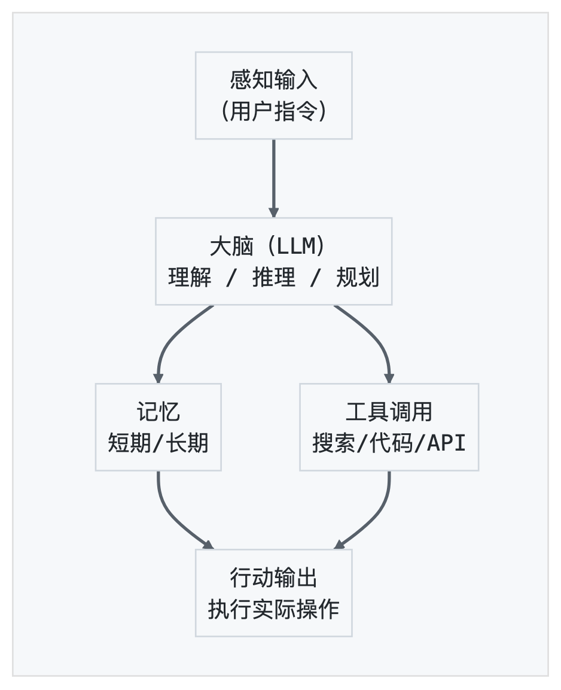
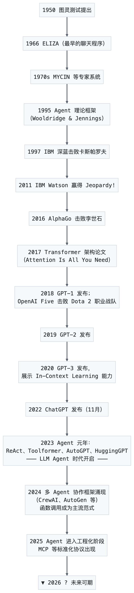
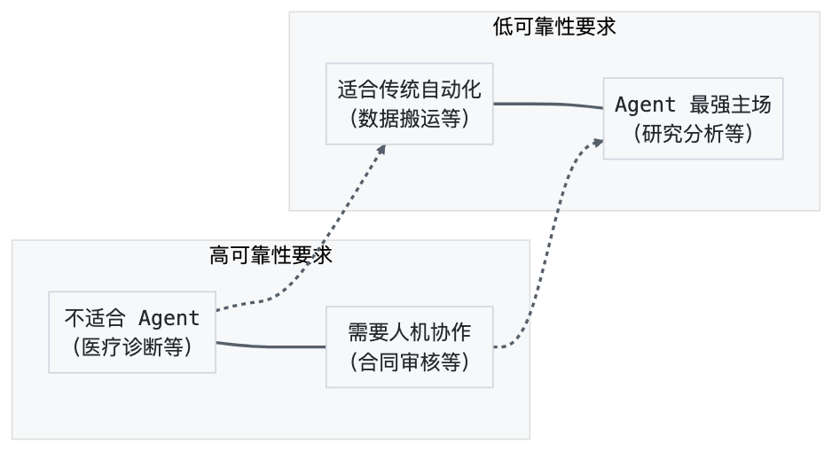
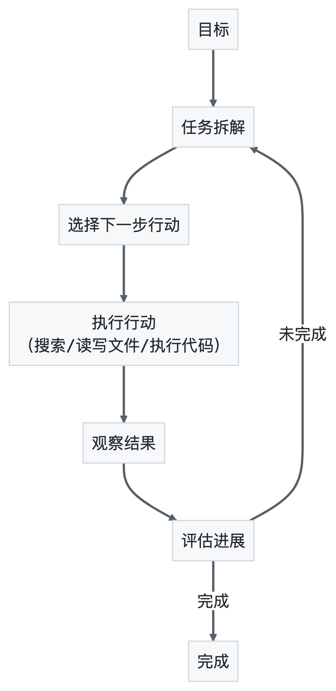

# 第1章 AI Agent 概述

> 工欲善其事，必先利其器。在动手构建 Agent 之前，我们先要把"什么是 Agent"这件事想清楚。

2024 年以来，AI Agent 成为技术圈最热的词汇之一。OpenAI 推出 GPTs 和 Assistants API，Anthropic 发布 Claude 的 Tool Use 能力，Google 用 Gemini 重塑其 AI 产品线，开源社区涌现出 LangChain、CrewAI、AutoGen 等一批框架——所有这些都在指向同一个方向：让 AI 从"能对话"进化到"能做事"。但热潮之下，一个根本性问题常被忽略：Agent 到底是什么？它和 ChatBot 有什么本质区别？它的能力边界在哪里？本章就是来回答这些问题的。我们将从定义出发，梳理发展脉络，解读关键论文，最终建立一个对 Agent 的清晰认知框架。

---

## 1.1 什么是 AI Agent

### 1.1.1 一个思想实验：你面对的是人还是机器？

1950年，艾伦·图灵在论文《计算机器与智能》中提出了一个著名的思想实验——图灵测试（Turing Test）。简单来说，如果你隔着墙跟一个"东西"对话，始终无法判断对方是人还是机器，那这台机器就可以被认为具有智能。

七十多年后的今天，当你跟 ChatGPT 聊天时，或许已经在某些瞬间"被骗"过——它说的某些话，确实像一个人。但图灵测试衡量的只是"对话能力"，它并不关心机器能不能帮你订机票、写代码、管理日程。一个只会聊天的系统，不管多像人，都还算不上我们今天要讨论的 Agent。

那么 Agent 到底是什么？

### 1.1.2 Agent 的定义

**Agent（智能体）**，简单说就是一个能"感知环境、做出决策、采取行动"来完成目标的系统。

这个词并不新鲜，它在人工智能领域已经存在了数十年。早在 1995 年，Stuart Russell 和 Peter Norvig 在经典教材《人工智能：一种现代方法》中就给出了一个简洁的定义：

> **Agent = 感知 + 行动**
>
> 任何可以通过传感器（sensor）感知环境，并通过执行器（actuator）对环境施加行动的事物，都可以被称为 Agent。

这个定义非常宽泛。按照这个定义，一个恒温器也是一个 Agent：它感知温度（传感器），决定是否加热（执行器），目标是让室温维持在设定值。一个自动驾驶汽车也是 Agent：它感知路况，决定方向盘和油门，目标是安全到达目的地。

但今天我们说的 **AI Agent**，特指以大语言模型（Large Language Model, LLM）为核心的智能体。它最大的特点不是"能感知"，而是"能思考"——更准确地说，是能**推理（Reasoning）**和**规划（Planning）**。

### 1.1.3 从"被动回答"到"主动执行"

传统软件是"你点一下，它动一下"——你点按钮，它执行预设的逻辑。聊天机器人稍微高级一点，你问一句，它答一句，但也仅此而已。

Agent 不一样。你可以给它一个目标，比如"帮我调研一下2025年新能源汽车的市场格局，写一份报告"，它会自己拆解任务：先搜索资料，再整理要点，再组织成文，最后交付给你。中间不需要你一步步指挥。

打个比方：传统软件像是**手电筒**，你按开关它就亮，不按就不亮；聊天机器人像是**对讲机**，你说一句它回一句；而 Agent 更像是一个**实习生**——你交代一个任务，他自己去查资料、做分析、写报告，只在关键节点来问你一声。

### 1.1.4 Agent 的核心要素

一个完整的 AI Agent 通常包含以下核心要素：

1. **感知（Perception）**：接收来自用户或环境的信息，比如用户的指令、API 返回的数据、网页上的内容等。
2. **大脑（Brain）**：即大语言模型，负责理解、推理和规划。它是 Agent 的"中央处理器"。
3. **记忆（Memory）**：存储对话历史、中间结果和长期知识，让 Agent 能"记住"上下文。
4. **工具（Tools）**：Agent 可以调用的外部能力，比如搜索引擎、代码执行器、数据库、API 等。
5. **行动（Action）**：Agent 对环境施加的实际操作，比如发送邮件、写入文件、调用接口等。

用一个简单的架构图来表示：



这五个要素缺一不可。没有感知，Agent 无法接收指令；没有大脑，Agent 无法推理；没有记忆，Agent 会"鱼的记忆"般反复遗忘；没有工具，Agent 只能"纸上谈兵"；没有行动，Agent 就是一个空转的引擎，产生不了任何实际效果。

### 1.1.5 一个最小的 Agent 示例

为了让你对 Agent 有更具体的感受，我们来看一个最简单的 Agent 调用示例。这里用 OpenAI 的 API 演示一个"能查天气的 Agent"：

```python
from openai import OpenAI

client = OpenAI()

# 定义工具：查天气
tools = [
    {
        "type": "function",
        "function": {
            "name": "get_weather",
            "description": "获取指定城市的当前天气信息",
            "parameters": {
                "type": "object",
                "properties": {
                    "city": {
                        "type": "string",
                        "description": "城市名称，如'北京'"
                    }
                },
                "required": ["city"]
            }
        }
    }
]

# 第一步
response = client.chat.completions.create(
    model="gpt-4o",
    messages=[{"role": "user", "content": "北京今天天气怎么样？"}],
    tools=tools
)

# 查看模型的决定
message = response.choices[0].message
if message.tool_calls:
    # Agent 决定调用 get_weather 工具
    tool_call = message.tool_calls[0]
    print(f"Agent 决定调用工具: {tool_call.function.name}")
    print(f"提取的参数: {tool_call.function.arguments}")
    # 输出：
    # Agent 决定调用工具
    # 提取的参数
```

注意这里发生了什么：模型不是直接回答"北京天气如何"，而是**主动判断**"我需要调用天气工具"，并**自动提取**了参数 `city: "北京"`。这就是 Agent 的雏形——它能根据目标，自主选择使用什么工具。

当然，完整的 Agent 还需要把工具返回的结果再喂回模型，让它生成最终回答，形成一个闭环。我们会在后续章节详细展开。

---

## 1.2 Agent 与 ChatBot 的本质区别

### 1.2.1 四种"自动化"的对比

很多人第一次接触 Agent 时会问：它跟聊天机器人有什么区别？跟 RPA（机器人流程自动化）又有什么不同？这个问题很好，因为理解"不是什么"往往比理解"是什么"更能抓住本质。

我们先把四种常见的"自动化系统"放在一起对比：

| 维度 | ChatBot（聊天机器人） | RPA（流程自动化） | 传统自动化脚本 | AI Agent |
|------|----------------------|-------------------|---------------|----------|
| **核心能力** | 对话生成 | 模拟人类操作 | 按规则执行 | 推理+行动 |
| **决策方式** | 无决策，基于模板或统计 | 无决策，按预设流程 | 无决策，if-else | 自主推理决策 |
| **适应性** | 只能回答训练范围内的问题 | 流程一变就崩溃 | 规则一变就崩溃 | 能适应新情况 |
| **工具使用** | 通常不用工具 | 模拟点击/输入 | 调用API/脚本 | 按需调用工具 |
| **记忆** | 有限对话上下文 | 无 | 无 | 短期+长期记忆 |
| **典型场景** | 客服问答 | 发票处理、数据搬运 | 定时备份、批量转换 | 研究分析、复杂任务 |

### 1.2.2 ChatBot：只能"说话"

最早的聊天机器人可以追溯到 1966 年 Joseph Weizenbaum 开发的 ELIZA。它用模式匹配模拟心理咨询师——你说"我很伤心"，它回"你为什么伤心？"看起来在对话，实际上只是把"我很X"替换成"你为什么X？"

现代的 ChatBot 基于 LLM，对话质量天差地别。但它们的本质仍然一样：**你问，我答，仅此而已。** 它不会主动去做什么，也不会调用外部工具帮你完成任务。

ChatGPT 刚发布时就是一个纯粹的 ChatBot。直到后来加入了联网搜索、代码执行、插件系统，它才逐步向 Agent 方向演进。

### 1.2.3 RPA：只能"照做"

RPA（Robotic Process Automation，机器人流程自动化）是过去十年企业数字化的主力工具。它的核心思路是：**把人类在电脑上的操作录下来，然后让机器人重复执行。**

比如一个财务人员每天要打开 ERP 系统，导出报表，复制数据到 Excel，计算汇总，发送邮件。RPA 可以把这些点击、复制、粘贴的操作录制成脚本，以后自动执行。

RPA 的问题在于：**它只会照做，不会思考。** 如果 ERP 系统改了界面布局，或者 Excel 文件格式变了，RPA 脚本就会报错。它没有任何适应能力，因为它不理解自己在做什么——它只是在机械地重复操作序列。

打个比方：RPA 像是一个**照着菜谱一板一眼做菜的厨师**，菜谱上写"加盐3克"，它就加3克，即使这批食材特别咸需要少加盐，它也不会变通。

### 1.2.4 传统自动化：只能"走流程"

传统自动化脚本是程序员写的 if-else 逻辑。比如一个 CI/CD 流水线：代码提交 -> 运行测试 -> 测试通过则部署，失败则通知。

这种自动化的特点是**确定性**：给定相同的输入，一定得到相同的输出。这对于标准化流程非常有效，但面对模糊、多变、需要判断的场景就力不从心了。

传统自动化像是一条**流水线**，每个环节都是固定的，产品必须按固定规格来。如果你需要处理的是非标准化的工作——比如分析一份措辞暧昧的合同、回复一封语气微妙的客户邮件——流水线就派不上用场了。

### 1.2.5 Agent：能"想"也能"做"

Agent 与上面三者的本质区别在于两个字：**自主**。

Agent 不是一个"输入-输出"的黑盒，而是一个**循环决策系统**：

```
感知 -> 推理 -> 行动 -> 观察 -> 再推理 -> 再行动 -> ...
```

这个循环叫做 **感知-推理-行动循环（Perception-Reasoning-Action Loop）**，是 Agent 的核心运行模式。

举一个具体的例子。假设你让 Agent "帮我找出公司最近一个季度的客户投诉热点，并生成改进建议"：

- **ChatBot** 会说："我无法访问你们公司的数据，但我可以告诉你分析投诉的一般方法……"
- **RPA** 会机械地打开 CRM，导出数据，但不知道怎么分析"热点"
- **传统自动化** 需要你事先定义好"投诉热点"的计算逻辑，写成脚本
- **Agent** 会：搜索数据库获取投诉记录 -> 分析文本提取关键词 -> 聚类归纳热点 -> 查阅行业最佳实践 -> 生成改进建议报告

关键区别在于：Agent 在每一步都在**思考下一步该做什么**，而不是执行预设的固定流程。如果它发现投诉记录里文本格式混乱，它会调整分析策略；如果某个热点特别突出，它会深入挖掘原因。这种**适应性**是其他三种系统不具备的。

### 1.2.6 一个类比：四种司机

如果用"开车"来类比：

- **ChatBot** 是一个只会"说"怎么开的副驾——"前面左转""该减速了"，但它不会碰方向盘
- **RPA** 是一个只会走固定路线的司机——你教它从家到公司的路线，它能开，但路上如果封路了，它就傻了
- **传统自动化** 是一个严格按导航走的司机——导航让右转就右转，即使右转在施工
- **Agent** 是一个有经验的司机——你告诉他目的地，他自己选路线，遇到封路会绕行，遇到突发情况会判断处理

---

## 1.3 Agent 发展脉络

### 1.3.1 三代 Agent 演进史

Agent 的概念虽然很早就存在，但它真正"能用"是最近两年的事。让我们简单回顾一下这条漫长的路。

**第一代：规则驱动的 Agent（1950s-2000s）**

最早的 Agent 是基于规则的专家系统。核心思想很简单：把人类专家的知识写成"如果-那么"规则，机器按规则推理。

最著名的例子是 1970 年代的 MYCIN 系统，它能根据病人的症状和化验结果，判断是否感染了某种细菌，并推荐抗生素。MYCIN 在某些场景下的诊断准确率甚至超过了人类医生，但它有一个致命缺陷：**规则是人工编写的，无法自动学习新知识。** 当遇到规则没有覆盖的情况，它就无能为力了。

这个时期还有一些重要的理论工作。1995 年，Michael Wooldridge 和 Nicholas Jennings 发表了论文《Intelligent Agents: Theory and Practice》，系统性地定义了 Agent 的属性：自主性（autonomy）、社会性（social ability）、反应性（reactivity）和主动性（pro-activeness）。这些属性到今天依然是判断一个系统是不是 Agent 的重要标准。

**第二代：学习驱动的 Agent（2010s-2022）**

随着深度学习的兴起，Agent 开始能够从数据中学习，而不是完全依赖人工编写规则。这个阶段的标志性成果包括：

- **AlphaGo（2016）**：通过强化学习掌握了围棋策略，击败李世石。它是一个在封闭环境中自主决策的 Agent，但只能下棋，不能做任何其他事。
- **OpenAI Five（2018）**：在 Dota 2 中击败职业战队，展示了多 Agent 协作的可能性。
- **各类游戏 AI**：从 Atari 到星际争霸，强化学习训练出的 Agent 在特定游戏中表现出色。

这些 Agent 有一个共同局限：**它们是专才，不是通才。** 一个围棋 Agent 不会下象棋，一个 Dota Agent 不会打篮球。每一个 Agent 都需要针对特定任务从零训练，成本极高。

**第三代：LLM 驱动的 Agent（2023-至今）**

2022年底 ChatGPT 的出现改变了一切。大语言模型展示了一种前所未有的能力：**通用推理**。一个模型，不需要针对特定任务训练，就能理解指令、推理因果、生成方案。

当人们意识到 LLM 可以作为 Agent 的"大脑"，整个领域就被引爆了。2023 年成为 "Agent 元年"：

- **ReAct** 论文提出"推理+行动"的范式
- **Toolformer** 展示了 LLM 自学使用工具的能力
- **AutoGPT** 第一个爆火的自主 Agent 项目，GitHub 星标数一周破5万
- **HuggingGPT** 展示了 LLM 调度多个专业模型完成复杂任务的架构

三代 Agent 的演进可以用一句话概括：**从"按规则做事"到"从数据学习"，再到"用语言思考"。**

### 1.3.2 为什么是 LLM 改变了一切？

你可能会问：为什么 LLM 出现后，Agent 才真正爆发？之前的强化学习 Agent 不也很强吗？

关键在于三个词：**通用性、灵活性、可扩展性。**

**通用性**：LLM 是一个"通才"。它读过互联网上的海量文本，具备了广泛的世界知识和推理能力。你不需要为每个任务训练一个新模型，一个 LLM 就能应对各种不同的场景。

**灵活性**：LLM 理解自然语言指令。你不需要写代码来定义 Agent 的行为，用自然语言描述即可。这极大降低了 Agent 的开发门槛。

**可扩展性**：通过函数调用（Function Calling）机制，LLM 可以调用任意工具。今天加一个搜索工具，明天加一个代码执行器，后天加一个数据库查询接口——Agent 的能力可以像搭积木一样不断扩展。

在 LLM 之前，要做一个"能搜索网页的 Agent"，你需要专门训练一个模型来理解搜索场景。现在？你只需要用自然语言描述搜索工具的用途，LLM 就能学会使用它。这就是范式的转变。

### 1.3.3 发展时间线



---

## 1.4 Agent 的能力边界

> 知己知彼，百战不殆。了解 Agent 能做什么，更要了解它不能做什么。

### 1.4.1 Agent 擅长什么？

**1. 信息整合与知识工作**

Agent 最擅长的领域是"把散落的信息整合起来"。比如：

- 阅读 20 份 PDF 文档，提取关键数据，生成对比表格
- 搜索多个数据源，综合分析一个行业的竞争格局
- 把一篇论文翻译并改写成适合大众阅读的科普文章

这类任务的特点是：输入是信息，输出也是信息，Agent 不需要直接操作物理世界。

**2. 代码生成与调试**

写代码本质上也是信息工作，但它是"结构化"的信息工作。Agent 不仅能写代码，还能运行代码、看报错、修改代码、再运行——形成一个完整的调试循环。

```python
# 一个简单的代码调试 Agent 工作流
# 1. Agent 生成代码
code = "def fibonacci(n): return fibonacci(n-1) + fibonacci(n-2)"

# 2. 运行代码，发现 RecursionError

# 3. Agent 分析错误，修复代码
fixed_code = """
def fibonacci(n):
    if n <= 1: return n
    return fibonacci(n-1) + fibonacci(n-2)
"""

# 4. 再次运行，验证通过
```

**3. 多步骤任务编排**

这是 Agent 区别于 ChatBot 最核心的能力。一个复杂任务往往需要多个步骤，有些步骤之间还有依赖关系。Agent 能自动规划执行顺序，处理中间结果，应对意外情况。

比如"帮我调研竞品并写分析报告"这个任务，Agent 会自动拆解为：搜索竞品信息 -> 提取关键数据 -> 对比分析 -> 撰写报告。如果搜索结果不够，它会换关键词重新搜索；如果某个竞品信息特别少，它会在报告中注明数据不足。

**4. 人机协作**

Agent 不需要完全替代人类。在很多场景下，它最好的角色是"助手"——完成大部分工作，把关键决策留给人类。比如 Agent 先草拟一份合同，人类律师审核修改；Agent 先筛选出最有价值的 10 篇论文，人类研究员精读。

### 1.4.2 Agent 不擅长什么？

**1. 高精度数值计算**

LLM 的推理基于"下一个词的概率"，而不是精确的数学运算。让 Agent 算 "3.14159 × 2.71828"，它大概率会给出一个近似值而不是精确结果。

解决方案是给 Agent 接入代码执行器——让它写一段 Python 来算，而不是自己硬算。这也体现了 Agent 架构的核心理念：**LLM 负责思考和决策，专业工具负责执行。**

**2. 长程一致性与复杂逻辑**

LLM 的上下文窗口是有限的。虽然现在的模型已经支持 10万+ token 的上下文，但在超长对话中，Agent 仍然可能出现"遗忘"——忘记之前约定好的规则、前后回答矛盾等问题。

比如你让 Agent 写一部 10 万字的小说，它可能在前 3 章设定了主角的性格特征，到第 7 章就自相矛盾了。这是当前 LLM Agent 的一个根本性挑战。

**3. 实时性与低延迟场景**

Agent 的推理过程需要多次调用 LLM，每次调用都有延迟。一个需要毫秒级响应的场景（比如高频交易、实时游戏）不适合用 Agent。Agent 更适合"秒级到分钟级"的任务。

**4. 涉及物理世界的操作**

Agent 目前只能操作数字世界。它能发邮件、写代码、查数据，但不能帮你倒一杯咖啡、修一台机器。虽然机器人技术正在与 AI 融合，但"数字 Agent + 物理机器人"的成熟应用还需要时间。

**5. 需要绝对可靠性的场景**

Agent 的行为有不确定性。同样的输入，可能产生不同的输出。这在创意工作中是优点（多样性），但在需要绝对一致性的场景中是致命缺陷。比如医疗诊断、法律判决、金融交易等场景，Agent 可以辅助，但不能完全取代人类决策。

### 1.4.3 Agent 的"能力地图"

我们可以把 Agent 的能力画成一张地图，帮你直观理解它的边界：



右下角——高复杂度+低可靠性要求——是 Agent 的最强主场。比如调研分析、内容创作、代码开发：这些任务足够复杂、需要灵活应对，但允许一定的试错空间。

右上角——高复杂度+高可靠性要求——是人机协作区。Agent 做大部分工作，人类在关键节点把关。

左下角——低复杂度+低可靠性要求——用传统自动化就够了，不必杀鸡用牛刀。

左上角——低复杂度+高可靠性要求——也不适合 Agent，用确定性代码更可靠。

### 1.4.4 一个容易忽略的问题：成本

谈论 Agent 的能力边界时，成本是一个经常被忽略但极其重要的维度。

Agent 每一次推理都要调用 LLM API，而复杂任务可能需要十几轮甚至几十轮推理。如果一个任务需要 Agent 调用 20 次 GPT-4o，每次输入输出约 2000 token，按当前 API 价格计算，单次任务的 API 成本可能在 0.5-2 美元之间。对于高频场景，这个成本会快速累积。

因此，**不是所有适合 Agent 的场景都应该用 Agent。** 当一个任务的复杂度足以证明 Agent 的成本合理时，使用 Agent 才是明智的选择。简单的任务用简单的方案，永远是最经济的做法。

---

## 1.5 关键论文解读

这一节我们来解读三篇对 LLM Agent 发展影响深远的论文。读懂它们，你就读懂了 Agent 的核心技术思想。

### 1.5.1 ReAct：推理与行动的交响

**论文**：*ReAct: Synergizing Reasoning and Acting in Language Models*（2022年10月，Yao et al.）

**核心问题**：LLM 是应该先想清楚再行动，还是边行动边思考？

在 ReAct 之前，人们尝试过两种极端的方式：

- **纯推理（Reasoning Only）**：让模型用"思维链（Chain-of-Thought, CoT）"一步步推导，但不接触外部信息。问题：模型只能基于自己的知识推理，可能产生"看似合理但事实错误"的幻觉（Hallucination）。
- **纯行动（Acting Only）**：让模型直接调用工具行动，不进行推理。问题：模型可能盲目行动，做出错误的决策。

ReAct 的核心洞察是：**推理和行动应该交替进行，互相增强。**

具体来说，ReAct 让模型在每一步都先"想"（Thought），再"做"（Action），然后观察结果（Observation），形成 "Thought-Action-Observation" 的循环：

```
问题：微软的创始人出生在哪个城市？

Thought 1: 我需要先确认微软的创始人是谁。
Action 1: Search[微软创始人]
Observation 1: 微软由比尔·盖茨和保罗·艾伦于1975年创立。

Thought 2: 比尔·盖茨是更广为人知的创始人，我需要查他的出生地。
Action 2: Search[比尔·盖茨 出生地]
Observation 2: 比尔·盖茨出生于美国华盛顿州西雅图。

Thought 3: 我现在知道答案了。
Action 3: Finish[西雅图]
```

ReAct 论文的实验表明，这种"边想边做"的方式，比纯推理和纯行动都更准确。原因很直觉：推理让行动有方向，行动让推理有依据。

用中国古语说，ReAct 的思想就是"**三思而后行，行后而再思**"——先想清楚再做，做完再复盘，循环往复。

### 1.5.2 Toolformer：让模型自学使用工具

**论文**：*Toolformer: Language Models Can Teach Themselves to Use Tools*（2023年2月，Schick et al.）

**核心问题**：LLM 能不能自己学会什么时候该用工具、怎么用工具？

在 Toolformer 之前，让 LLM 使用工具主要有两种方式：

- **提示工程（Prompt Engineering）**：在提示词中描述可用工具，让模型"在上下文中学习"使用。问题：每次对话都要带上工具描述，占用上下文空间；模型的工具使用格式不稳定。
- **微调（Fine-tuning）**：用标注了工具使用的数据集微调模型。问题：标注数据成本高，工具变更后需要重新微调。

Toolformer 提出了一种全新的方式：**让模型自学。**

具体流程如下：

1. **采样**：对于一段文本，在每个位置插入工具调用的"提示"，让模型生成可能的 API 调用。比如在"西雅图今天很暖和"后面，插入 `[Weather(西雅图) ->`，让模型补全。

2. **执行**：把模型生成的 API 调用真正执行，得到返回结果。

3. **过滤**：计算"有工具结果"和"没有工具结果"两种情况下，模型预测后续文本的困惑度（Perplexity）。如果有了工具结果，后续文本更容易预测（困惑度更低），说明这个工具调用是有价值的，保留；否则丢弃。

4. **微调**：用筛选后的数据微调模型，让它学会在合适的位置调用合适的工具。

Toolformer 的精妙之处在于：**它不需要人工标注什么时机该用什么工具，模型自己就能发现。** 如果一个 API 调用对理解文本有帮助，模型就会学会使用它。

不过 Toolformer 也有局限：它只支持预先定义好的工具集，新工具需要重新走一遍流程；而且它更擅长信息查询类的工具，对于需要多步操作的工具链支持有限。

### 1.5.3 AutoGPT：第一个"完全自主"的 Agent

**项目**：*AutoGPT*（2023年3月，Significant Gravitas）

**核心问题**：能不能让 Agent 完全自主地完成一个复杂目标，不需要人类中间干预？

AutoGPT 不是一篇学术论文，而是一个开源项目，但它的影响力不亚于任何论文——它让全世界第一次看到了"完全自主 Agent"的可能性。

AutoGPT 的工作方式：

1. 你给它一个目标，比如"研究如何用 Python 构建一个网络爬虫，并写一份教程"
2. 它自动把这个大目标拆解成小任务
3. 逐个执行小任务：搜索资料、阅读网页、写代码、测试代码、写文档
4. 每完成一步，它自己评估进展，决定下一步做什么
5. 最终交付结果

AutoGPT 的核心架构：



AutoGPT 在 2023 年 3 月底发布后，迅速在 GitHub 上获得了超过 15 万星标，成为当时最火的开源项目之一。但热度很快退潮，因为人们发现它有几个严重问题：

**1. 容易陷入死循环**：Agent 可能在两个行动之间反复跳转，消耗大量 token 却毫无进展。比如它可能在"搜索"和"阅读搜索结果"之间来回切换，始终无法推进到下一步。

**2. 缺乏长期规划能力**：虽然 AutoGPT 会制定计划，但它经常"忘掉"自己的计划，被新信息带偏。规划能力不足导致它在复杂任务中表现不佳。

**3. 成本失控**：一个看似简单的任务，AutoGPT 可能消耗数十美元的 API 费用——大量 token 花在了重复、无效的推理上。

**4. 幻觉问题**：Agent 会"编造"它做了某件事，实际上并没有做。比如它可能声称已经创建了一个文件，但磁盘上并不存在。

AutoGPT 的意义不在于它有多好用，而在于它**证明了完全自主 Agent 是可行的**，同时也暴露了需要解决的核心问题。它像是 Agent 发展史上的第一架试飞的飞机——飞得不高，飞得不稳，但确实飞起来了。

### 1.5.4 三篇工作的关系

如果用一句话总结三者的关系：

- **ReAct** 解决了"怎么想"的问题——推理和行动应该交替进行
- **Toolformer** 解决了"怎么用工具"的问题——让模型自己学会何时用、怎么用
- **AutoGPT** 解决了"怎么自主"的问题——让 Agent 在没有人类干预的情况下持续运转

三者合在一起，就构成了 LLM Agent 的基本范式：**自主规划 -> 推理决策 -> 调用工具 -> 观察结果 -> 继续规划**。

---

## 习题

1. **动手搭建一个最小 Agent**：使用 OpenAI API（或任意支持 Function Calling 的 LLM API），实现一个能调用至少 2 个工具的 Agent。建议工具：天气查询 + 简单计算器。关键体验：观察模型如何自主决定调用哪个工具、提取什么参数。提示：可以用 `python-dotenv` 管理 API Key，不要把 Key 硬编码在代码里。

2. **ReAct 论文复现**：阅读 ReAct 原始论文（arxiv.org/abs/2210.03629），然后用纯 Prompt Engineering 的方式实现 ReAct 模式——不依赖任何 Agent 框架，只用系统提示词定义 Thought-Action-Observation 的格式，让模型按格式输出。用 3-5 个需要多步推理的问题测试效果，记录成功率和失败原因。

3. **Agent vs ChatBot 对比实验**：选择一个需要多步操作的任务（如"调研某公司最近的融资情况"），分别用纯 ChatBot 模式（无工具）和 Agent 模式（有搜索工具+代码执行）完成。记录两者的表现差异：信息准确度、完成度、耗时。思考：在什么条件下 Agent 模式显著优于 ChatBot 模式？

## 参考文献

1. Yao, S. et al. "ReAct: Synergizing Reasoning and Acting in Language Models." ICLR 2023. arXiv:2210.03629
2. Schick, T. et al. "Toolformer: Language Models Can Teach Themselves to Use Tools." NeurIPS 2023. arXiv:2302.04761
3. Richards, T. "AutoGPT: An Autonomous GPT-4 Experiment." GitHub, 2023.

## 开放讨论

1. **Agent 是否必须"完全自主"？** 今天的 Agent 大多需要人类在关键节点审批（Human-in-the-loop）。如果 Agent 永远需要人类审批，它跟一个高级助手有什么区别？你更倾向于"全自主 Agent"还是"半自主 Agent"？在什么场景下两者各更有优势？

2. **通用 Agent vs 专用 Agent**：有人认为未来的方向是"一个 Agent 搞定一切"，也有人认为"专业的事交给专业的 Agent"更实际。类比人类社会中"通才"与"专才"的关系，你如何看待这个问题？有没有可能存在一个"足够通用"的 Agent？

3. **Agent 的责任归属**：当 Agent 自主做出了一个错误决策——比如错误地删除了生产数据库中的记录——谁应该负责？使用者？开发者？模型提供商？这个问题在今天还没有法律定论，但它会深刻影响 Agent 的落地方式。你怎么看？

---
