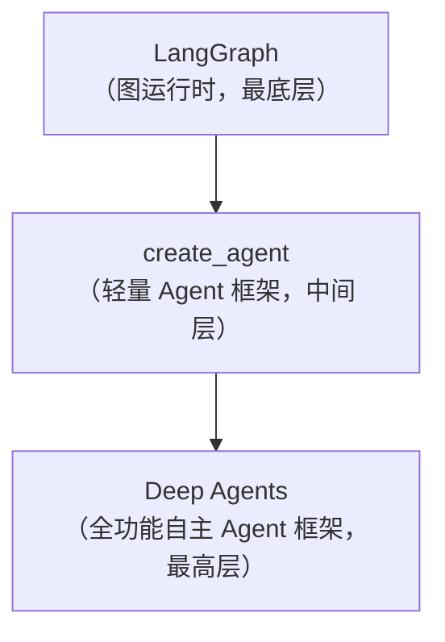

# 第3章 技术生态：框架与模型

> 三十辐共一毂，当其无，有车之用。——《道德经》

在上一章中，我们理解了 AI Agent 的核心架构和工作原理。现在，是时候走进 AI Agent 的"兵器库"了。框架是你的战甲，模型是你的武艺——战甲决定你能承受多大的冲击，武艺决定你能打出多强的攻击。本章将横向对比 LangGraph、CrewAI、AutoGen、OpenAI Agents SDK 等主流框架的设计哲学和适用场景，掌握 GPT-4o、Claude、Gemini、开源模型的选型策略，理解不同框架在抽象层级、灵活性、生态成熟度上的权衡。我不会告诉你"哪个最好"——因为最好的，永远是最适合你的。至于工具链与基础设施，我们留给下一章详述。

---

## 3.1 框架横评

选择一个 Agent 框架，就像选择一门武学——每门武学都有其核心理念、适用场景和修炼难度。不过在选择之前，有两个误区值得留意：一是"从一而终"，选定一个框架后所有项目都套用它，即使场景不匹配也不愿换；二是"过度抽象"，用框架的高级 API 封装一切，导致出了问题完全不知道底层发生了什么。更稳妥的做法是，根据项目实际复杂度来选型——简单任务用轻量方案，复杂流程再上 LangGraph 这类重量级框架；同时尽量理解框架的底层原理（至少读过核心循环的源码），保持"随时可以脱离框架"的能力。本节我们将逐一拆解当前最主流的五大 Agent 框架，帮你找到最适合自己的那一门。

### 3.1.1 LangGraph：图灵之剑

LangGraph 是 LangChain 团队推出的基于图（Graph）的 Agent 框架。它的核心理念是把 Agent 的工作流建模为有向图——节点是处理步骤，边是状态流转。

**设计哲学：** 万物皆图。任何一个 Agent 工作流，无论多复杂，都可以用"状态 + 节点 + 边"来精确描述。这种抽象方式赋予了 LangGraph 极强的表达力：从最简单的线性流程，到包含条件分支、循环、并行执行的复杂工作流，都能优雅地建模。

**核心特性：**
- **状态驱动的图执行：** 每个节点接收一个共享状态（State），处理后返回更新后的状态。状态的流转路径由条件边决定。
- **人机协作（Human-in-the-loop）：** 内置断点机制，可以在任意节点暂停执行，等待人类审批后继续。
- **持久化与时间旅行：** 支持将执行状态持久化到外部存储，甚至可以回退到历史某个检查点重新执行。
- **多 Agent 编排：** 支持将多个 Agent 作为子图嵌入主图，实现层级式多 Agent 协作。

```python
# LangGraph 安装与最小示例
# pip install langgraph

from typing import Annotated
from typing_extensions import TypedDict
from langgraph.graph import StateGraph, START, END
from langgraph.graph.message import add_messages

# 定义状态
class State(TypedDict):
    messages: Annotated[list, add_messages]

# 定义节点
def chatbot(state: State):
    return {"messages": [("assistant", "你好，我是 LangGraph Agent！")]}

# 构建图
graph_builder = StateGraph(State)
graph_builder.add_node("chatbot", chatbot)
graph_builder.add_edge(START, "chatbot")
graph_builder.add_edge("chatbot", END)

graph = graph_builder.compile()

# 执行
result = graph.invoke({"messages": [("user", "你好")]})
print(result)
```

**适用场景：** 需要精细控制工作流的复杂 Agent 系统，尤其是涉及多步决策、条件分支和人工审批的企业级应用。

**注意事项：** 学习曲线较陡，图的概念需要时间消化；对于简单场景可能显得"杀鸡用牛刀"。

### 3.1.2 CrewAI：团队之术

CrewAI 的核心理念是"模拟人类团队协作"。它把 Agent 比作团队成员，赋予他们角色（Role）、目标（Goal）和背景故事（Backstory），让他们像一个真实的项目团队一样协作完成任务。

**设计哲学：** 角色即架构。与其设计复杂的控制流，不如定义好每个 Agent 的角色和职责，让他们自主协作。这种方式更接近真实世界的团队管理。

**核心特性：**
- **角色驱动：** 每个 Agent 有明确的角色描述，影响其行为模式和决策倾向。
- **任务编排：** 支持顺序（Sequential）、层级（Hierarchical）和自主（Autonomous）三种任务执行模式。
- **工具集成：** 内置丰富的工具生态，支持自定义工具，Agent 可以搜索网页、读写文件、调用 API。
- **记忆系统：** 支持短期记忆和长期记忆，Agent 可以记住之前的交互和学到的知识。
- **人类输入：** 支持在任务执行过程中请求人类反馈。

```python
# CrewAI 安装与最小示例
# pip install crewai

from crewai import Agent, Task, Crew, Process

# 定义 Agent
researcher = Agent(
    role="市场研究员",
    goal="收集并分析市场趋势数据",
    backstory="你是一位资深市场研究员，擅长从海量信息中提炼关键洞察。",
    verbose=True,
)

writer = Agent(
    role="内容创作者",
    goal="将研究成果转化为引人入胜的报告",
    backstory="你是一位专业的内容创作者，擅长将复杂数据转化为通俗故事。",
    verbose=True,
)

# 定义任务
research_task = Task(
    description="研究2026年AI Agent市场的主要趋势",
    agent=researcher,
    expected_output="一份包含3-5个关键趋势的市场分析摘要",
)

write_task = Task(
    description="基于研究成果撰写一份市场洞察报告",
    agent=writer,
    expected_output="一篇800字左右的市场洞察文章",
)

# 组建团队并执行
crew = Crew(
    agents=[researcher, writer],
    tasks=[research_task, write_task],
    process=Process.sequential,
)

result = crew.kickoff()
print(result)
```

**适用场景：** 需要多角色协作的内容创作、研究分析、自动化运维等场景。尤其适合团队中没有深厚工程背景、更习惯用"角色分工"思维来设计系统的用户。

**注意事项：** 对于需要精确控制执行流程的场景，角色驱动的自主性可能带来不确定性；调试多 Agent 协作问题有时像"管理一个失控的团队"。

### 3.1.3 AutoGen：对话之禅

AutoGen 是微软研究院推出的多 Agent 框架，其核心理念是"对话即计算"（Conversation-as-Computation）。它让多个 Agent 通过结构化对话来协作解决问题。

**设计哲学：** 对话是最自然的协作方式。人类团队通过对话协调工作，Agent 也应该如此。AutoGen 将 Agent 间的交互抽象为对话流，支持自动对话和人工介入。

**核心特性：**
- **对话驱动：** Agent 之间通过发送消息进行协作，天然支持多轮对话和上下文传递。
- **AssistantAgent 与 UserProxy：** 内置两种核心角色——AssistantAgent 代表 AI 助手，UserProxy 代表人类用户，两者通过对话完成任务。
- **代码执行：** UserProxy 可以安全地执行 Agent 生成的代码，支持沙箱环境。
- **GroupChat：** 支持 GroupChat 模式，多个 Agent 在一个群聊中讨论和协作。
- **可组合性：** Agent 可以嵌套组合，形成更复杂的系统。

```python
# AutoGen 安装与最小示例
# pip install autogen-agentpy

import autogen

# 配置 LLM
config_list = [{"model": "gpt-4o", "api_key": "your-api-key"}]

# 创建 Assistant Agent
assistant = autogen.AssistantAgent(
    name="assistant",
    llm_config={"config_list": config_list},
)

# 创建 User Proxy Agent
user_proxy = autogen.UserProxyAgent(
    name="user_proxy",
    human_input_mode="TERMINATE",
    code_execution_config={"work_dir": "coding", "use_docker": False},
)

# 发起对话
user_proxy.initiate_chat(
    assistant,
    message="请帮我写一个Python函数，计算斐波那契数列的第n项",
)
```

**适用场景：** 需要自然对话式协作的场景，如代码生成与审查、数据分析、研究讨论。尤其适合学术研究和实验性项目。

**注意事项：** AutoGen 经历了从 v0.2 到 v0.4 的重大架构变化，API 不稳定；对话驱动的模式在确定性要求高的生产环境中可能缺乏可控性。

### 3.1.4 OpenAI Agents SDK：官方之道

OpenAI Agents SDK 是 OpenAI 于 2025 年推出的官方 Agent 开发框架。它的设计哲学是"简洁即力量"——用最少的抽象，提供最核心的 Agent 能力。

**设计哲学：** 官方出品，大道至简。不追求通用性，而是深度绑定 OpenAI 生态，提供开箱即用的 Agent 开发体验。

**核心特性：**
- **Agent 原语：** 只有两个核心概念——Agent 和 Handoff。Agent 定义行为，Handoff 定义 Agent 之间的协作。
- **Runner 模式：** 通过 Runner 统一管理 Agent 的执行循环，支持同步和流式输出。
- **Guardrails：** 内置输入/输出护栏机制，可以在 Agent 执行前后进行安全检查。
- **Tracing：** 内置追踪能力，可以可视化 Agent 的执行过程，方便调试和优化。
- **深度集成 OpenAI：** 原生支持 OpenAI 的 Function Calling、Structured Output、Assistants API 等。

```python
# OpenAI Agents SDK 安装与最小示例
# pip install openai-agents

from agents import Agent, Runner, function_tool

# 定义工具
@function_tool
def get_weather(city: str) -> str:
    """获取指定城市的天气信息"""
    return f"{city}今天晴，气温25°C"

# 定义 Agent
agent = Agent(
    name="天气助手",
    instructions="你是一个天气查询助手，帮助用户查询天气信息。",
    tools=[get_weather],
)

# 运行 Agent
result = Runner.run_sync(agent, messages=[{"role": "user", "content": "北京今天天气怎么样？"}])
print(result.final_output)
```

**适用场景：** 已在使用 OpenAI 模型的项目，需要快速构建 Agent 原型，或对生产稳定性要求高的商业应用。

**注意事项：** 强绑定 OpenAI 生态，切换模型供应商需要额外适配；功能相对轻量，复杂工作流需要自行组合。

### 3.1.5 Deep Agents：深度之力

如果你已经了解了 LangGraph 这把"图灵之剑"，那么 Deep Agents 就是剑鞘之外的那套全身铠甲——不仅给你武器，还给你坐骑、粮草、斥候和亲兵。Deep Agents 是 LangChain 团队推出的开源自主 Agent 框架，定位为"batteries-included agent harness"——开箱即用的 Agent 全副武装。

**设计哲学：** 意见即效率。LangGraph 给了你一块铁坯，你可以锻造任何形状的剑；`create_agent` 给了你一把剑坯，加个柄就能上阵；而 Deep Agents 直接递给你一把开了刃的宝剑，连剑鞘都配好了。它是 LangChain Agent 技术栈中最高的抽象层——同样的砖块（LangGraph），别人还在搬砖，Deep Agents 已经盖好了房子。它的设计灵感来自 Claude Code，目标只有一个：让开发者用最少的代码，构建真正能"自己跑起来"的自主 Agent。

要理解 Deep Agents 在 LangChain Agent 技术栈中的位置，可以这样看：



三者共享同一套基础构建块，但每一层都在上层的基础上封装了更多能力。LangGraph 是引擎，`create_agent` 是底盘，Deep Agents 是整车。

**核心特性：**
- **子 Agent（Sub-agents）：** 主 Agent 可以将子任务委派给独立的子 Agent，每个子 Agent 拥有独立的上下文窗口，不会污染主对话。就像将军把局部战事交给偏将——各打各的，但目标一致。
- **文件系统（Filesystem）：** 内置文件读写、编辑、搜索能力，支持可插拔的本地/沙箱/远程后端。Agent 不只是"想想而已"，它真的能读你的代码、改你的文件。
- **上下文管理（Context Management）：** 自动摘要、工具输出溢出到磁盘——当对话历史撑爆上下文窗口时，Deep Agents 会自动裁剪，确保 Agent 永远不会"失忆"或"爆脑"。
- **Shell 访问：** 支持沙箱化的命令执行，Agent 可以安全地运行终端命令。
- **持久化记忆（Persistent Memory）：** 可插拔的状态/存储后端，支持跨会话记忆召回。今天的 Agent，明天还能记得你。
- **人机协作（Human-in-the-loop）：** 工具调用的审批/编辑/拒绝——Agent 想动你的文件？先过你这一关。
- **技能（Skills）：** 可复用的行为模块，按需加载。就像武学中的"招式"——基础功法是内力，技能是外功，按敌择招。
- **工具（Tools）：** 支持自定义函数或接入任何 MCP 服务器，工具生态无限扩展。
- **Harness Profiles：** 声明式配置文件，一键切换不同模型供应商（OpenAI、Anthropic 等）的最佳实践配置。换模型？改一行配置即可。
- **权限控制（Permissions）：** 文件系统访问控制，精细化管理 Agent 能读什么、能写什么、能删什么。

```bash
# Deep Agents Code
# 一行命令安装
curl -fsSL https://raw.githubusercontent.com/langchain-ai/deepagents/main/install.sh | bash

# 或通过 Python 使用 Deep Agents 框架
# pip install deepagents
```

```python
# Deep Agents 框架使用示例
from deepagents import Agent, Skill

# 定义一个自定义技能
class CodeReviewSkill(Skill):
    name = "code_review"
    description = "审查代码并给出改进建议"

    def execute(self, agent, context):
        # 读取文件、分析代码、生成建议
        files = agent.filesystem.read("src/")
        review = agent.llm.chat(
            f"请审查以下代码并给出改进建议：\n{files}"
        )
        return review

# 创建 Agent 并加载技能
agent = Agent(
    name="代码审查员",
    skills=[CodeReviewSkill()],
    # Harness Profile：声明式模型配置
    profile="anthropic",  # 或 "openai"，一键切换
)

# 运行——Agent 会自主读取文件、分析、输出建议
result = agent.run("审查 src/ 目录下的所有 Python 文件")
```

**适用场景：** 复杂、长运行的自主任务——深度研究、代码开发、数据分析。如果你需要的不只是一个"听话的工具人"，而是一个"能独立思考、自己查资料、自己写代码、还能记住上次干了什么"的 Agent，Deep Agents 就是为这种场景而生的。

**注意事项：** 意见即效率，但意见也意味着灵活性受限。Deep Agents 的"开箱即用"是有代价的——它替你做了很多决策，如果你需要高度定制化的工作流，可能还是要回到 LangGraph 或 `create_agent` 层面去搭建。此外，框架仍在快速演进中（当前 v0.6.x），API 可能有变动，生产环境采用需谨慎评估

### 3.1.6 框架演进趋势：从"各自为战"到"殊途同归"

在对比具体框架之前，值得先理解一个宏观趋势：当前 Agent 框架虽然"形散"——有的基于图，有的基于角色，有的基于对话——但"神不散"。所有框架都在解决同一个核心问题：如何让 LLM 可靠地使用工具、管理状态、与其他 Agent 协作。

观察到三个明显的趋同方向：

1. **图成为底层共识：** 即使是 CrewAI 和 AutoGen 这类角色/对话驱动的框架，也在底层引入了图或 DAG 的概念来管理执行流。LangGraph 的"万物皆图"正在从特立独行变成行业共识。
2. **MCP 成为工具标准：** 越来越多的框架开始支持 MCP 协议接入工具，这意味着未来你可以"一套工具走天下"，而不用为每个框架单独适配。
3. **可观测性内置化：** 从"事后加埋点"到"框架内建追踪"，可观测性正在从可选项变成必选项。OpenAI Agents SDK 的 Tracing 和 LangGraph 的 LangSmith 集成都是这一趋势的体现。

理解了这些趋势，你在选型时就不只是看"今天谁功能多"，而是看"谁的方向对了"。

### 3.1.7 框架对比总览

工欲善其事，必先利其器。但"利器"因人而异，以下对比表帮你快速定位：

| 维度 | LangGraph | CrewAI | AutoGen | OpenAI Agents SDK | Deep Agents |
|------|-----------|--------|---------|-------------------|-------------|
| **核心抽象** | 有向图 + 状态 | 角色 + 团队 | 对话流 | Agent + Handoff | 自主 Agent + 技能 |
| **学习曲线** | 陡峭 | 中等 | 中等 | 平缓 | 平缓 |
| **灵活性** | 极高 | 中等 | 较高 | 中等 | 中等 |
| **多Agent协作** | 子图嵌套 | 角色编排 | 群聊对话 | Handoff 交接 | 子 Agent 委派 |
| **生产就绪度** | 高 | 中高 | 中 | 高 | 中（v0.6.x） |
| **模型绑定** | 无 | 无 | 无 | OpenAI | 无（Profile 切换） |
| **人机协作** | 内置断点 | 支持反馈 | UserProxy | Guardrails | 工具调用审批 |
| **可观测性** | LangSmith | 有限 | 有限 | 内置 Tracing | LangSmith |
| **开源协议** | MIT | MIT | Apache 2.0 | Apache 2.0 | MIT |
| **社区活跃度** | 高 | 高 | 中 | 高 | 高（23K+ stars） |
| **典型场景** | 复杂工作流 | 内容协作 | 研究实验 | OpenAI 生态 | 自主长任务 |

**选型建议：**
- 如果你需要构建**复杂工作流**、需要**精确控制**每一步执行路径——选 LangGraph
- 如果你更习惯**角色分工**思维、团队偏产品运营——选 CrewAI
- 如果你做**研究实验**、喜欢对话式交互——选 AutoGen
- 如果你深度使用 **OpenAI 模型**、追求**简洁稳定**——选 OpenAI Agents SDK
- 如果你需要 Agent **自主执行长任务**（代码开发、深度研究）、想要**开箱即用**——选 Deep Agents
- 如果你既要 Deep Agents 的便利、又要 LangGraph 的灵活——可以从 Deep Agents 入手，需要时向下拆解到 `create_agent` 或 LangGraph

凡事预则立，不预则废。技术选型不是一锤子买卖，建议先用小项目验证，再决定是否全面采用。

### 3.1.8 框架设计取舍：为什么它们"长成这样"

理解框架的选型建议只是第一步，更深层的问题是：为什么 LangGraph 选择图而非有限状态机？为什么 CrewAI 选择角色驱动而非流程驱动？这些设计决策不是随意的，而是每个框架对"Agent 的核心问题是什么"的不同回答。理解这些取舍，你才能在框架不满足需求时知道如何绕过或扩展。

**LangGraph：为什么是图而不是 FSM？**

有限状态机（FSM）是最直觉的工作流建模方式——定义一组状态和状态之间的转移规则。LangGraph 为什么不用 FSM？

核心原因是**组合爆炸**。如果工作流有 10 个独立的状态变量（如"是否需要搜索""是否需要计算""是否需要翻译"等），每个变量有 2 种取值，那么 FSM 需要定义 2^10 = 1024 个状态和它们之间的转移规则。而图只需要定义 10 个节点和它们的条件路由——路由函数只关心"当前状态 + 下一步该做什么"，不需要枚举所有可能的全局状态。当状态变量增多时，FSM 的状态数呈指数增长，而图的节点数是线性增长的。

图的另一个优势是**可组合性**。LangGraph 的子图（Subgraph）机制让你可以把一个复杂的图封装成一个"超级节点"，嵌入到更大的图中。这就像函数调用——你不需要理解函数内部的实现，只需要知道它的输入输出。FSM 没有这种原生的组合机制。

代价是什么？图的抽象比 FSM 更难理解。初学者面对 `add_node`、`add_edge`、`add_conditional_edges` 这些 API 时，需要先建立"状态在节点之间流转"的心智模型，学习曲线更陡。

**CrewAI：为什么是角色驱动而不是流程驱动？**

流程驱动的框架（如 LangGraph）要求你事先定义好每一步做什么、下一步去哪里。这在确定性高的场景中很有效，但在创意性任务中反而限制了 Agent 的发挥——你无法预知研究员 Agent 会在搜索中发现什么，也无法预知写手 Agent 会如何组织素材。

CrewAI 的角色驱动是一种"松耦合"的设计哲学：你定义好每个 Agent 的角色和能力，然后让他们自主协作。这更像真实团队的管理方式——你不会给团队成员规定每一步操作，而是设定目标和边界，让他们自己决定怎么做。

代价是**可控性降低**。角色驱动的 Agent 可能做出你意想不到的行为——研究员 Agent 可能花太多时间在一个次要话题上，写手 Agent 可能偏离了客户要求的风格。调试这类问题更像"管理一个失控的团队"而非"修复一个 Bug"。

**AutoGen：为什么是对话驱动？**

AutoGen 的设计灵感来自一个观察：人类团队最自然的协作方式就是对话。你不需要一个"项目经理"来规定谁在什么时候说什么——团队成员自然会根据上下文决定何时发言、说什么。

对话驱动的优势是**零学习成本**——你只需要告诉 Agent "你们是一个团队，请讨论解决这个问题"，Agent 就会自行协调。这对研究实验和快速原型非常友好。

代价是**效率低下**。真实团队中，对话是达成共识的手段，但不是执行任务的方式。AutoGen 的 Agent 可能花大量轮次在"讨论"上，而不是在"做事"上。在生产环境中，这种低效率是不可接受的。

**OpenAI Agents SDK：为什么只保留 Agent + Handoff？**

OpenAI Agents SDK 的极简设计是一个有意为之的取舍。它只提供两个核心概念——Agent 和 Handoff——而不是图、角色、对话等更丰富的抽象。

这个取舍的逻辑是：**80% 的 Agent 应用只需要 20% 的抽象能力**。大多数 Agent 的工作流可以用"一个 Agent 做到一定程度，然后交接给另一个 Agent"来描述。Handoff 就是这个"交接"的标准化机制——它比图简单，比角色精确，比对话高效。

代价是**天花板明显**。当你需要条件分支、循环、并行执行时，Agent + Handoff 的模型就力不从心了。这时你需要退回到 LangGraph 或自行实现控制流。

**设计取舍的元规律：** 所有框架的设计取舍都遵循同一个规律——**抽象层级 vs 灵活性**。抽象层级越高（Deep Agents > CrewAI > LangGraph），开发速度越快，但天花板越低；抽象层级越低（LangGraph < CrewAI < Deep Agents），灵活性越高，但开发成本越大。没有"最优"的抽象层级，只有"最适合当前项目"的抽象层级。

---

## 3.2 模型选型

如果说框架是 Agent 的骨架，那么大语言模型（LLM）就是 Agent 的大脑。选择一个合适的"大脑"，直接决定了 Agent 的智力上限。

本节我们不列参数表格（参数会过时），而是从"什么场景用什么模型"的实战角度出发，帮你建立模型选型的直觉。

### 3.2.1 闭源模型三巨头

在选择模型之前，需要先理解一个根本问题：闭源模型和开源模型的本质区别不在于"谁更强"，而在于"控制权在谁手里"。闭源模型是"租用"——你按调用付费，模型的能力和安全性由供应商保障，但你无法修改它、无法离线运行它、无法确保它永远可用。开源模型是"拥有"——你下载权重、自己部署、完全掌控，但你需要承担运维成本和能力天花板的风险。

理解了这个根本区别，我们再来看具体的模型选择。

#### GPT-4o：全能选手

OpenAI 的 GPT-4o 是目前综合能力最均衡的模型之一。它支持文本、图像、音频的多模态输入输出，在推理、代码生成、多语言理解等方面都有出色表现。

**核心优势：**
- **多模态统一：** 原生支持文本、图像、音频的统一理解和生成，无需额外模型。
- **Function Calling 生态成熟：** 作为 Function Calling 的"发明者"，OpenAI 的工具调用能力最成熟、最稳定。
- **生态最广：** 几乎所有 Agent 框架都优先适配 GPT 系列模型。
- **响应速度快：** GPT-4o 的推理延迟在同级模型中表现优秀。

**适用场景：** 通用 Agent 开发、需要工具调用的 Agent、多模态交互场景。

**注意事项：** 成本相对较高；国内访问需要代理或 Azure OpenAI 服务；API 调用存在速率限制。

#### Claude：深度思考者

Anthropic 的 Claude 系列模型以"安全"和"长上下文"著称。Claude 在长文档理解、精细指令遵循和代码生成方面表现突出。

**核心优势：**
- **超长上下文：** 支持最高 200K token 的上下文窗口，适合处理超长文档。
- **指令遵循能力强：** 对复杂指令的遵从度极高，适合需要精确输出的场景。
- **安全性优先：** Anthropic 以"Constitutional AI"方法论著称，模型输出更安全、更可预测。
- **工具调用：** 支持 Function Calling，兼容主流 Agent 框架。

**适用场景：** 长文档分析 Agent、需要高安全性的场景、复杂指令遵循、代码审查。

**注意事项：** 在 Function Calling 的生态成熟度上略逊于 GPT-4o；国内访问同样需要代理。

#### Gemini：多模态先锋

Google 的 Gemini 系列模型在多模态能力上表现突出，尤其是视频理解和多语言支持。

**核心优势：**
- **原生多模态：** 从底层设计就支持文本、图像、音频、视频的统一处理。
- **Google 生态集成：** 深度集成 Google Search、Google Workspace 等生态。
- **超长上下文：** Gemini 支持百万级 token 上下文窗口。
- **免费额度：** Google AI Studio 提供慷慨的免费 API 额度，适合实验和学习。

**适用场景：** 视频理解 Agent、Google 生态集成、教育实验项目。

**注意事项：** Function Calling 支持不如 OpenAI 成熟；API 稳定性偶有波动。

### 3.2.2 开源模型双雄

#### Qwen（通义千问）

阿里巴巴的 Qwen 系列是目前开源模型中综合能力最强之一。从 0.5B 到 72B 多种规格，覆盖了从端侧部署到服务器部署的全场景。

**核心优势：**
- **中文能力出色：** 在中文理解和生成方面表现优秀，是国内 Agent 开发的首选开源模型。
- **多种规格：** 0.5B、1.5B、7B、14B、32B、72B，可根据硬件和性能需求灵活选择。
- **工具调用支持：** Qwen2.5 及以上版本支持 Function Calling，可直接用于 Agent 开发。
- **许可友好：** Qwen 系列采用 Apache 2.0 或通义千问许可协议，商业使用友好。

**适用场景：** 国内企业 Agent 应用、需要私有化部署、对中文质量要求高的场景。

#### DeepSeek

DeepSeek 以"开源中的性能王者"闻名，其 DeepSeek-V3 和 DeepSeek-R1 模型在推理能力上接近甚至超越同级闭源模型。

**核心优势：**
- **推理能力突出：** DeepSeek-R1 采用强化学习训练的推理链，在数学、代码和逻辑推理上表现卓越。
- **成本极低：** API 定价远低于同级闭源模型，性价比极高。
- **开源透明：** 模型权重完全开源，可自行部署和微调。
- **MoE 架构：** 采用混合专家（Mixture of Experts）架构，在保持高性能的同时降低推理成本。

**适用场景：** 推理密集型 Agent（数学、代码、逻辑分析）、成本敏感场景、需要自部署的项目。

### 3.2.3 模型选型实战指南

与其问"哪个模型最好"，不如问"我的场景需要什么"。

| 场景 | 首选模型 | 备选模型 | 理由 |
|------|---------|---------|------|
| 通用 Agent 开发 | GPT-4o | Claude | 生态最成熟，工具调用稳定 |
| 长文档分析 | Claude | Gemini | 200K+ 上下文，指令遵循好 |
| 视频理解 | Gemini | GPT-4o | 原生多模态，视频理解强 |
| 中文场景 | Qwen-72B | DeepSeek-V3 | 中文能力最强，可私有化 |
| 数学/代码推理 | DeepSeek-R1 | GPT-4o | 推理链优秀，性价比极高 |
| 成本敏感 | DeepSeek-V3 | Qwen | API 成本极低 |
| 安全合规要求高 | Claude | GPT-4o | Constitutional AI，输出可预测 |
| 快速原型验证 | Gemini（免费） | GPT-4o-mini | Google AI Studio 免费额度 |
| 端侧部署 | Qwen-7B | Qwen-1.5B | 小规格，可手机端运行 |

**一个重要的实战技巧：多模型组合。** 在实际项目中，不必"一棵树上吊死"。常见的策略是：
- **路由模式：** 简单问题用轻量模型（GPT-4o-mini / Qwen-7B），复杂问题用旗舰模型（GPT-4o / Claude）。
- **专精模式：** 不同任务用不同模型——代码生成用 DeepSeek-R1，文档分析用 Claude，通用对话用 GPT-4o。
- **降级模式：** 主模型不可用时自动降级到备用模型，保障服务可用性。

**模型选型的"三问法"：** 每次选模型前，问自己三个问题：
1. **我的 Agent 核心任务是什么？** 推理密集还是对话密集？需要多模态还是纯文本？这决定了模型的"能力门槛"。
2. **我的部署约束是什么？** 必须私有化还是可以用云服务？延迟要求是多少？预算是多少？这决定了模型的"部署方式"。
3. **我的风险容忍度是多少？** 能否接受模型供应商的 API 偶尔故障？输出偏差的后果有多严重？这决定了是否需要多模型降级方案。

### 3.2.4 模型选型的隐性成本

选模型时，大多数人只看"每百万 token 多少钱"和"跑分多少"。但实际项目中，还有几个隐性成本经常被忽略：

**适配成本：** 不同模型的 Function Calling 格式、系统提示词的响应方式、JSON 输出的稳定性都有差异。从 GPT-4o 切换到 Claude，你可能需要重写提示词、调整工具定义格式、处理不同的错误码。这个适配成本往往被低估——有时候"换模型"的工程量不亚于"重写 Agent"。

**延迟成本：** 模型的首 token 延迟（Time to First Token, TTFT）直接影响用户体验。一个需要 5 秒才开始输出的模型，即使最终输出质量很高，用户也会觉得"太慢了"。在 Agent 场景中，一次任务可能需要 10-20 轮模型调用，延迟会累积放大。

**上下文成本：** 长上下文窗口听起来很美好，但使用成本是按输入 token 计费的。一个 200K 上下文的 Agent，如果每次调用都带上 100K 的历史，单次调用的输入成本就已经很高了。更经济的做法是用 RAG 或摘要压缩来减少每次调用的上下文长度，而不是一味追求长窗口。

**锁定的风险：** 深度绑定某个模型的专有特性（如 OpenAI 的 Assistants API、Claude 的 Tool Use 格式），会让你在未来切换模型时付出高昂代价。建议在架构层面设计模型适配层，将模型相关的代码与业务逻辑解耦。

### 3.2.5 一个真实的选型案例

假设你要为一个中型企业构建"智能客服 Agent"，需要处理售后咨询、订单查询、退换货处理等任务。让我们走一遍选型流程：

**第一步：明确需求。** 客服场景的核心需求是：理解用户意图（分类准确率 > 95%）、调用内部系统查询订单状态、按照公司政策生成回复、在无法处理时转接人工。

**第二步：评估约束。** 企业要求国内部署（数据不出境）、日均调用量约 5000 次、P95 延迟 < 3 秒、年度预算约 10 万元。

**第三步：模型筛选。** 数据不出境排除了 GPT-4o 和 Claude 的云服务。候选方案：Qwen-72B 私有化部署、DeepSeek-V3 API（国内可用）、GPT-4o via Azure（中国区）。

**第四步：原型验证。** 用三个候选模型各跑 100 条真实客服对话，评估意图分类准确率、工具调用成功率、回复质量。结果可能发现：Qwen-72B 在中文意图理解上最好，但私有化部署的 GPU 成本超出预算；DeepSeek-V3 性价比最高，但工具调用偶尔格式不规范；Azure GPT-4o 最稳定但成本偏高。

**第五步：最终方案。** 采用路由模式——80% 的常规咨询用 DeepSeek-V3 处理，20% 的复杂/高风险场景路由到 Azure GPT-4o。这样既控制了成本，又保障了关键场景的质量。

这个案例说明：模型选型不是"选最好的"，而是"选最合适的组合"。

---

## 习题

### 习题 1

选择同一个任务（如"研究某公司的市场情况并生成报告"），分别用 LangGraph 和 CrewAI 实现。记录以下指标：
- 开发时间
- 代码行数
- 输出质量（1-5 分自评）
- 可控性（工作流可自定义的程度）
- 可观测性（执行过程可追踪的程度）

写一份 500 字的对比报告，分析两种框架在目标任务上的优劣，并给出你的选型建议。

### 习题 2

实现一个支持多模型路由的简单 Agent：
- 定义一个路由函数，根据用户输入的复杂度自动选择模型
- 简单问题（如"今天星期几"）路由到轻量模型
- 复杂问题（如"分析这段代码的时间复杂度"）路由到旗舰模型
- 记录并比较两种模型在各自场景下的响应时间和输出质量
- 思考：路由策略应该是基于规则，还是让模型自己判断？各有什么利弊？

### 习题 3

设计一个模型适配层（Model Adapter Layer），使得你的 Agent 应用可以在不修改业务逻辑的前提下切换底层模型：
- 定义统一的模型调用接口（包含文本生成、工具调用、流式输出）
- 至少适配两个不同的模型供应商（如 OpenAI 和 DeepSeek）
- 思考：哪些模型能力是"可标准化的"，哪些是"各家的私货"？适配层应该在哪个抽象级别上统一？

## 参考文献

1. LangGraph Documentation. https://langchain-ai.github.io/langgraph/
2. CrewAI Documentation. https://docs.crewai.com/
3. Wu, Q. et al. "AutoGen: Enabling Next-Gen LLM Applications via Multi-Agent Conversation." Microsoft Research, 2023. arXiv:2308.08155

## 开放讨论

1. **框架趋同与分化：** 当前 Agent 框架百花齐放，但核心能力（工具调用、记忆、规划）越来越趋同。你认为未来会出现"一统天下"的框架，还是会持续分化？技术生态的"统一"与"多样"之间，是否存在最优平衡点？

2. **模型选型的动态性：** 模型能力迭代极快，今天的最优选择三个月后可能就不再成立。在实际项目中，你如何设计架构来应对模型的快速更迭？有没有可能做到"换模型如换电池"？

3. **闭源与开源的边界：** 闭源模型在能力和稳定性上仍占优势，但开源模型在数据主权和成本上有不可替代的价值。在你看来，什么样的项目必须选择开源模型？什么样的场景闭源模型不可替代？

---
