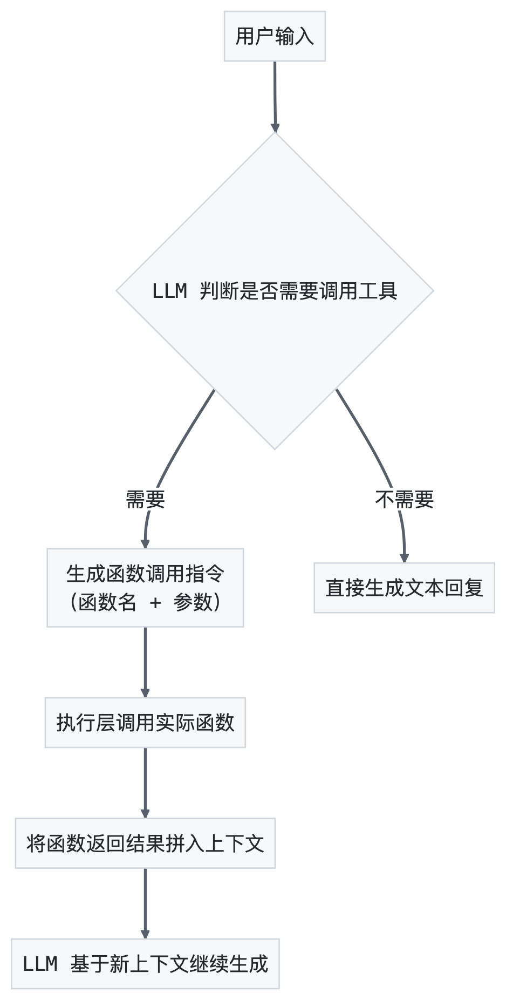
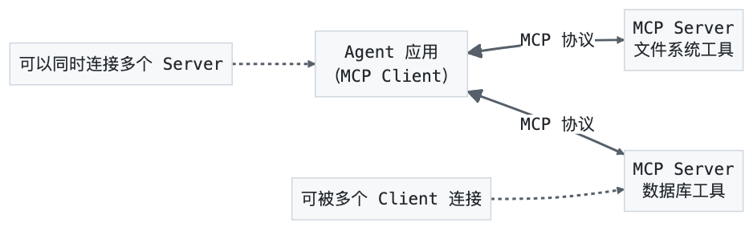

# 第4章 技术生态：工具链与基础设施

> 善假于物者，智之大者也。——《荀子·劝学》

在上一章中，我们完成了框架与模型的选型——骨架已成，大脑已就。但一个真正的 Agent，还需要"双手"来操控外部工具，需要"粮草"来存储长期记忆，需要"情报系统"来观测自身行为。工具链与基础设施，正是这三者的统称。Function Calling 和 MCP 协议赋予 Agent 与世界交互的能力，向量数据库为 Agent 提供持久化的知识记忆，可观测性工具让 Agent 的运行状态透明可控。它们不是"锦上添花"，而是 Agent 从"能对话"走向"能做事"的关键基础设施。本章将带你深入这三座技术堡垒，帮你理解原理、掌握选型、建立实战能力。

---

## 4.1 工具链生态

Agent 只有"大脑"还不够，还需要"双手"来与外部世界交互。Function Calling 和 MCP 协议就是 Agent 操控外部工具的两双手。这里先澄清一个常见的概念混淆：MCP 是 Agent 与外部工具服务通信的**协议标准**（Protocol），Function Calling 则是 LLM 输出结构化工具调用指令的**模型接口规范**（Model API）——两者处于不同层次，不能混为一谈。此外还有一个工程细节需要留意：工具的 JSON Schema 定义必须与实际函数签名严格一致，否则 LLM 生成的参数无法正确传递到函数中；实践中推荐用 Pydantic Model 自动生成 Schema，避免手写带来的脱节问题。

### 4.1.1 Function Calling：Agent 的第一双手

Function Calling（函数调用）是 LLM 与外部工具交互的基础协议。它的核心思路很简单：让模型在生成文本的同时，还能生成结构化的函数调用指令，由执行层负责实际调用。

**理解 Function Calling 的一个关键认知：** 它不是"模型学会了编程"，而是"模型学会了填表"。模型根据你提供的工具定义（函数名、参数描述），输出一份结构化的"调用申请表"（函数名 + 参数值），然后由你的执行层根据这张表去调用真正的函数。模型本身并不执行任何代码。

这个认知很重要——它意味着 Function Calling 的可靠性取决于两点：一是模型"填表"的准确度（选什么函数、填什么参数），二是你的工具定义写得好不好（描述是否清晰、参数是否明确）。

**工作流程：**



**关键概念：**
- **工具定义（Tool Definition）：** 告诉模型有哪些工具可用，每个工具接受什么参数。通常以 JSON Schema 格式描述。
- **工具调用（Tool Call）：** 模型输出的结构化调用指令，包含函数名和参数。
- **工具结果（Tool Result）：** 函数执行后返回的结果，被拼入对话上下文供模型参考。

```python
# Function Calling 示例（以 OpenAI API 为例）
from openai import OpenAI

client = OpenAI(api_key="your-api-key")

# 定义工具
tools = [
    {
        "type": "function",
        "function": {
            "name": "get_stock_price",
            "description": "获取指定股票的当前价格",
            "parameters": {
                "type": "object",
                "properties": {
                    "symbol": {
                        "type": "string",
                        "description": "股票代码，如 AAPL、GOOGL",
                    }
                },
                "required": ["symbol"],
            },
        },
    }
]

# 第一次调用：模型决定调用工具
response = client.chat.completions.create(
    model="gpt-4o",
    messages=[{"role": "user", "content": "苹果公司现在股价多少？"}],
    tools=tools,
)

# 检查模型是否调用了工具
if response.choices[0].message.tool_calls:
    tool_call = response.choices[0].message.tool_calls[0]
    # 执行实际函数，获取结果
    # stock_price = get_stock_price(symbol="AAPL")
    stock_price = "198.50 USD"  # 模拟结果

    # 第二次调用：将工具结果返回给模型
    response2 = client.chat.completions.create(
        model="gpt-4o",
        messages=[
            {"role": "user", "content": "苹果公司现在股价多少？"},
            response.choices[0].message,
            {
                "role": "tool",
                "tool_call_id": tool_call.id,
                "content": stock_price,
            },
        ],
        tools=tools,
    )
    print(response2.choices[0].message.content)
    # 输出类似
```

**各模型的 Function Calling 支持情况：**

| 模型 | 支持状态 | 特点 |
|------|---------|------|
| GPT-4o | 原生支持 | 最成熟，支持并行调用 |
| Claude | 原生支持 | 稳定，支持复杂参数 |
| Gemini | 原生支持 | 支持，但偶有格式偏差 |
| Qwen | 支持 | Qwen2.5+ 支持较好 |
| DeepSeek | 支持 | DeepSeek-V3 支持完善 |

### 4.1.2 MCP 协议：Agent 的第二双手

如果说 Function Calling 是 Agent 与工具交互的"方言"，那么 MCP（Model Context Protocol，模型上下文协议）就是一套"普通话"——一套标准化的工具接入协议。MCP 由 Anthropic 于 2024 年底发布，旨在解决 Agent 工具生态的碎片化问题：在 MCP 出现之前，每个框架都有自己的工具集成方式，开发者需要为每个框架单独适配工具；MCP 的目标是"写一次工具，所有框架都能用"。

**MCP 解决的核心问题：N×M 变成 N+M。** 没有 MCP 时，N 个 Agent 框架和 M 个工具之间需要 N×M 次适配。有了 MCP，框架和工具各自适配 MCP 协议一次，总共只需 N+M 次适配。这个数学上的简化，就是标准化的价值。

**MCP 的架构：** MCP 采用 Client-Server 架构。Agent 应用中嵌入 MCP Client，工具提供方实现 MCP Server。Client 和 Server 之间通过标准协议通信，支持三种传输方式：标准输入输出（stdio，适合本地工具）、HTTP+SSE（适合远程服务）、Streamable HTTP（适合流式场景）。



**MCP Server 提供三类能力：**
- **Tools（工具）：** 可被 Agent 调用的函数，如搜索、计算、API 调用。对应 Function Calling 中的"工具"概念。
- **Resources（资源）：** 可被 Agent 读取的数据，如文件内容、数据库记录。类似 REST API 的 GET 请求。
- **Prompts（提示词模板）：** 预定义的提示词模板，Agent 可以按需加载。这是 MCP 独有的概念，让工具提供方可以同时提供"怎么用这个工具"的指导。

**MCP 与 Function Calling 的关系：** 两者不是替代关系，而是互补关系。Function Calling 是 LLM 调用工具的接口规范（模型层），MCP 是工具接入和管理的协议标准（应用层）。一个完整的 Agent 系统中，MCP 负责发现和管理工具，Function Calling 负责让 LLM 生成工具调用指令。流程是：MCP Server 注册工具 → MCP Client 发现工具 → 转换为 Function Calling 格式 → LLM 生成调用指令 → 执行并返回结果。

MCP 的完整架构、Server 和 Client 开发将在第 8 章详解。这里先给出一个最小 MCP Server 的代码骨架，让你对"开发一个 MCP 工具"有直觉：

```python
# 最小 MCP Server 示例：一个天气查询工具
# pip install mcp

from mcp.server import Server
from mcp.types import Tool, TextContent

server = Server("weather-tool")

@server.list_tools()
async def list_tools():
    return [
        Tool(
            name="get_weather",
            description="获取指定城市的当前天气信息",
            inputSchema={
                "type": "object",
                "properties": {
                    "city": {"type": "string", "description": "城市名称"}
                },
                "required": ["city"]
            }
        )
    ]

@server.call_tool()
async def call_tool(name, arguments):
    if name == "get_weather":
        city = arguments["city"]
        # 实际项目中这里调用天气 API
        weather_data = fetch_weather(city)
        return [TextContent(type="text", text=f"{city}当前天气：{weather_data}")]

# 启动 Server（stdio 模式，适合本地开发）
# 实际运行
```

这个骨架展示了 MCP Server 的核心模式：**声明工具（list_tools）+ 实现工具（call_tool）**。任何 Agent 框架只要支持 MCP Client，就能自动发现并调用这个工具——不需要为每个框架单独写适配代码。这就是标准化的威力。

---

## 4.2 向量数据库选型

Agent 需要"记忆"，而向量数据库（Vector Database）就是 Agent 的长期记忆系统。无论是知识库检索、对话历史回溯，还是相似案例匹配，都离不开向量数据库。

### 4.2.1 为什么 Agent 需要向量数据库？

LLM 的上下文窗口有限（即使 200K token 也有上限），不可能把所有知识都塞进提示词。向量数据库通过"嵌入—存储—检索"的范式，让 Agent 按需获取知识：

1. **嵌入（Embedding）：** 将文本转换为高维向量，语义相近的文本在向量空间中距离更近。
2. **存储（Storage）：** 将向量及其元数据持久化存储。
3. **检索（Retrieval）：** 根据查询向量，在数据库中找到最相似的 k 个结果。

这就是 RAG（Retrieval-Augmented Generation，检索增强生成）的核心流程，也是 Agent 知识增强的基石。

### 4.2.2 四大向量数据库详解

在逐一介绍之前，先厘清一个常见误区：向量数据库不是"数据库的替代品"，而是"数据库的补充"。你不会用向量数据库存储用户订单或财务记录——那是关系型数据库的工作。向量数据库专门解决一个问题：在海量文本中，快速找到语义最相近的内容。它和传统数据库的关系是协作而非竞争。

#### Chroma：轻量之选

Chroma 是一款专注于开发者体验的轻量级向量数据库。它的口号是"AI 原生嵌入数据库"。

**核心特点：**
- **零配置启动：** `pip install chromadb` 即可使用，无需部署服务。
- **内置嵌入模型：** 默认使用 all-MiniLM-L6-v2 嵌入模型，无需额外配置。
- **开发友好：** Python API 简洁直观，5 行代码就能跑通 RAG 流程。
- **适合原型验证：** 快速验证想法，再迁移到生产级数据库。

```python
# Chroma 最小示例
# pip install chromadb

import chromadb

# 创建客户端（内存模式，也可指定持久化路径）
client = chromadb.Client()

# 创建集合
collection = client.create_collection(name="knowledge_base")

# 添加文档
collection.add(
    documents=["AI Agent 是能够自主执行任务的智能体", "向量数据库用于存储和检索语义嵌入"],
    ids=["doc1", "doc2"],
)

# 查询
results = collection.query(
    query_texts=["什么是 AI Agent?"],
    n_results=1,
)
print(results["documents"])
# 输出
```

**适用场景：** 快速原型、小规模实验、单机应用、学习 RAG。

#### Pinecone：云端之选

Pinecone 是一款全托管的云向量数据库，专注于生产级性能和零运维体验。

**核心特点：**
- **全托管：** 无需部署和维护，API 即服务。
- **高性能：** 毫秒级查询延迟，支持十亿级向量规模。
- **自动扩缩容：** 根据流量自动扩缩容，无需容量规划。
- **命名空间与元数据过滤：** 支持多维度的数据隔离和过滤。

**适用场景：** 生产环境、大规模应用、不想运维基础设施的团队。

**注意事项：** 数据存储在 Pinecone 云上，不适合数据主权要求严格的场景；成本随数据量和查询量增长。

#### Milvus：规模之王

Milvus 是一款开源的分布式向量数据库，由 Zilliz 公司维护，专为大规模向量检索设计。

**核心特点：**
- **分布式架构：** 支持水平扩展，可处理百亿级向量。
- **多种索引类型：** 支持 IVF、HNSW、DISKANN 等多种索引算法，可根据场景选择。
- **混合检索：** 支持向量检索与标量过滤的混合查询。
- **云原生：** 支持云原生部署，与 Kubernetes 深度集成。
- **企业级特性：** 支持多租户、RBAC、数据备份恢复等。

```python
# Milvus 最小示例（使用 Milvus Lite 本地模式）
# pip install pymilvus

from pymilvus import MilvusClient

# 创建客户端（本地模式）
client = MilvusClient("./milvus_demo.db")

# 创建集合
client.create_collection(
    collection_name="knowledge",
    dimension=384,  # 嵌入向量维度
)

# 插入数据
client.insert(
    collection_name="knowledge",
    data=[
        {"id": 1, "vector": [0.1] * 384, "text": "AI Agent 的核心是自主决策能力"},
        {"id": 2, "vector": [0.2] * 384, "text": "向量数据库支撑语义检索"},
    ],
)

# 查询
results = client.search(
    collection_name="knowledge",
    data=[[0.1] * 384],  # 查询向量
    output_fields=["text"],
    limit=1,
)
print(results)
```

**适用场景：** 大规模生产部署、数据主权要求高的企业、需要混合检索的复杂场景。

**注意事项：** 部署和运维复杂度较高；小规模场景"大材小用"。

#### Qdrant：精度之星

Qdrant 是一款用 Rust 编写的高性能向量数据库，在检索精度和性能之间取得了出色平衡。

**核心特点：**
- **Rust 原生：** 内存安全，性能卓越，无 GC 停顿。
- **HNSW 索引：** 默认使用 HNSW（Hierarchical Navigable Small World）索引算法，在召回率和查询速度间取得平衡。
- **过滤查询：** 支持丰富的元数据过滤条件，适合复杂查询。
- **量化压缩：** 支持标量量化、乘积量化等压缩技术，大幅降低内存占用。
- **单机与分布式：** 支持单机模式和分布式模式，灵活切换。

**适用场景：** 对检索精度要求高的场景、需要复杂过滤的生产环境、Rust 技术栈团队。

### 4.2.3 向量数据库对比总览

| 维度 | Chroma | Pinecone | Milvus | Qdrant |
|------|--------|----------|--------|--------|
| **部署方式** | 嵌入式 / Client-Server | 全托管云服务 | 自部署 / Zilliz Cloud | 自部署 / Qdrant Cloud |
| **编程语言** | Python | - | Go + C++ | Rust |
| **适用规模** | 百万级以下 | 十亿级 | 百亿级 | 亿级 |
| **检索性能** | 中 | 高 | 高 | 高 |
| **过滤能力** | 基础 | 元数据过滤 | 丰富 | 丰富 |
| **学习曲线** | 极低 | 低 | 高 | 中 |
| **运维复杂度** | 极低 | 零（托管） | 高 | 中 |
| **开源协议** | Apache 2.0 | 闭源 | Apache 2.0 | Apache 2.0 |
| **成本** | 免费 | 按量计费 | 免费（自部署） | 免费（自部署） |
| **数据主权** | 完全自主 | 云端 | 完全自主 | 完全自主 |

**选型建议：**
- **学习和原型阶段**——选 Chroma，零配置上手
- **快速上生产、不想运维**——选 Pinecone，全托管省心
- **大规模企业部署、数据主权**——选 Milvus，分布式扛得住
- **追求检索精度、Rust 技术栈**——选 Qdrant，性能与精度兼得

### 4.2.4 向量数据库选型的实战考量

选型表给出了方向，但实际项目中还有几个容易被忽略的细节：

**嵌入模型的选择比数据库更重要。** 向量数据库只是存储和检索向量的容器，真正决定检索质量的是嵌入模型。用同一个数据库，换一个更好的嵌入模型，检索质量可能提升 20% 以上。常见的嵌入模型选择：OpenAI 的 text-embedding-3-small/large（通用性好）、BGE 系列（中文场景强）、Cohere 的 embed-v3（多语言）。建议在选数据库之前，先花时间评估嵌入模型。

**混合检索正在成为标配。** 纯向量检索在"精确匹配"场景中表现不佳——比如用户搜索一个特定的产品编号，向量检索可能返回语义相近但编号不同的结果。混合检索（Hybrid Search）结合了向量检索和关键词检索，兼顾语义匹配和精确匹配。Milvus 和 Qdrant 都原生支持混合检索，Chroma 和 Pinecone 需要额外配置。

**数据规模决定架构选择。** 100 万条以下的向量，Chroma 单机模式足够；100 万到 1 亿条，Qdrant 或 Pinecone；1 亿条以上，Milvus 分布式集群。不要一上来就选最重的方案——过早优化是万恶之源。

**一个常见的迁移路径：** 很多团队的实际路径是 Chroma（原型验证）→ Qdrant（小规模生产）→ Milvus（大规模生产）。这个路径的好处是每一步的迁移成本都不高，因为主流向量数据库的 API 逻辑相似（创建集合→插入数据→查询），差异主要在部署和运维层面。

### 4.2.5 实测对比：Chroma vs Qdrant 的检索质量

理论分析之后，用一组实测数据说话。测试条件：10 万条中文技术文档（平均 500 字/条），使用 BGE-large-zh-v1.5 嵌入模型，查询 100 个真实用户问题。

| 指标 | Chroma (0.4.x) | Qdrant (1.8.x) |
|------|----------------|-----------------|
| **Recall@10** | 0.82 | 0.84 |
| **MRR** | 0.71 | 0.73 |
| **查询延迟 P50** | 12ms | 8ms |
| **查询延迟 P99** | 45ms | 18ms |
| **索引构建时间** | 3min | 5min |
| **内存占用** | 1.2GB | 0.8GB |
| **混合检索** | 需额外配置 | 原生支持 |

几个值得注意的发现：

**Qdrant 的 P99 延迟优势显著。** Chroma 在大部分查询中表现不错，但偶有"毛刺"——某些查询的延迟突然飙到 40ms 以上。Qdrant 的延迟更稳定。这在生产环境中很重要：用户感知到的不是平均延迟，而是最慢的那次。

**Recall 差距不大，但混合检索拉开差距。** 纯向量检索时，两者的 Recall 差距只有 2 个百分点。但开启混合检索后，Qdrant 的 Recall 跳到 0.91，而 Chroma 需要额外集成 BM25 检索才能达到类似效果，工程复杂度显著增加。

**Chroma 的优势在开发体验。** 从零开始到跑通第一个查询，Chroma 只需要 5 行代码、2 分钟；Qdrant 需要 Docker 启动、配置连接、理解 Collection 概念，大约 15 分钟。这个差距在原型阶段很重要——你不想在还没验证想法之前就花时间配数据库。

**结论：** 10 万条以下的中文场景，Chroma 和 Qdrant 的检索质量差距不大，选哪个都行。但如果你需要混合检索或更稳定的 P99 延迟，Qdrant 值得多花的那 10 分钟配置时间。

---

## 4.3 开发工具链

构建 Agent 不是"写完代码就完事"——你需要观察它的行为、诊断它的问题、优化它的性能。这就是 LLM 可观测性（Observability）工具的价值。

古人云，凡事预则立，不预则废。在 Agent 开发中，"预"不是预判所有问题，而是建立一套完善的观测体系，让问题无处藏身。

### 4.3.1 LLM 可观测性的三大支柱

LLM 应用的可观测性建立在三大支柱之上：

1. **Tracing（追踪）：** 记录 Agent 执行的每一步操作，包括 LLM 调用、工具执行、状态变化。像侦探追踪线索一样，Tracing 让你能回放 Agent 的完整执行路径。
2. **Evaluation（评估）：** 量化 Agent 的输出质量。不仅仅是"对不对"，还包括"好不好"、"稳不稳"、"贵不贵"。
3. **Prompt Management（提示词管理）：** 版本化管理提示词，支持 A/B 测试和渐进式优化。

**为什么传统监控不够用？** 传统应用的监控主要关注延迟、错误率、吞吐量等系统指标。但 LLM 应用有一个独特的挑战：它的输出不是确定性的——同一个输入，可能得到不同的输出，而且"对不对"需要语义层面的判断，而非简单的状态码检查。这就是为什么 LLM 可观测性需要专门的工具，而不能仅仅依赖 Prometheus + Grafana 这样的传统监控方案。

LLM 可观测性的核心问题是：**你无法优化你看不见的东西。** 一个 Agent 调用失败了，是模型的问题、提示词的问题、工具的问题、还是上下文太长的问题？没有 Tracing，你只能猜。有了 Tracing，你能看见。

### 4.3.2 LangSmith：全栈观测平台

LangSmith 是 LangChain 团队推出的 LLM 应用可观测性平台，与 LangChain / LangGraph 深度集成。

**核心能力：**
- **全链路追踪：** 自动追踪 LangChain / LangGraph 的每一步执行，可视化展示完整的调用链。
- **输入输出记录：** 记录每次 LLM 调用的输入、输出、token 用量和延迟。
- **评估框架：** 内置评估框架，支持自动评估和人工评估。
- **Prompt Hub：** 提示词版本管理，支持团队协作和 A/B 测试。
- ** Playground：** 在线调试提示词，无需写代码即可测试和优化。

```python
# LangSmith 集成示例
# 设置环境变量即可启用追踪
# export LANGSMITH_API_KEY="your-api-key"
# export LANGSMITH_TRACING="true"
# export LANGSMITH_PROJECT="my-agent-project"

import os
os.environ["LANGSMITH_API_KEY"] = "your-api-key"
os.environ["LANGSMITH_TRACING"] = "true"
os.environ["LANGSMITH_PROJECT"] = "my-agent-project"

# 之后正常使用 LangChain 即可，LangSmith 自动记录追踪数据
from langchain_openai import ChatOpenAI

llm = ChatOpenAI(model="gpt-4o")
response = llm.invoke("你好，请介绍一下 AI Agent")
# 此调用会自动出现在 LangSmith 控制台中
```

**优势：** 与 LangChain 生态无缝集成；功能最全面；社区最活跃。
**局限：** 与 LangChain 生态绑定较深；非 LangChain 项目需要手动埋点；商业版价格较高。

### 4.3.3 Weave：轻量追踪工具

Weave 是 Weights & Biases（W&B）推出的 LLM 可观测性工具，强调轻量和通用。

**核心能力：**
- **框架无关：** 不绑定任何特定框架，可以追踪任何 LLM 调用。
- **装饰器模式：** 通过 `@weave.op()` 装饰器，一行代码即可追踪任意函数。
- **评估工具：** 内置评估流水线，支持自定义评估指标。
- **与 W&B 集成：** 与 W&B 的实验管理平台深度集成，适合 ML 工程师。

```python
# Weave 集成示例
# pip install weave

import weave

# 初始化 Weave 项目
weave.init("my-agent-project")

# 使用装饰器追踪函数
@weave.op()
def generate_response(query: str) -> str:
    # 你的 LLM 调用逻辑
    return f"回答：{query} 的答案是..."

# 调用函数，Weave 自动追踪
result = generate_response("什么是 AI Agent?")
```

**优势：** 轻量、通用；W&B 生态加持；对非 LangChain 项目友好。
**局限：** 功能不如 LangSmith 全面；社区规模较小；评估框架较新。

### 4.3.4 Phoenix：开源可观测性利器

Phoenix 是 Arize AI 推出的开源 LLM 可观测性平台，强调本地部署和数据自主。

**核心能力：**
- **完全开源：** 所有功能开源，可自行部署，数据完全自主。
- **本地优先：** 默认本地运行，数据不出本机，安全合规。
- **自动埋点：** 支持 LangChain、LlamaIndex、OpenAI SDK 等框架的自动埋点。
- **嵌入分析：** 可视化分析嵌入向量的分布和漂移，帮助诊断检索质量。
- **实时监控：** 支持实时监控 LLM 应用的延迟、错误率和 token 用量。

```python
# Phoenix 集成示例
# pip install arize-phoenix

import phoenix as px

# 启动 Phoenix 本地服务
session = px.launch_app()

# 使用 OpenInference 自动追踪
# pip install openinference-instrumentation-openai
from openinference.instrumentation.openai import OpenAIInstrumentor
OpenAIInstrumentor().instrument()

# 之后正常使用 OpenAI SDK，Phoenix 自动记录追踪数据
from openai import OpenAI
client = OpenAI()
response = client.chat.completions.create(
    model="gpt-4o",
    messages=[{"role": "user", "content": "你好"}],
)

# 查看 Phoenix UI
print(f"Phoenix UI: {session.url}")
```

**优势：** 开源免费，数据自主；嵌入分析是独门利器；本地运行零延迟。
**局限：** 企业级功能（如 RBAC、团队协作）需要商业版；大规模部署需要自行扩展。

### 4.3.5 可观测性工具对比

| 维度 | LangSmith | Weave | Phoenix |
|------|-----------|-------|---------|
| **开源** | 否（有免费额度） | 否（有免费额度） | 是 |
| **数据存储** | LangSmith 云 | W&B 云 | 本地 |
| **框架绑定** | LangChain | 无 | 无（支持多框架） |
| **追踪能力** | 强 | 中 | 强 |
| **评估框架** | 强 | 强 | 中 |
| **嵌入分析** | 无 | 无 | 有（独门利器） |
| **Prompt 管理** | 有 | 有限 | 无 |
| **部署方式** | SaaS | SaaS | 本地 / 自部署 |
| **适合团队** | LangChain 用户 | ML 工程师 | 安全敏感团队 |

**选型建议：**
- **LangChain / LangGraph 项目**——选 LangSmith，一体化体验
- **非 LangChain 项目、已有 W&B 生态**——选 Weave，轻量通用
- **数据安全要求高、预算有限**——选 Phoenix，开源自主

---

## 习题

### 习题 1

使用 Chroma 和 Qdrant 分别搭建一个简单的 RAG 系统：
- 准备一份 1000 字以上的技术文档作为知识库
- 分别用两个数据库存储和检索
- 设计 5 个测试查询，比较两者的召回率和响应时间
- 分析差异原因（嵌入模型、索引算法、过滤能力等）
- 思考：在什么情况下，检索精度比检索速度更重要？反之呢？

### 习题 2

开发一个 MCP Server，提供以下三个工具：
- `web_search`：模拟网页搜索（可用固定数据集模拟）
- `summarize`：文本摘要
- `translate`：文本翻译

然后在任意支持 MCP 的客户端（如 Claude Desktop）中测试这三个工具。思考：
- MCP 协议相比直接 Function Calling，增加了什么抽象层？这个抽象层的价值是什么？
- 如果你需要把这个 MCP Server 从个人项目变成团队共享服务，需要考虑哪些问题？

### 习题 3

选择一个你之前开发的 Agent 应用，为其添加完整的可观测性：
- 使用 LangSmith 或 Phoenix 追踪 Agent 的执行过程
- 记录至少 10 次执行的追踪数据
- 分析数据，找出至少 2 个可以优化的点（如某步骤延迟过高、某工具调用失败率偏高、token 浪费等）
- 实施优化后，再记录 10 次执行数据，对比优化效果

提交：优化前后的追踪截图对比 + 500 字优化分析报告。

## 参考文献

1. Anthropic. "Model Context Protocol (MCP) Specification." 2024. https://spec.modelcontextprotocol.io/
2. OpenAI. "Function Calling Guide." https://platform.openai.com/docs/guides/function-calling
3. Johnson, J. et al. "Billion-scale similarity search with GPUs." IEEE T-BD 2021.

## 开放讨论

1. **MCP 的标准化前景：** MCP 协议能否成为 Agent 工具接入的事实标准？一个由 Anthropic 提出的协议，能否在 OpenAI、Google 等竞争对手的生态中被广泛采纳？标准化的背后，是技术共识还是商业博弈？

2. **开源模型的生产可用性：** Qwen 和 DeepSeek 的能力正在快速追赶闭源模型，但在稳定性、安全性和工具调用等"工程化"指标上仍存在差距。在你看来，开源模型要真正在生产环境中替代闭源模型，最关键的突破点是什么？

3. **可观测性的成本与收益：** 为 Agent 添加完整的可观测性（追踪、评估、Prompt 管理）需要额外投入开发时间和基础设施成本。在实际项目中，你如何决定可观测性的"投资力度"？有没有一个判断框架，帮你在"看得清"和"省成本"之间找到平衡？

---
