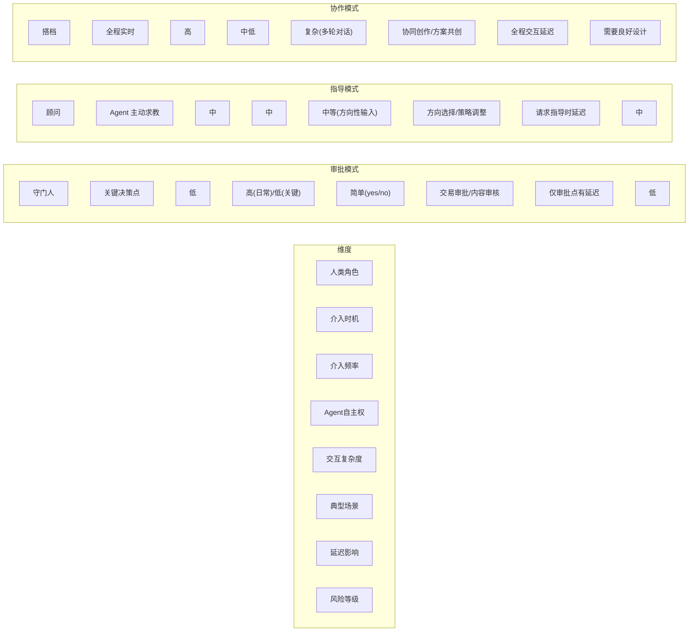
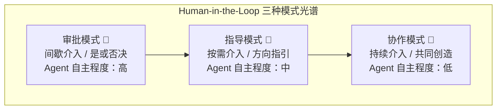
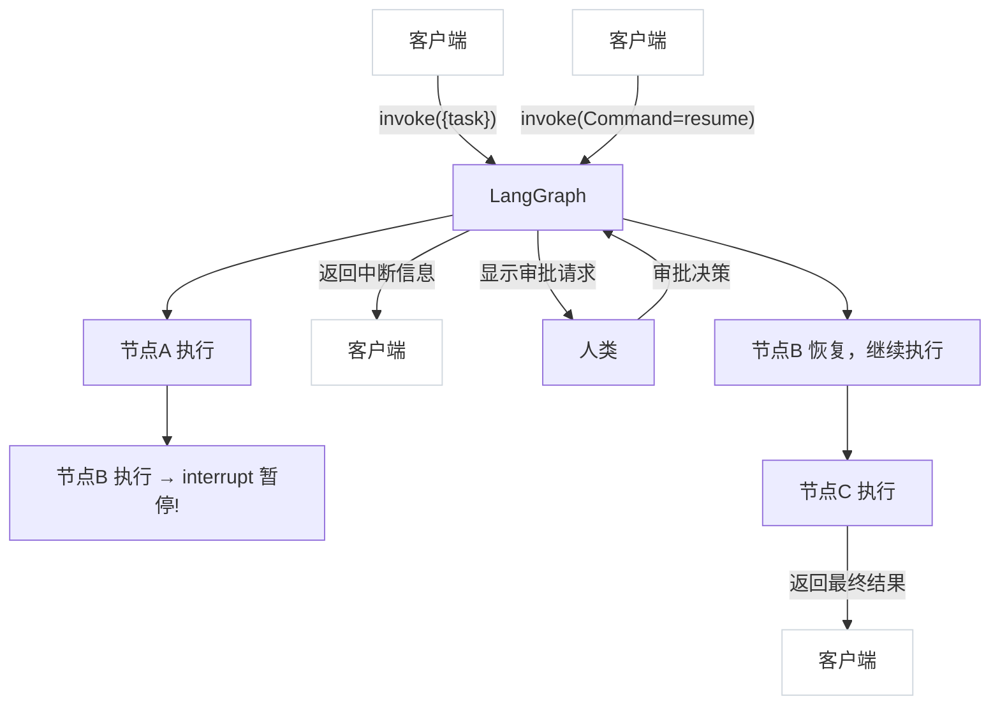
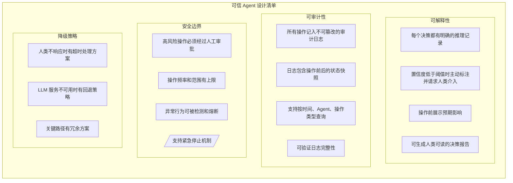
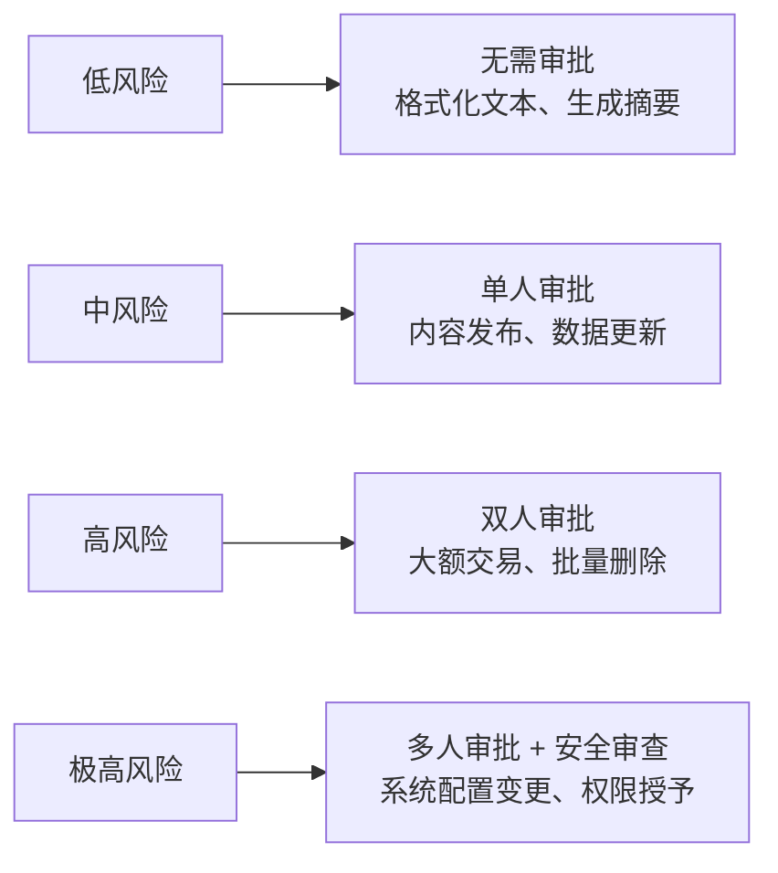
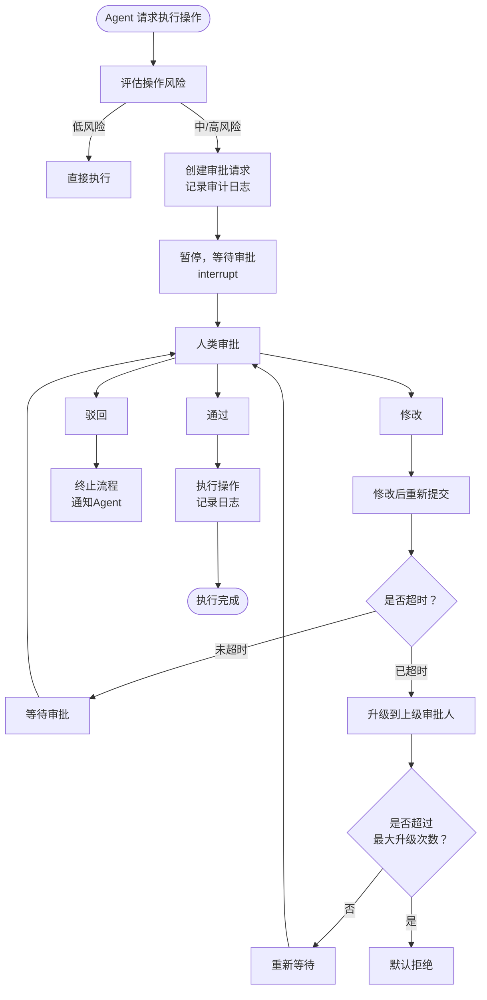

# 第13章 人机协作模式

> 君子慎独。——《礼记·中庸》

当 Agent 越来越聪明、越来越自主，一个根本性的问题浮出水面：谁来监督 Agent？在前面的章节里，我们构建了能自主规划、自主执行、自我纠错的智能体系统——它们可以浏览网页、调用 API、操作数据库，能力越来越强。但能力越强，失控的风险就越大。一个执行删除操作的 Agent 如果没有人工确认，一次"幻觉"就可能酿成灾难。人机协作（Human-Agent Collaboration）的核心命题就是：如何在 Agent 的自主性和人类控制之间找到平衡？本章将带你理解 Human-in-the-Loop 的三种模式（审批、监督、协作），掌握 LangGraph 的中断与恢复机制实现审批流，学会设计可信 Agent 和审计日志，并实战构建带审批流的内容生成 Agent。

孔子说"从心所欲不逾矩"，这恰恰是可信 Agent 的设计哲学——让 Agent 在规则框架内自由行动，既能"从心所欲"地发挥能力，又"不逾矩"地守住底线。Human-in-the-Loop（人机闭环，简称 HITL）就是那道"矩"。

本章我们将深入探讨 HITL 的三种模式、LangGraph 的中断与恢复机制、可信 Agent 的设计原则，并通过一个完整的审批流内容生成 Agent 将理论落地。

---

## 13.1 Human-in-the-Loop 的三种模式

Human-in-the-Loop 并非一个单一概念，而是一个光谱——从人类完全掌控到人类辅助监督，中间存在多种协作模式。在深入具体模式之前，有必要先正视一个现实问题：当审批请求过于频繁时，人类审批者会产生"审批疲劳"——不再仔细审查就直接点击"通过"，这比没有审批更危险，因为它制造了虚假的安全感；而如果所有操作都集中在同一个审批人身上，此人就会成为瓶颈，Agent 大量时间在等待审批，效率大幅下降。实践中需要实施分级审批（低风险操作免审或批量审批，高风险操作才逐条审核），设置多审批人轮值机制分散负载，并为审批设置自动降级规则（超时未审批的操作自动降级为安全版本，如"发布"降级为"保存为草稿"）。根据人类介入的时机和程度，我们可以将 HITL 归纳为三种经典模式：**审批模式（Approval）**、**指导模式（Guidance）** 和 **协作模式（Collaboration）**。

### 13.1.1 审批模式（Approval）

审批模式是最常见的 HITL 形式。Agent 自主完成大部分工作，只在关键决策点暂停，等待人类"签字放行"。

**核心特征：**
- 人类只在"检查站"介入，不做日常干预
- Agent 拥有完全的执行自主权，直到触碰审批门槛
- 典型场景：金融交易确认、数据删除操作、内容发布审核

**工作流程：**

```
用户请求 → Agent 规划 → Agent 执行步骤1 → Agent 执行步骤2
    → [审批点] 暂停 → 人类审批 → 通过/驳回 → 继续/回滚
```

举个例子：一个自动化交易 Agent，日常的小额交易可以自主完成，但超过 10 万元的交易必须经过基金经理审批。这就是审批模式——大部分时间 Agent 自主运行，关键时刻人类把关。

### 13.1.2 指导模式（Guidance）

指导模式下，人类不直接审批 Agent 的输出，而是在 Agent 执行过程中提供方向性指导。Agent 遇到不确定的情况时主动求教，人类充当"顾问"角色。

**核心特征：**
- 人类提供方向性输入，而非简单的 yes/no
- Agent 主动请求指导，而非被动等待审批
- 典型场景：创意写作的方向调整、研究方向选择、策略优先级排序

**工作流程：**

```
用户请求 → Agent 分析 → [不确定点] 请求指导
    → 人类提供方向 → Agent 据此调整 → 继续执行
    → [下一个不确定点] 请求指导 → ...
```

比如一个市场调研 Agent，在分析竞品时发现三个值得深挖的方向，但它不确定用户最关心哪个，于是主动提问："我发现了定价策略、用户增长、技术架构三个方向，您希望我优先深入哪个？"这就是指导模式——Agent 不是被动等待审批，而是主动寻求智慧。

### 13.1.3 协作模式（Collaboration）

协作模式是 HITL 的最高形态。人类和 Agent 像搭档一样共同完成任务，实时交互、互相补充。Agent 负责执行和信息整合，人类负责创意判断和战略决策。

**核心特征：**
- 人类和 Agent 实时互动，没有明确的"轮次"边界
- 双方都可以主动发起交互
- 典型场景：协同写作、方案共创、复杂问题联合攻关

**工作流程：**

```
用户提出主题 ⇄ Agent 生成初稿 ⇄ 人类修改润色
    ⇄ Agent 根据修改重新生成 ⇄ 人类再调整
    ⇄ ... → 最终成果
```

想象你在写一份商业计划书，Agent 帮你搜集数据、生成图表、草拟章节，你审阅后添加自己的见解和调整，Agent 再根据你的反馈优化——这就是协作模式的日常。

### 三种模式对比



> **对比要点**：审批模式适合高风险低频操作（如金融交易），指导模式适合需要专业判断的场景（如策略制定），协作模式适合创意类任务（如内容创作）。



> **选型原则**：风险容忍度越低 → 越靠近审批模式；任务复杂度越高 → 越靠近协作模式；效率要求越高 → 越减少人工介入。

选择哪种模式，取决于三个因素：**风险容忍度**（出错后果越严重，越需要审批）、**任务复杂度**（越复杂的任务，越需要指导或协作）、**效率要求**（对延迟越敏感，越应该减少人工介入）。

---

## 13.2 LangGraph 中的中断与恢复机制

理论讲完了，我们来看怎么在代码中实现 HITL。LangGraph 为此提供了一套优雅的机制：**interrupt（中断）** 和 **Command（命令）**。

### 13.2.1 interrupt：让 Agent 主动"喊停"

`interrupt` 是 LangGraph 提供的一个特殊函数，它可以在图的执行过程中暂停运行，将控制权交还给人类。它的本质是：**在当前节点挂起执行，保存状态，等待外部输入后恢复。**

```python
# interrupt 的基本用法
from langgraph.types import interrupt

def my_node(state):
    # Agent 执行到某个关键点
    result = do_something_risky(state)

    # 暂停执行，请求人类确认
    human_decision = interrupt({
        "question": "是否继续执行此操作？",
        "context": result,
        "options": ["approve", "reject", "modify"]
    })

    # 根据人类的输入决定后续行为
    if human_decision == "approve":
        return {"status": "approved", "result": result}
    elif human_decision == "reject":
        return {"status": "rejected"}
    else:
        return {"status": "modified", "feedback": human_decision}
```

这里有一个关键点需要理解：**interrupt 不是简单的断点，而是一个"请求-响应"机制。** 当 `interrupt` 被调用时：

1. 图的执行暂停，当前状态被持久化保存
2. `interrupt` 的参数（问题、上下文等）对外暴露
3. 人类做出决策后，通过 `Command` 将输入传回
4. 图从 `interrupt` 调用处恢复，`interrupt` 的返回值就是人类的输入

这意味着 `interrupt` 的返回值可以是任意类型——简单的布尔值、枚举选项、甚至是复杂的文本修改建议。这为三种 HITL 模式都提供了底层支持。

### 13.2.2 Command：人类的"遥控器"

`Command` 是人类向暂停中的 Agent 发送指令的方式。它不仅传递人类的决策，还可以同时更新图的状态。

```python
from langgraph.types import Command

# 简单的审批命令 —— 恢复执行，传递审批结果
cmd = Command(resume={"action": "approve"})

# 带状态更新的命令 —— 恢复执行的同时修改状态
cmd = Command(
    resume={"action": "modify", "suggestion": "请调整语气，更加正式"},
    update={"revision_count": 2}
)

# 使用 Command 恢复图的执行
result = graph.invoke(cmd, config={"configurable": {"thread_id": "thread-123"}})
```

`Command` 的两个核心参数：
- **resume**：传回给 `interrupt` 的值，即人类的决策
- **update**：可选，直接更新图的状态（不经过节点处理）

这种设计非常巧妙——`resume` 处理"对话"，`update` 处理"状态修正"，两者可以独立使用，也可以组合使用。

### 13.2.3 完整的中断-恢复流程

让我们把 `interrupt` 和 `Command` 组合起来，看一个完整的执行流程：



有几个重要的实现细节：

**持久化是关键**。中断后的状态必须被持久化保存，否则无法恢复。LangGraph 通过 Checkpoint 机制实现这一点——每次节点执行完毕，状态都会自动保存。中断时，就是从最近的 Checkpoint 恢复。

```python
from langgraph.checkpoint.memory import MemorySaver

# 使用内存检查点（生产环境应使用数据库持久化）
checkpointer = MemorySaver()

# 编译图时指定检查点
graph = app.compile(checkpointer=checkpointer)
```

**thread_id 是恢复的钥匙**。每个执行实例通过 `thread_id` 标识，`Command` 恢复时必须指定相同的 `thread_id`，LangGraph 才能找到正确的暂停点。

```python
config = {"configurable": {"thread_id": "task-001"}}

# 第一次调用 —— 执行到 interrupt 暂停
result = graph.invoke({"task": "删除过期数据"}, config)

# 人类审批后恢复 —— 必须使用相同的 thread_id
result = graph.invoke(Command(resume={"approved": True}), config)
```

**interrupt 可以多次调用**。一个图中可以有多个 `interrupt` 点，形成多级审批。每次调用 `invoke` 只会恢复到下一个 `interrupt` 或图结束。

### 13.2.4 interrupt 与传统条件边的区别

你可能会问：为什么不直接用条件边（conditional edge）+ 人类输入来实现审批？关键区别在于：

| 特性 | 条件边 + 人类输入 | interrupt + Command |
|------|-------------------|---------------------|
| 执行模型 | 同步阻塞 | 异步暂停-恢复 |
| 状态保存 | 需要自行管理 | 自动持久化 |
| 超时处理 | 需要自行实现 | 天然支持（状态已保存） |
| 多级审批 | 实现复杂 | 自然支持 |
| 审计追踪 | 需要额外设计 | Checkpoint 自带 |

简单来说，条件边方案假设人类输入总是"立即可得"，而 `interrupt` 方案承认人类决策需要时间——可能是几分钟，也可能是几天。这种设计更符合真实场景。

---

## 13.3 可信 Agent 设计

"君子慎独"——一个人在独处时也能谨慎自律，这是儒家修身的高标准。对 Agent 来说，"慎独"意味着即使没有人类实时监督，也应该保证行为的可解释和可审计。当没人看着你的时候，你做什么和有人看着时一样——这才是可信 Agent。

### 13.3.1 可解释性（Explainability）

可解释性要求 Agent 能够回答一个问题：**"你为什么这么做？"**

一个不可解释的 Agent 就像一个黑箱——输入进去，结果出来，但中间发生了什么完全不清楚。这在低风险场景或许可以接受，但在医疗诊断、法律决策、金融交易等高风险领域，黑箱是不可容忍的。

实现可解释性需要从三个层面着手：

**1. 决策日志（Decision Log）**

记录 Agent 每一步的决策原因：

```python
class DecisionLog:
    """决策日志：记录 Agent 的每一步决策及其原因"""

    def __init__(self):
        self.logs = []

    def record(self, step: str, decision: str, reasoning: str,
               confidence: float, alternatives: list = None):
        self.logs.append({
            "step": step,
            "decision": decision,
            "reasoning": reasoning,
            "confidence": confidence,
            "alternatives": alternatives or [],
            "timestamp": datetime.now().isoformat()
        })

    def explain(self) -> str:
        """生成完整的决策链解释"""
        explanation = []
        for log in self.logs:
            explanation.append(
                f"步骤 '{log['step']}': 决定 '{log['decision']}'，"
                f"原因：{log['reasoning']} "
                f"(置信度: {log['confidence']:.0%})"
            )
            if log["alternatives"]:
                explanation.append(
                    f"  其他候选方案: {', '.join(log['alternatives'])}"
                )
        return "\n".join(explanation)
```

**2. 思维链追踪（Chain-of-Thought Tracing）**

不仅要记录"做了什么"，还要记录"怎么想的"。现代 LLM 的思维链（Chain-of-Thought, CoT）本身就是一种可解释性工具——如果 Agent 是通过逐步推理得出结论的，那推理过程本身就是最好的解释。

**3. 影响力分析（Impact Analysis）**

在执行操作前，评估并展示该操作可能产生的影响：

```python
def analyze_impact(action: dict, current_state: dict) -> dict:
    """分析操作的影响范围和程度"""
    return {
        "action": action["name"],
        "affected_entities": compute_affected(action, current_state),
        "reversibility": assess_reversibility(action),
        "risk_level": compute_risk(action, current_state),
        "estimated_side_effects": predict_side_effects(action)
    }
```

### 13.3.2 可审计性（Auditability）

可审计性要求 Agent 的行为可以被事后追溯和审查。它与可解释性的区别在于：可解释性关注"为什么这样做"，可审计性关注"到底做了什么"——所有操作都有迹可循。

**审计日志的核心原则：**

1. **完整性**：每一个操作都必须被记录，不能有遗漏
2. **不可篡改**：日志一旦生成，不能被修改或删除
3. **可追溯**：每条日志都能关联到具体的执行实例和操作者
4. **可理解**：日志格式统一，便于人类和机器阅读

```python
import hashlib
import json
from datetime import datetime

class AuditLogger:
    """不可篡改的审计日志"""

    def __init__(self):
        self.entries = []
        self._chain_hash = "0" * 64  # 创世哈希

    def log(self, agent_id: str, action: str, details: dict,
            state_before: dict = None, state_after: dict = None):
        entry = {
            "id": len(self.entries) + 1,
            "timestamp": datetime.now().isoformat(),
            "agent_id": agent_id,
            "action": action,
            "details": details,
            "state_before": state_before,
            "state_after": state_after,
            "prev_hash": self._chain_hash
        }
        # 计算当前条目的哈希，形成链式结构
        entry_hash = hashlib.sha256(
            json.dumps(entry, sort_keys=True).encode()
        ).hexdigest()
        entry["hash"] = entry_hash
        self._chain_hash = entry_hash

        self.entries.append(entry)

    def verify_integrity(self) -> bool:
        """验证审计日志的完整性"""
        prev_hash = "0" * 64
        for entry in self.entries:
            if entry["prev_hash"] != prev_hash:
                return False
            computed = hashlib.sha256(
                json.dumps(
                    {k: v for k, v in entry.items() if k != "hash"},
                    sort_keys=True
                ).encode()
            ).hexdigest()
            if computed != entry["hash"]:
                return False
            prev_hash = entry["hash"]
        return True
```

这个审计日志采用了类似区块链的链式哈希结构——每条记录包含前一条的哈希值，任何篡改都会导致链断裂，从而被检测到。虽然在生产环境中你可能需要更专业的方案（如 Append-Only 数据库、WORM 存储），但核心思想是一样的：**让每一步都有据可查，且不可抵赖。**

### 13.3.3 可信 Agent 的设计清单

综合可解释性和可审计性，一个可信 Agent 应该满足以下条件：



---

## 13.4 审批流设计

审批流（Approval Flow）是 HITL 审批模式的工程化实现。它定义了哪些操作需要审批、由谁审批、审批的规则是什么。一个好的审批流设计，既要确保安全，又不能成为效率的瓶颈。

### 13.4.1 审批流的核心要素

一个完整的审批流需要定义以下要素：

**1. 审批触发条件（Trigger）**

什么时候需要审批？这不应该是一个硬编码的"总是"或"从不"，而是基于规则的动态判断：

```python
class ApprovalTrigger:
    """审批触发条件"""

    def __init__(self):
        self.rules = []

    def add_rule(self, condition, description, approver_role):
        self.rules.append({
            "condition": condition,
            "description": description,
            "approver_role": approver_role
        })

    def evaluate(self, action: dict, context: dict) -> list:
        """评估动作是否需要审批，返回需要审批的规则列表"""
        triggered = []
        for rule in self.rules:
            if rule["condition"](action, context):
                triggered.append(rule)
        return triggered


# 示例：内容发布审批规则
trigger = ApprovalTrigger()
trigger.add_rule(
    condition=lambda a, c: a["type"] == "publish",
    description="所有发布操作需要审批",
    approver_role="editor"
)
trigger.add_rule(
    condition=lambda a, c: a.get("risk_score", 0) > 0.7,
    description="高风险操作需要主管审批",
    approver_role="supervisor"
)
trigger.add_rule(
    condition=lambda a, c: a["type"] == "delete",
    description="删除操作需要管理员审批",
    approver_role="admin"
)
```

**2. 审批等级（Approval Level）**

不同风险级别的操作，需要的审批等级不同：



> **示例**：内容发布属中风险，需单人（编辑）审批；数据库批量删除属高风险，需双人（编辑+主管）联合审批。

**3. 审批超时与升级（Timeout & Escalation）**

如果审批人迟迟不响应怎么办？审批流必须有超时机制和升级策略：

```python
class ApprovalTimeout:
    """审批超时处理"""

    def __init__(self, timeout_minutes=30, max_escalations=2):
        self.timeout_minutes = timeout_minutes
        self.max_escalations = max_escalations

    def handle_timeout(self, approval_request):
        if approval_request.escalation_count < self.max_escalations:
            # 升级：通知更高级别的审批人
            return {
                "action": "escalate",
                "new_approver": self.get_next_level_approver(
                    approval_request.approver_role
                ),
                "reason": f"审批超时（{self.timeout_minutes}分钟），自动升级"
            }
        else:
            # 已达到最大升级次数，默认拒绝
            return {
                "action": "reject",
                "reason": "审批超时且已达到最大升级次数，默认拒绝"
            }
```

### 13.4.2 审批流流程图

下面是一个完整的审批流流程图，涵盖了从触发到最终执行的完整链路：



### 13.4.3 审批流对延迟的影响与优化

审批流不可避免地会增加 Agent 的响应延迟。一个没有审批的 Agent 可能 1 秒完成操作，加上审批可能需要 30 分钟甚至更久。理解和优化这种延迟至关重要。

**延迟来源分析：**


> **特点**：人类响应延迟占主导且不可控，优化重点应放在减少不必要的审批触发和缩短通知链路上。

**优化策略：**

1. **分级审批，减少不必要的审批**
   低风险操作免审批，只在真正需要人类判断时才暂停。这不是偷懒，而是把人类的注意力用在最关键的地方。

2. **预审批与批量审批**
   对于可预见的操作，提前获得审批授权。例如"接下来 1 小时内的格式化操作，预授权通过"。类似地，将多个同类操作合并为一次审批请求。

3. **异步通知与快速通道**
   审批请求通过即时通讯、短信等多通道通知审批人，缩短"审批人不知道需要审批"的时间窗口。对于紧急操作，提供"快速通道"——加急审批，同时提高审批等级。

4. **智能预测与预热**
   如果 Agent 能预判某个操作很可能需要审批，可以提前发起审批请求，与后续步骤并行处理。

5. **超时自动降级**
   审批超时后，不是简单地拒绝，而是降级处理——例如将"发布"操作降级为"保存为草稿"，既保障安全又不完全阻断流程。

```python
# 延迟优化策略的实现思路
class OptimizedApprovalFlow:
    def __init__(self):
        self.pre_approved = {}      # 预审批缓存
        self.batch_queue = []       # 批量审批队列
        self.timeout_handler = ApprovalTimeout()

    def should_interrupt(self, action, context):
        # 1. 检查预审批
        if self.check_pre_approved(action, context):
            return False  # 无需中断

        # 2. 检查是否可合并到批量审批
        if self.can_batch(action):
            self.batch_queue.append(action)
            if len(self.batch_queue) >= 5:  # 积累到5个一起审批
                return True
            return False

        # 3. 正常的审批触发判断
        return self.evaluate_risk(action, context) > self.risk_threshold

    def handle_resume(self, decision):
        if decision.get("action") == "approve_with_modification":
            # 修改后降级执行，例如"发布"→"保存为草稿"
            return self.downgrade_execution(decision)
        return decision
```

---

## 13.5 实战

理论铺垫得够多了，现在让我们动手构建一个完整的内容生成 Agent。它具备以下能力：

- 根据主题自动生成文章初稿
- 生成后暂停，请求人工审核
- 支持通过、驳回、修改三种审批结果
- 修改后可再次提交审批
- 全程记录审计日志

### 13.5.1 项目结构

```
ch13/
├── ch13.md                    # 本章文档
├── content_agent.py           # 完整的内容生成 Agent
├── requirements.txt           # 依赖
└── README.md                  # 说明
```

### 13.5.2 完整代码

下面是完整的可运行代码。代码文件头注明了版本信息。

**content_agent.py**

```python
# -*- coding: utf-8 -*-
# content_agent.py
# 版本: 1.0.0
# 第13章实战
# 依赖

import os
import json
import hashlib
from datetime import datetime
from typing import TypedDict, Annotated, Literal
from enum import Enum

from langgraph.graph import StateGraph, END, START
from langgraph.graph.message import add_messages
from langgraph.checkpoint.memory import MemorySaver
from langgraph.types import interrupt, Command
from langchain_openai import ChatOpenAI
from langchain_core.messages import HumanMessage, SystemMessage


# ============================================================
# 第一部分：审计日志
# ============================================================

class AuditLogger:
    """不可篡改的链式审计日志"""

    def __init__(self):
        self.entries = []
        self._chain_hash = "0" * 64

    def log(self, action: str, details: dict,
            agent_id: str = "content-agent"):
        entry = {
            "id": len(self.entries) + 1,
            "timestamp": datetime.now().isoformat(),
            "agent_id": agent_id,
            "action": action,
            "details": details,
            "prev_hash": self._chain_hash,
        }
        entry_hash = hashlib.sha256(
            json.dumps(entry, sort_keys=True, ensure_ascii=False).encode()
        ).hexdigest()
        entry["hash"] = entry_hash
        self._chain_hash = entry_hash
        self.entries.append(entry)
        print(f"[审计日志] #{entry['id']} {action}: "
              f"{json.dumps(details, ensure_ascii=False)[:100]}")

    def verify_integrity(self) -> bool:
        prev_hash = "0" * 64
        for entry in self.entries:
            if entry["prev_hash"] != prev_hash:
                return False
            computed = hashlib.sha256(
                json.dumps(
                    {k: v for k, v in entry.items() if k != "hash"},
                    sort_keys=True, ensure_ascii=False
                ).encode()
            ).hexdigest()
            if computed != entry["hash"]:
                return False
            prev_hash = entry["hash"]
        return True

    def get_report(self) -> str:
        lines = ["=" * 60, "审计日志报告", "=" * 60]
        for entry in self.entries:
            lines.append(
                f"#{entry['id']} [{entry['timestamp'][:19]}] "
                f"{entry['action']}"
            )
            lines.append(f"   详情: {json.dumps(entry['details'], ensure_ascii=False)}")
        lines.append(f"\n完整性校验: {'通过' if self.verify_integrity() else '未通过'}")
        return "\n".join(lines)


# 全局审计日志实例
audit_logger = AuditLogger()


# ============================================================
# 第二部分：状态定义
# ============================================================

class ApprovalStatus(str, Enum):
    PENDING = "pending"
    APPROVED = "approved"
    REJECTED = "rejected"
    NEEDS_REVISION = "needs_revision"


class ContentState(TypedDict):
    """内容生成 Agent 的状态"""
    messages: Annotated[list, add_messages]
    topic: str                  # 文章主题
    style: str                  # 写作风格
    draft: str                  # 当前草稿
    revision_count: int         # 修订次数
    approval_status: str        # 审批状态
    approval_feedback: str      # 审批反馈
    max_revisions: int          # 最大修订次数


# ============================================================
# 第三部分：节点函数
# ============================================================

# 初始化 LLM
llm = ChatOpenAI(
    model="gpt-4o-mini",
    temperature=0.7,
)


def plan_node(state: ContentState) -> dict:
    """规划节点：分析主题，制定写作计划"""
    topic = state["topic"]
    style = state.get("style", "专业且通俗")

    audit_logger.log("plan_start", {
        "topic": topic, "style": style
    })

    prompt = f"""你是一位资深内容策划师。请为以下主题制定一个简要的写作计划：

主题：{topic}
风格：{style}

请输出：
1. 核心观点（一句话）
2. 文章结构（3-5个要点）
3. 目标读者
4. 预期字数

格式简洁，直接输出内容。"""

    response = llm.invoke([HumanMessage(content=prompt)])

    audit_logger.log("plan_complete", {
        "topic": topic,
        "plan_preview": response.content[:200]
    })

    return {
        "messages": [response],
        "revision_count": 0,
        "approval_status": ApprovalStatus.PENDING.value,
    }


def write_node(state: ContentState) -> dict:
    """写作节点：根据计划生成文章初稿"""
    topic = state["topic"]
    style = state.get("style", "专业且通俗")
    plan = state["messages"][-1].content
    feedback = state.get("approval_feedback", "")
    revision_count = state.get("revision_count", 0)

    audit_logger.log("write_start", {
        "topic": topic,
        "revision_count": revision_count,
        "has_feedback": bool(feedback)
    })

    if feedback:
        # 基于反馈修订
        prompt = f"""你是一位经验丰富的作者。请根据编辑的反馈修订文章。

主题：{topic}
风格：{style}
修订次数：第 {revision_count + 1} 次修订

编辑反馈：
{feedback}

请修订文章，确保：
1. 充分回应编辑的每一条反馈
2. 保持文章的连贯性和逻辑性
3. 维持原有风格

直接输出修订后的完整文章。"""
    else:
        # 首次撰写
        prompt = f"""你是一位经验丰富的作者。请根据以下计划撰写文章。

主题：{topic}
风格：{style}

写作计划：
{plan}

要求：
1. 结构清晰，逻辑连贯
2. 语言{style}
3. 包含具体的例子或数据支撑
4. 字数 800-1500 字

直接输出文章内容。"""

    response = llm.invoke([HumanMessage(content=prompt)])

    audit_logger.log("write_complete", {
        "topic": topic,
        "revision_count": revision_count + 1,
        "draft_length": len(response.content)
    })

    return {
        "messages": [response],
        "draft": response.content,
        "revision_count": revision_count + 1,
    }


def review_node(state: ContentState) -> dict:
    """审批节点：暂停执行，请求人工审批"""
    draft = state["draft"]
    topic = state["topic"]
    revision_count = state["revision_count"]
    max_revisions = state.get("max_revisions", 3)

    audit_logger.log("review_interrupt", {
        "topic": topic,
        "revision_count": revision_count,
        "draft_length": len(draft)
    })

    # 构建审批请求信息
    review_info = {
        "type": "content_approval",
        "topic": topic,
        "draft_preview": draft[:500] + ("..." if len(draft) > 500 else ""),
        "revision_count": revision_count,
        "max_revisions": max_revisions,
        "message": (
            f"文章《{topic}》第 {revision_count} 版草稿已生成，"
            f"请审核。\n\n"
            f"草稿预览：\n{draft[:500]}...\n\n"
            f"请选择：approve（通过）/ reject（驳回）/ "
            f"revise（需要修改，请附修改意见）"
        )
    }

    # 中断执行，等待人工审批
    human_decision = interrupt(review_info)

    # 根据审批结果更新状态
    action = human_decision.get("action", "reject")
    feedback = human_decision.get("feedback", "")

    if action == "approve":
        new_status = ApprovalStatus.APPROVED.value
    elif action == "reject":
        new_status = ApprovalStatus.REJECTED.value
    else:
        new_status = ApprovalStatus.NEEDS_REVISION.value

    audit_logger.log("review_decision", {
        "action": action,
        "status": new_status,
        "has_feedback": bool(feedback),
        "feedback_preview": feedback[:200] if feedback else ""
    })

    return {
        "approval_status": new_status,
        "approval_feedback": feedback,
    }


def publish_node(state: ContentState) -> dict:
    """发布节点：审批通过后执行发布"""
    draft = state["draft"]
    topic = state["topic"]

    audit_logger.log("publish", {
        "topic": topic,
        "final_length": len(draft),
        "revision_count": state["revision_count"]
    })

    publish_result = (
        f"文章《{topic}》已通过审批并发布！\n\n"
        f"最终版本字数：{len(draft)}\n"
        f"修订次数：{state['revision_count']}\n\n"
        f"--- 文章正文 ---\n{draft}"
    )

    return {
        "messages": [HumanMessage(content=publish_result)],
    }


def reject_node(state: ContentState) -> dict:
    """驳回节点：审批被驳回"""
    topic = state["topic"]
    feedback = state.get("approval_feedback", "无具体原因")

    audit_logger.log("reject", {
        "topic": topic,
        "feedback": feedback
    })

    return {
        "messages": [HumanMessage(
            content=f"文章《{topic}》已被驳回。原因：{feedback}"
        )],
    }


# ============================================================
# 第四部分：条件边
# ============================================================

def should_continue_after_review(state: ContentState) -> str:
    """审批后的路由判断"""
    status = state["approval_status"]

    if status == ApprovalStatus.APPROVED.value:
        return "publish"
    elif status == ApprovalStatus.REJECTED.value:
        return "reject"
    elif status == ApprovalStatus.NEEDS_REVISION.value:
        max_revisions = state.get("max_revisions", 3)
        if state["revision_count"] >= max_revisions:
            audit_logger.log("max_revisions_reached", {
                "revision_count": state["revision_count"],
                "max_revisions": max_revisions
            })
            return "reject"
        return "revise"
    else:
        return "reject"


# ============================================================
# 第五部分：构建图
# ============================================================

def build_content_agent():
    """构建带审批流的内容生成 Agent"""

    # 创建状态图
    workflow = StateGraph(ContentState)

    # 添加节点
    workflow.add_node("plan", plan_node)
    workflow.add_node("write", write_node)
    workflow.add_node("review", review_node)
    workflow.add_node("publish", publish_node)
    workflow.add_node("reject", reject_node)

    # 添加边
    workflow.add_edge(START, "plan")
    workflow.add_edge("plan", "write")
    workflow.add_edge("write", "review")

    # 审批后的条件路由
    workflow.add_conditional_edges(
        "review",
        should_continue_after_review,
        {
            "publish": "publish",
            "reject": "reject",
            "revise": "write",
        }
    )

    workflow.add_edge("publish", END)
    workflow.add_edge("reject", END)

    # 编译图（带检查点以支持中断恢复）
    checkpointer = MemorySaver()
    app = workflow.compile(checkpointer=checkpointer)

    return app


# ============================================================
# 第六部分：运行示例
# ============================================================

def run_interactive():
    """交互式运行内容生成 Agent"""

    print("=" * 60)
    print("带审批流的内容生成 Agent")
    print("=" * 60)

    # 构建 Agent
    app = build_content_agent()

    # 用户输入
    topic = input("\n请输入文章主题: ").strip()
    style = input("请输入写作风格（默认：专业且通俗）: ").strip() or "专业且通俗"

    # 配置线程 ID
    thread_id = f"content-{datetime.now().strftime('%Y%m%d%H%M%S')}"
    config = {"configurable": {"thread_id": thread_id}}

    print(f"\n开始生成文章《{topic}》...")
    print(f"线程ID: {thread_id}\n")

    # 第一次调用
    result = app.invoke(
        {
            "topic": topic,
            "style": style,
            "messages": [],
            "draft": "",
            "revision_count": 0,
            "approval_status": ApprovalStatus.PENDING.value,
            "approval_feedback": "",
            "max_revisions": 3,
        },
        config=config,
    )

    # 检查是否在中断点暂停
    state = app.get_state(config)
    while state.next:  # 还有未执行的节点
        # 显示中断信息
        if state.tasks:
            for task in state.tasks:
                if hasattr(task, "interrupts") and task.interrupts:
                    for intr in task.interrupts:
                        info = intr.value
                        print("\n" + "=" * 60)
                        print("审批请求")
                        print("=" * 60)
                        print(info.get("message", ""))
                        print("=" * 60)

        # 获取人类决策
        print("\n请选择审批操作：")
        print("  1. approve  - 通过")
        print("  2. reject   - 驳回")
        print("  3. revise   - 需要修改")
        choice = input("\n您的选择 (1/2/3): ").strip()

        if choice == "1":
            decision = {"action": "approve", "feedback": ""}
        elif choice == "2":
            reason = input("驳回原因: ").strip()
            decision = {"action": "reject", "feedback": reason}
        elif choice == "3":
            feedback = input("修改意见: ").strip()
            decision = {"action": "revise", "feedback": feedback}
        else:
            print("无效选择，默认驳回")
            decision = {"action": "reject", "feedback": "无效的审批操作"}

        # 恢复执行
        result = app.invoke(
            Command(resume=decision),
            config=config,
        )

        # 更新状态
        state = app.get_state(config)

    # 输出最终结果
    print("\n" + "=" * 60)
    print("最终结果")
    print("=" * 60)

    # 获取完整状态
    final_state = app.get_state(config)
    for msg in final_state.values.get("messages", []):
        if hasattr(msg, "content") and isinstance(msg.content, str):
            print(msg.content)

    # 输出审计报告
    print("\n" + audit_logger.get_report())

    # 验证审计日志完整性
    is_valid = audit_logger.verify_integrity()
    print(f"\n审计日志完整性: {'✓ 通过' if is_valid else '✗ 未通过'}")


def run_programmatic_example():
    """编程式运行示例（无需交互，适合测试和演示）"""

    print("=" * 60)
    print("编程式运行：内容生成 Agent 审批流演示")
    print("=" * 60)

    app = build_content_agent()
    thread_id = "demo-thread-001"
    config = {"configurable": {"thread_id": thread_id}}

    # ---- 第一步
    print("\n[步骤1] 启动 Agent，生成文章初稿...")
    result = app.invoke(
        {
            "topic": "AI Agent 的未来发展趋势",
            "style": "专业且通俗",
            "messages": [],
            "draft": "",
            "revision_count": 0,
            "approval_status": ApprovalStatus.PENDING.value,
            "approval_feedback": "",
            "max_revisions": 3,
        },
        config=config,
    )

    # 检查中断
    state = app.get_state(config)
    print(f"[中断点] 当前节点: {state.next}")

    # ---- 第二步
    print("\n[步骤2] 审批人：需要修改，补充实际案例...")
    result = app.invoke(
        Command(resume={
            "action": "revise",
            "feedback": "请补充2-3个具体的AI Agent落地案例，增强说服力"
        }),
        config=config,
    )

    # 再次检查中断
    state = app.get_state(config)
    print(f"[中断点] 当前节点: {state.next}")

    # ---- 第三步：审批通过 ----
    print("\n[步骤3] 审批人：修改后通过！")
    result = app.invoke(
        Command(resume={"action": "approve", "feedback": ""}),
        config=config,
    )

    # 输出最终状态
    final_state = app.get_state(config)
    print("\n" + "=" * 60)
    print("最终状态")
    print("=" * 60)
    print(f"审批状态: {final_state.values.get('approval_status')}")
    print(f"修订次数: {final_state.values.get('revision_count')}")
    draft = final_state.values.get('draft', '')
    print(f"文章长度: {len(draft)} 字")
    print(f"文章预览: {draft[:300]}...")

    # 审计报告
    print("\n" + audit_logger.get_report())


# ============================================================
# 主入口
# ============================================================

if __name__ == "__main__":
    import sys

    if len(sys.argv) > 1 and sys.argv[1] == "--demo":
        # 编程式演示
        run_programmatic_example()
    else:
        # 交互式运行
        run_interactive()
```

### 13.5.3 代码解读

让我们逐段拆解这个 Agent 的设计思路。

**状态设计。** `ContentState` 是整个 Agent 的数据骨架。注意几个关键字段：`approval_status` 用枚举值跟踪审批状态，`revision_count` 控制修订轮次上限，`approval_feedback` 传递人类反馈。这三个字段构成了审批流的核心信息通道。

**中断点设计。** `review_node` 是唯一的 `interrupt` 调用点。它将草稿预览、修订次数等信息打包成结构化数据传给 `interrupt`，让审批人获得充分上下文。审批人返回的 `decision` 字典包含 `action` 和 `feedback`，清晰明确。

**条件路由。** `should_continue_after_review` 函数根据审批结果决定走向：通过则发布，驳回则终止，需要修改则回到 `write` 节点。同时设置了修订上限——超过 3 次修订仍不满意，自动驳回，避免无限循环。

**审计日志。** 全局 `audit_logger` 记录了从规划到发布的每一步操作，采用链式哈希保证不可篡改。在任何争议场景下，审计日志都可以作为"铁证"。

**两种运行模式。** `run_interactive` 是交互式运行，适合实际使用；`run_programmatic_example` 是编程式演示，通过代码模拟审批人的决策，适合测试和演示。两种模式的核心差异仅在于审批输入的来源——一个来自人类输入，一个来自代码模拟，Agent 本身完全相同。

### 13.5.4 运行方式

```bash
# 安装依赖
pip install -r requirements.txt

# 设置 OpenAI API Key
export OPENAI_API_KEY="your-api-key"

# 交互式运行
python content_agent.py

# 编程式演示（无需手动输入）
python content_agent.py --demo
```

---

## 进阶拓展

### 从审批流到完整的人机协作平台

本章的审批流是一个"最小可用"的实现。在真实的生产环境中，人机协作平台还需要考虑：

**多角色协作。** 一个内容生产流程可能涉及作者、编辑、法务、运营等多个角色，每个角色有不同的审批权限和关注点。LangGraph 的状态图天然支持这种多角色流程——你只需要添加更多的审批节点和条件边。

**异步协作。** 真实场景中，审批人可能不会即时响应。你需要超时机制（本章已展示）、通知机制（邮件、短信、IM 推送）、以及升级机制（超时后自动升级到上级审批人）。

**并发控制。** 多个 Agent 实例可能同时请求审批，你需要一个审批队列来管理和优先级排序。

**回滚与补偿。** 审批通过后的操作如果失败，需要有回滚或补偿机制。例如文章发布失败，应该回退到"待发布"状态，而不是丢失内容。

### 审批流与 RAG 的结合

审批流不仅限于内容审核，还可以与检索增强生成（RAG）结合。例如，当 Agent 检索到的信息置信度较低时，自动触发人工确认；当检索结果存在矛盾时，请求人类判断哪个来源更可信。这种"检索质量驱动的审批触发"是 HITL 的高级应用。

---

## 习题

1. **多级审批实现。** 在本章代码基础上，实现一个多级审批流：低风险内容只需编辑审批，中风险内容需要编辑+主管审批，高风险内容需要编辑+主管+法务审批。要求使用多个 `interrupt` 点，并实现"任一级别驳回即终止"的逻辑。

2. **超时自动升级。** 为审批节点增加超时机制：如果 10 分钟内未获得审批，自动升级到上级审批人；如果 30 分钟内仍未审批，默认拒绝。提示：可以使用 LangGraph 的后台任务或在状态中记录审批请求时间。

3. **审批流仪表盘。** 设计一个审批流状态仪表盘的数据模型（不需要实现 UI），要求能够展示：待审批任务列表、各状态任务数量统计、平均审批时长、审批通过率。用 Python 数据类或 Pydantic Model 定义数据结构。

## 参考文献

1. LangGraph Human-in-the-Loop Documentation. https://langchain-ai.github.io/langgraph/
2. Wu, J. et al. "AI Chains: Transparent and Controllable Human-AI Interaction by Chaining Large Language Model Prompts." CHI 2022.

## 开放讨论

1. **自主权的边界在哪里？** 如果 Agent 越来越智能，人类审批会不会变成纯粹的"橡皮图章"？在什么情况下，我们应该限制 Agent 的自主权，即使它的决策准确率已经超过人类？

2. **协作模式下的责任归属。** 在协作模式中，人和 Agent 共同完成一个成果。如果成果出现问题（如文章有事实错误、交易造成损失），责任该如何划分？技术设计如何帮助厘清责任？

3. **审批疲劳。** 当审批请求过于频繁时，人类容易产生"审批疲劳"——不仔细审查就直接通过。如何从系统设计的角度缓解审批疲劳？分级审批和智能过滤能否真正解决这个问题？

---
