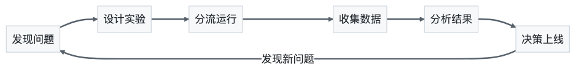
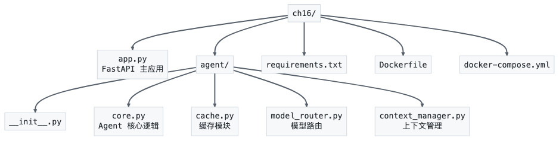

# 第16章 部署与运维——让 Agent 走向生产环境

> 胜兵先胜而后求战，败兵先战而后求胜。——《孙子兵法·形篇》

你在本地跑通了一个 Agent，它能搜索、能推理、能调用工具，看起来无所不能。但当你要把它放到生产环境时，一连串问题扑面而来：怎么部署？怎么控制成本？怎么监控？怎么保证稳定？这一章，我们就来把 Agent 从"能跑"变成"能扛"。本章将带你掌握 Agent 的三种部署架构（同步 API、异步流式、事件驱动），学会成本优化策略（模型选择、缓存、批处理），理解可观测性三支柱（日志、追踪、指标）在 Agent 运维中的应用，并实战构建生产级 Agent API 服务。

---

## 16.1 Agent 部署架构

### 16.1.1 三种主流部署模式

把 Agent 部署到生产环境，本质上是在回答一个问题：**用户如何与 Agent 交互？** 目前有三种主流模式，各有适用场景。

**模式一：同步 API 服务**

最常见的部署方式。客户端发一个请求，Agent 处理完毕后返回结果。适合任务明确、响应时间可控的场景，比如文档摘要、数据提取。

```
客户端 → HTTP 请求 → API 服务 → Agent 执行 → 返回结果
```

优点是简单直接，缺点是 Agent 推理可能耗时较长，客户端会一直等待。如果 Agent 需要调用多个工具、多轮思考，几十秒甚至几分钟的等待时间会让用户体验大打折扣。

**模式二：流式响应（Streaming）**

流式响应是解决"等太久"问题的利器。Agent 一边思考，一边把中间结果推送给客户端，用户能看到 Agent 的推理过程，感知上快了很多。

```
客户端 → HTTP 请求 → API 服务 → Agent 逐步执行
                                    ↓ Token 1
                                    ↓ Token 2
                                    ↓ Token 3
                                    ↓ ...完成
```

从技术实现看，流式响应通常基于 Server-Sent Events（SSE）或 WebSocket。SSE 更轻量，适合服务端单向推送；WebSocket 支持双向通信，适合需要中途干预的场景。

**模式三：Serverless 无服务器**

Serverless 模式把 Agent 部署为函数，按调用次数付费，不用时自动缩容到零。适合流量波动大、调用频率不固定的场景，比如内部工具、低频自动化任务。

```
事件触发（HTTP/定时/消息队列）→ Serverless 函数 → Agent 执行 → 返回结果
```

Serverless 的核心优势是成本——不用时不花钱。但它也有明显的限制：执行时间受限（通常 5-15 分钟）、冷启动延迟、状态管理困难。对于需要长时运行的 Agent，Serverless 并不是最佳选择。

### 16.1.2 部署架构对比

下面这张表能帮你快速决策：

| 维度 | 同步 API | 流式响应 | Serverless |
|------|----------|----------|------------|
| 响应体验 | 等待完整结果 | 逐步输出，感知快 | 等待完整结果 |
| 实现复杂度 | 低 | 中 | 中 |
| 成本模型 | 固定服务器费用 | 固定服务器费用 | 按调用计费 |
| 长时任务 | 不适合 | 适合 | 受限 |
| 冷启动 | 无 | 无 | 有延迟 |
| 适用场景 | 快速任务 | 对话/推理 | 低频/波动流量 |
| 代表框架 | FastAPI/Flask | FastAPI+SSE | AWS Lambda/Cloudflare Workers |

### 16.1.3 架构选型的决策树

怎么选？可以按这个逻辑来：

1. 任务是否需要超过 30 秒？
   - 不需要 → 同步 API 足矣
   - 需要 → 继续判断
2. 用户是否需要看到中间过程？
   - 需要 → 流式响应
   - 不需要 → 继续判断
3. 流量是否波动大、低频为主？
   - 是 → Serverless
   - 否 → 同步 API + 后台任务队列

实际项目中，这三种模式并非互斥。一个成熟的生产系统可能同时使用同步 API 处理轻量查询、流式响应处理对话、Serverless 处理定时任务。

### 16.1.4 容器化部署：Docker 是标配

无论选择哪种模式，容器化部署都是现代生产环境的标准实践。一个典型的 Agent 服务 Dockerfile 结构如下：

```dockerfile
FROM python:3.11-slim

WORKDIR /app
COPY requirements.txt .
RUN pip install --no-cache-dir -r requirements.txt

COPY . .

EXPOSE 8000
CMD ["uvicorn", "app:app", "--host", "0.0.0.0", "--port", "8000"]
```

容器化的好处不只是"环境一致"，更重要的是它让水平扩展变得简单——用 Kubernetes 或 Docker Compose 就能快速增加实例数，应对流量高峰。

---

## 16.2 成本优化

### 16.2.1 Token 计费：算清楚每一分钱

在生产环境运行 Agent，Token 就是钱。我们先用一个具体例子来算算账。

假设你构建了一个客服 Agent，使用 GPT-4o 模型，每天处理 1000 次对话，每次对话平均 5 轮交互。我们来算算月成本：

**单次对话的 Token 消耗估算：**

| 项目 | 数量 | 单价 | 小计 |
|------|------|------|------|
| 系统提示词 | ~500 tokens | - | - |
| 单轮用户输入 | ~100 tokens | - | - |
| 单轮 Agent 回复 | ~300 tokens | - | - |
| 5 轮对话输入（累积上下文） | ~500+100+200+100+400+100+600+100+800 = 2900 tokens | - | - |
| 5 轮对话输出 | ~300×5 = 1500 tokens | - | - |
| **单次对话输入总计** | **~3400 tokens** | **$2.50/1M tokens** | **$0.0085** |
| **单次对话输出总计** | **~1500 tokens** | **$10.00/1M tokens** | **$0.0150** |
| **单次对话成本** | - | - | **$0.0235** |

**月成本计算：**

| 项目 | 计算 | 金额 |
|------|------|------|
| 日成本 | $0.0235 × 1000 = $23.5 | $23.5/天 |
| 月成本（30天） | $23.5 × 30 | **$705/月** |

一个月 705 美元，看起来还行。但如果日对话量增长到 10000 次，月成本直接飙到 7050 美元。如果不做优化，成本会随着规模线性增长。

### 16.2.2 Token 用量控制：四两拨千斤

控制 Token 用量，核心思路有三个：**减少输入、压缩中间、限制输出**。

**策略一：精简提示词**

系统提示词是每轮对话都要发送的，精简它的效果最显著。来看对比：

```
# 冗长版（800 tokens）
你是一个专业的客服助手。你的职责是回答用户关于产品的问题，
包括但不限于产品功能、价格、退换货政策、配送信息等。
当用户提出问题时，你需要先理解问题的核心意图，
然后从知识库中查找相关信息，最后组织成清晰的回答。
如果无法找到答案，请诚实告知用户并建议联系人工客服。
回答时请注意语气友好、专业，避免使用过于技术化的术语......

# 精简版（150 tokens）
你是客服助手。查知识库回答用户问题。找不到答案时建议联系人工客服。
保持友好专业，避免术语。
```

效果：系统提示词从 800 tokens 降到 150 tokens，每轮对话省 650 tokens，5 轮对话省 3250 tokens。按上面的计费模型，单次对话成本从 $0.0235 降到约 $0.016，降幅超过 30%。

**策略二：上下文窗口管理**

对话轮次越多，累积的上下文越长，Token 消耗指数增长。解决方案是对历史对话进行摘要压缩：

```python
# 版本: ch16_context_manager.py v1.0
class ContextManager:
    """对话上下文管理器，控制 Token 用量"""

    def __init__(self, max_tokens: int = 4000, summary_threshold: float = 0.7):
        self.max_tokens = max_tokens
        self.summary_threshold = summary_threshold
        self.messages = []

    def add_message(self, role: str, content: str):
        self.messages.append({"role": role, "content": content})

    def get_messages(self, llm_client) -> list:
        """获取消息列表，超过阈值时自动摘要压缩"""
        current_tokens = self._estimate_tokens()

        if current_tokens > self.max_tokens * self.summary_threshold:
            # 保留最近2轮对话，对更早的对话做摘要
            recent = self.messages[-4:]  # 最近2轮（每轮1问1答）
            older = self.messages[:-4]

            if older:
                summary = self._summarize(older, llm_client)
                self.messages = [
                    {"role": "system", "content": f"之前对话摘要：{summary}"},
                    *recent
                ]

        return self.messages

    def _estimate_tokens(self) -> int:
        """粗略估算 Token 数（中文约1.5字/token）"""
        total_chars = sum(len(m["content"]) for m in self.messages)
        return int(total_chars / 1.5)

    def _summarize(self, messages: list, llm_client) -> str:
        """调用 LLM 对历史对话做摘要"""
        conversation = "\n".join(
            f"{m['role']}: {m['content']}" for m in messages
        )
        response = llm_client.chat.completions.create(
            model="gpt-4o-mini",
            messages=[{
                "role": "user",
                "content": f"请用2-3句话概括以下对话的关键信息：\n{conversation}"
            }],
            max_tokens=200
        )
        return response.choices[0].message.content
```

**策略三：限制输出长度**

通过 `max_tokens` 参数限制模型输出长度，避免 Agent 啰嗦浪费 Token。设置合理的 `max_tokens` 不仅省钱，还能防止 Agent 失控输出大段无关内容。

### 16.2.3 缓存策略：以逸待劳

> 以逸待劳——缓存策略让 Agent 用更少的 Token 完成同样的任务。

缓存的核心思想很简单：**相同或相似的请求，不要重复调用 LLM**。这就像古人说的"以逸待劳"——把劳动成果存下来，下次直接取用，省时省力省 Token。

**层级一：精确缓存（Exact Cache）**

对完全相同的输入，直接返回缓存结果。适合 FAQ 类场景，比如"你们的退货政策是什么"这种高频问题。

```python
# 版本: ch16_cache.py v1.0
import hashlib
import json
import time
from functools import wraps

class ExactCache:
    """精确匹配缓存"""

    def __init__(self, ttl: int = 3600):
        self.cache = {}
        self.ttl = ttl  # 缓存过期时间（秒）

    def _make_key(self, messages: list, model: str) -> str:
        content = json.dumps(messages, ensure_ascii=False) + model
        return hashlib.md5(content.encode()).hexdigest()

    def get(self, messages: list, model: str):
        key = self._make_key(messages, model)
        if key in self.cache:
            entry = self.cache[key]
            if time.time() - entry["timestamp"] < self.ttl:
                return entry["response"]
            del self.cache[key]
        return None

    def set(self, messages: list, model: str, response):
        key = self._make_key(messages, model)
        self.cache[key] = {
            "response": response,
            "timestamp": time.time()
        }
```

**层级二：语义缓存（Semantic Cache）**

精确缓存只能命中完全相同的输入，但用户问"退货政策"和"怎么退货"本质上是同一个问题。语义缓存通过 Embedding 相似度匹配，能覆盖语义相同但表述不同的请求。

```python
# 版本: ch16_semantic_cache.py v1.0
from openai import OpenAI

class SemanticCache:
    """语义缓存，基于向量相似度匹配"""

    def __init__(self, similarity_threshold: float = 0.92, ttl: int = 3600):
        self.client = OpenAI()
        self.threshold = similarity_threshold
        self.ttl = ttl
        self.entries = []  # [{"embedding": [...], "response": ..., "timestamp": ...}]

    def _get_embedding(self, text: str) -> list:
        response = self.client.embeddings.create(
            model="text-embedding-3-small",
            input=text
        )
        return response.data[0].embedding

    def _cosine_similarity(self, a: list, b: list) -> float:
        a_np, b_np = np.array(a), np.array(b)
        return np.dot(a_np, b_np) / (np.linalg.norm(a_np) * np.linalg.norm(b_np))

    def get(self, query: str):
        query_embedding = self._get_embedding(query)
        current_time = time.time()

        for entry in self.entries:
            if current_time - entry["timestamp"] > self.ttl:
                continue
            sim = self._cosine_similarity(query_embedding, entry["embedding"])
            if sim >= self.threshold:
                return entry["response"]
        return None

    def set(self, query: str, response: str):
        embedding = self._get_embedding(query)
        self.entries.append({
            "embedding": embedding,
            "response": response,
            "timestamp": time.time()
        })
```

**层级三：Prompt Caching（提示缓存）**

这是 OpenAI 和 Anthropic 提供的底层缓存机制。当你发送的请求前缀（系统提示词、工具定义等）与之前的请求相同时，模型可以跳过对这些前缀的重新计算，直接从缓存读取。这能将输入 Token 成本降低 50%-90%。

使用方式很简单——保持系统提示词和工具定义稳定不变，API 提供商会自动处理缓存命中。

### 16.2.4 模型路由：好钢用在刀刃上

不是每个任务都需要最贵的模型。模型路由的核心思路是：**简单任务用小模型，复杂任务用大模型**。

```python
# 版本: ch16_model_router.py v1.0
    """模型路由器，根据任务复杂度选择合适的模型"""

    # 模型成本对比（美元/1M tokens）
    MODEL_COSTS = {
        "gpt-4o": {"input": 2.50, "output": 10.00},
        "gpt-4o-mini": {"input": 0.15, "output": 0.60},
        "gpt-3.5-turbo": {"input": 0.50, "output": 1.50},
    }

    def __init__(self):
        self.routing_rules = {
            "simple_qa": "gpt-4o-mini",        # 简单问答
            "summarization": "gpt-4o-mini",      # 摘要
            "code_generation": "gpt-4o",          # 代码生成
            "complex_reasoning": "gpt-4o",        # 复杂推理
            "tool_calling": "gpt-4o",             # 工具调用
        }

    def classify_task(self, query: str) -> str:
        """基于规则的任务分类"""
        query_lower = query.lower()

        if any(kw in query_lower for kw in ["写代码", "编程", "实现", "code"]):
            return "code_generation"
        elif any(kw in query_lower for kw in ["分析", "推理", "对比", "为什么"]):
            return "complex_reasoning"
        elif any(kw in query_lower for kw in ["调用", "查询", "搜索", "工具"]):
            return "tool_calling"
        elif any(kw in query_lower for kw in ["总结", "摘要", "概括"]):
            return "summarization"
        else:
            return "simple_qa"

    def route(self, query: str) -> str:
        task_type = self.classify_task(query)
        model = self.routing_rules[task_type]
        return model

    def estimate_cost(self, model: str, input_tokens: int, output_tokens: int) -> float:
        """估算单次调用成本"""
        costs = self.MODEL_COSTS[model]
        return (input_tokens * costs["input"] + output_tokens * costs["output"]) / 1_000_000
```

**成本对比示例：** 假设 1000 次请求中，60% 是简单问答，20% 是摘要，20% 是复杂任务。

| 策略 | 模型 | 输入成本 | 输出成本 | 总计 |
|------|------|----------|----------|------|
| 全部用 GPT-4o | GPT-4o | 3400×1000×2.5/1M = $8.5 | 1500×1000×10/1M = $15 | **$23.5** |
| 模型路由 | 混合 | $2.04 | $5.40 | **$7.44** |

模型路由节省了 68% 的成本！这就是"好钢用在刀刃上"。

### 16.2.5 成本优化策略总结

| 策略 | 原理 | 预期节省 | 实施难度 |
|------|------|----------|----------|
| 精简提示词 | 减少每轮输入 Token | 20%-40% | 低 |
| 上下文摘要压缩 | 避免上下文指数增长 | 30%-50% | 中 |
| 限制输出长度 | 防止输出浪费 | 10%-20% | 低 |
| 精确缓存 | 避免重复调用 | 20%-40% | 低 |
| 语义缓存 | 覆盖语义相同的请求 | 30%-60% | 中 |
| Prompt Caching | 利用 API 底层缓存 | 50%-90%（输入部分） | 低 |
| 模型路由 | 简单任务用小模型 | 40%-70% | 中 |
| 批处理（Batch API） | 离线任务用批处理接口 | 50% | 低 |

---

## 16.3 可观测性

### 16.3.1 为什么可观测性至关重要

> 居安思危——生产环境需要预见性监控和告警。

在开发环境，你可以 print 大法调试一切。但在生产环境，你面对的是：用户说"Agent 回答不对"，但没有更多线索。是模型选错了？工具调用失败了？提示词有问题？上下文太长被截断了？没有可观测性，你就是在黑暗中摸象。

可观测性（Observability）包含三个支柱：

- **日志（Logging）**：记录 Agent 执行的每一步操作
- **指标（Metrics）**：量化 Agent 的性能和成本
- **追踪（Traces）**：可视化 Agent 的执行链路

### 16.3.2 LangSmith：LangChain 生态的监控利器

LangSmith 是 LangChain 团队推出的可观测性平台，与 LangChain/LangGraph 深度集成。它的核心能力：

**追踪 Agent 执行链路：** 每次 Agent 运行，LangSmith 都会记录完整的执行链——从输入到 LLM 调用、工具调用、最终输出，形成一棵调用树。

**调试与回放：** 可以查看某次运行的完整输入输出，甚至回放执行过程，定位问题。

**评估与测试：** 内置评估框架，可以对 Agent 的输出质量做自动化评估。

```python
# 版本: ch16_langsmith_config.py v1.0

# 配置 LangSmith（只需设置环境变量）
os.environ["LANGSMITH_API_KEY"] = "your-langsmith-api-key"
os.environ["LANGSMITH_PROJECT"] = "my-agent-prod"
os.environ["LANGCHAIN_TRACING_V2"] = "true"

# LangSmith 会自动追踪所有 LangChain/LangGraph 的调用
# 无需修改业务代码
```

LangSmith 的优势在于开箱即用——如果你的 Agent 基于 LangChain 构建，只需设置环境变量就能获得完整的可观测性。缺点是它是商业服务，数据存储在 LangSmith 的服务器上。

### 16.3.3 Phoenix：开源的可观测性选择

Arize Phoenix 是一个开源的 LLM 可观测性平台，可以自托管，数据完全掌控在自己手中。

```python
# 版本: ch16_phoenix_setup.py v1.0
from phoenix.trace.langchain import LangChainInstrumentor

# 启动 Phoenix 服务器（默认端口 6006）
session = px.launch_app()

# 自动追踪 LangChain 调用
LangChainInstrumentor().instrument()

# 访问 http://localhost:6006 查看追踪面板
print(f"Phoenix 面板: {session.url}")
```

Phoenix 的核心功能包括：

- **Trace 可视化**：查看 Agent 的完整执行链路
- **Embedding 分析**：检测 Embedding 漂移，发现数据质量问题
- **成本追踪**：实时统计 Token 消耗和成本
- **评估实验**：对比不同版本的 Agent 表现

### 16.3.4 OpenTelemetry：通用可观测性标准

如果你的 Agent 不基于 LangChain，或者需要更通用的可观测性方案，OpenTelemetry（OTel）是最佳选择。它是云原生领域的可观测性标准，不绑定任何框架。

```python
# 版本: ch16_otel_tracing.py v1.0
from opentelemetry.sdk.trace import TracerProvider
from opentelemetry.sdk.trace.export import BatchSpanProcessor
from opentelemetry.exporter.otlp.proto.grpc.trace_exporter import OTLPSpanExporter

# 配置 OpenTelemetry
provider = TracerProvider()
processor = BatchSpanProcessor(OTLPSpanExporter(endpoint="http://localhost:4317"))
provider.add_span_processor(processor)
trace.set_tracer_provider(provider)

tracer = trace.get_tracer("agent-service")

# 在 Agent 代码中手动添加追踪
def run_agent(query: str) -> str:
    with tracer.start_as_current_span("agent.run") as span:
        span.set_attribute("agent.query", query)

        with tracer.start_as_current_span("agent.llm_call") as llm_span:
            response = call_llm(query)
            llm_span.set_attribute("llm.model", "gpt-4o")
            llm_span.set_attribute("llm.input_tokens", 500)
            llm_span.set_attribute("llm.output_tokens", 300)

        with tracer.start_as_current_span("agent.tool_call") as tool_span:
            result = call_tool(response)
            tool_span.set_attribute("tool.name", "search")
            tool_span.set_attribute("tool.status", "success")

        span.set_attribute("agent.response_length", len(result))
        return result
```

OpenTelemetry 的优势是通用性——无论你用什么框架，都可以统一接入。结合 Jaeger、Zipkin 等后端，能构建完整的分布式追踪系统。

### 16.3.5 关键监控指标

无论用哪个工具，以下指标是必须监控的：

| 指标类别 | 具体指标 | 告警阈值建议 |
|----------|----------|--------------|
| 性能 | P50/P95/P99 延迟 | P99 > 30s |
| 性能 | 首 Token 时间（TTFT） | > 5s |
| 质量 | 幻觉率 | > 5% |
| 质量 | 工具调用成功率 | < 90% |
| 成本 | 单次对话 Token 消耗 | 超过基线 50% |
| 成本 | 日/周成本趋势 | 环比增长 > 30% |
| 可用性 | 请求成功率 | < 99% |
| 可用性 | 超时率 | > 5% |

---

## 16.4 LangGraph Platform 部署

### 16.4.1 LangGraph Platform 是什么

LangGraph Platform 是 LangChain 团队推出的 Agent 部署平台，专门为 LangGraph 构建的 Agent 提供了一站式的部署、运行和管理方案。它解决了 Agent 部署中最棘手的几个问题：

- **持久化执行**：Agent 可能运行很长时间，中间需要暂停、恢复，甚至被人介入（Human-in-the-loop）
- **流式输出**：支持 Token 级别的流式推送
- **并发控制**：多个用户同时使用 Agent 时的状态隔离
- **Cron 调度**：定时触发 Agent 执行

### 16.4.2 核心概念

LangGraph Platform 引入了几个关键概念：

**Graph（图）**：你用 LangGraph 定义的 Agent 逻辑，是一个状态图。

**Deployment（部署）**：一个运行中的 Graph 实例，可以是云托管或自托管。

**Assistant（助手）**：Deployment 中的一个配置化实例，可以有不同的系统提示词、工具配置。

**Thread（线程）**：一个用户的会话上下文，自动持久化状态。

### 16.4.3 部署到 LangGraph Cloud

LangGraph Cloud 是托管版本，最简单的部署方式：

```bash
# 1. 安装 LangGraph CLI
pip install langgraph-cli

# 2. 创建配置文件 langgraph.json
# （在项目根目录）

# 3. 部署到云端
langgraph deploy
```

配置文件 `langgraph.json` 示例：

```json
{
    "python_version": "3.11",
    "dependencies": ["."],
    "graphs": {
        "agent": "./agent.py:graph"
    },
    "env": ".env"
}
```

部署完成后，LangGraph Cloud 会自动提供：
- REST API 端点
- 流式输出支持
- 持久化状态管理
- 自动扩缩容

### 16.4.4 自托管 LangGraph Platform

对于数据敏感的场景，可以选择自托管。LangGraph Platform 提供了 Docker 镜像，可以部署在自己的基础设施上。

```bash
# 使用 Docker Compose 自托管
git clone https://github.com/langchain-ai/langgraph-platform.git
cd langgraph-platform
docker compose up -d
```

自托管模式需要自己管理：
- 服务器资源和扩缩容
- 数据库（Redis + PostgreSQL）
- 认证和安全
- 版本升级

### 16.4.5 LangGraph Platform vs 自建部署

| 维度 | LangGraph Cloud | 自托管 LangGraph Platform | 自建（FastAPI 等） |
|------|----------------|--------------------------|-------------------|
| 部署难度 | 极低 | 中 | 高 |
| 状态持久化 | 内置 | 内置 | 需自建 |
| 流式输出 | 内置 | 内置 | 需自建 |
| Human-in-the-loop | 内置 | 内置 | 需自建 |
| 成本 | 按用量付费 | 基础设施费用 | 基础设施费用 |
| 数据控制 | LangChain 服务器 | 自有服务器 | 自有服务器 |
| 定制灵活性 | 低 | 中 | 高 |
| 适合阶段 | MVP / 快速验证 | 中大规模 | 大规模 / 深度定制 |

---

## 16.5 A/B 测试与持续改进

### 16.5.1 为什么 Agent 需要 A/B 测试

Agent 的行为高度依赖提示词、模型、工具配置。改一行提示词，可能让 80% 的场景表现更好，但 20% 的场景变差。没有 A/B 测试，你永远不知道改动是改善了还是破坏了。

### 16.5.2 A/B 测试框架

```python
# 版本: ch16_cache.py v1.0
import hashlib
import random
from dataclasses import dataclass
from typing import Optional

@dataclass
class Experiment:
    """A/B 测试实验配置"""
    name: str
    variants: dict  # {"control": config_a, "treatment": config_b}
    traffic_split: dict  # {"control": 0.5, "treatment": 0.5}

class ABTestRouter:
    """A/B 测试路由器"""

    def __init__(self):
        self.experiments = {}
        self.results = {}  # 存储实验结果

    def register(self, experiment: Experiment):
        self.experiments[experiment.name] = experiment
        self.results[experiment.name] = {
            variant: {"count": 0, "total_latency": 0, "success_count": 0}
            for variant in experiment.variants
        }

    def get_variant(self, experiment_name: str, user_id: str) -> str:
        """根据用户ID确定性地分配实验组"""
        experiment = self.experiments[experiment_name]
        # 使用哈希确保同一用户始终在同一组
        hash_val = int(hashlib.md5(
            f"{experiment_name}:{user_id}".encode()
        ).hexdigest(), 16) % 100

        cumulative = 0
        for variant, ratio in experiment.traffic_split.items():
            cumulative += ratio * 100
            if hash_val < cumulative:
                return variant

        return list(experiment.traffic_split.keys())[-1]

    def record_result(self, experiment_name: str, variant: str,
                      latency: float, success: bool):
        """记录实验结果"""
        stats = self.results[experiment_name][variant]
        stats["count"] += 1
        stats["total_latency"] += latency
        if success:
            stats["success_count"] += 1

    def get_report(self, experiment_name: str) -> dict:
        """生成实验报告"""
        report = {}
        for variant, stats in self.results[experiment_name].items():
            if stats["count"] > 0:
                report[variant] = {
                    "sample_size": stats["count"],
                    "avg_latency": stats["total_latency"] / stats["count"],
                    "success_rate": stats["success_count"] / stats["count"],
                }
            else:
                report[variant] = {"sample_size": 0}
        return report
```

### 16.5.3 持续改进的闭环

A/B 测试不是一次性的，它应该融入持续改进的闭环：



> **关键指标**：任务完成率、用户满意度、平均交互轮数、成本效率——四个指标共同衡量改进效果，单一指标容易产生误导。

**持续改进的关键指标：**

1. **任务完成率**：Agent 是否成功完成了用户的任务？
2. **用户满意度**：用户对 Agent 回答的正面反馈比例
3. **平均交互轮数**：完成任务需要多少轮对话？越少越好
4. **成本效率**：完成每个任务的平均 Token 消耗

**改进方向举例：**

- 提示词优化：通过 A/B 测试比较不同提示词版本
- 模型切换：测试小模型是否能在特定场景替代大模型
- 工具优化：比较不同工具配置对完成率的影响
- 上下文策略：比较不同上下文管理策略的效果

### 16.5.4 自动化评估流水线

将评估集成到 CI/CD 中，每次代码变更都自动跑评估：

```yaml
# .github/workflows/agent-eval.yml 示例
name: Agent Evaluation

on:
  pull_request:
    paths:
      - 'agent/**'

jobs:
  evaluate:
    runs-on: ubuntu-latest
    steps:
      - uses: actions/checkout@v4
      - name: Run evaluation
        run: |
          python -m agent.eval \
            --dataset eval_set_v2.jsonl \
            --metrics accuracy,tool_success_rate,avg_tokens \
            --baseline main \
            --output results.json
      - name: Check regression
        run: |
          python -m agent.check_regression \
            --results results.json \
            --threshold 0.05
```

---

## 16.6 实战

这一节，我们从头到尾搭建一个生产级的 Agent API 服务，包含流式响应、缓存、可观测性、成本追踪等完整功能。在动手之前先关注两个生产环境中极易出问题的地方：其一流式输出的资源管理——Agent 的流式输出可能持续数十秒，如果客户端中途断开而服务端没有感知，就会导致资源泄漏，需要在使用 SSE 时设置心跳包检测连接状态，并为流式响应设置合理超时；其二缓存与一致性——语义缓存在相似但不相同的请求间共享结果，可能返回过时或不精确的答案，需要为缓存设置 TTL 并在关键数据变更时主动失效，同时对缓存命中率做监控，命中率异常高可能意味着缓存策略过于宽松。

### 16.6.1 项目结构



> **模块职责划分**：`core.py` 封装 LLM 调用和工具执行；`cache.py` 实现精确缓存 + 语义缓存双层策略；`model_router.py` 按任务复杂度路由到不同模型；`context_manager.py` 管理对话上下文和自动摘要压缩。

### 16.6.2 核心代码实现

完整代码见同目录下的 Python 文件。以下是关键模块的说明：

**app.py** —— FastAPI 主应用，提供同步和流式两种 API，集成缓存、模型路由、可观测性。

**agent/core.py** —— Agent 核心逻辑，封装 LLM 调用和工具执行。

**agent/cache.py** —— 精确缓存 + 语义缓存双层策略。

**agent/model_router.py** —— 基于任务复杂度的模型路由。

**agent/context_manager.py** —— 对话上下文管理，自动摘要压缩。

### 16.6.3 部署与运行

```bash
# 本地开发
pip install -r requirements.txt
uvicorn app:app --reload --port 8000

# Docker 部署
docker compose up -d

# 测试同步接口
curl -X POST http://localhost:8000/api/chat \
  -H "Content-Type: application/json" \
  -d '{"message": "你好", "user_id": "user123"}'

# 测试流式接口
curl -X POST http://localhost:8000/api/chat/stream \
  -H "Content-Type: application/json" \
  -d '{"message": "你好", "user_id": "user123"}' \
  --no-buffer
```

### 16.6.4 生产环境检查清单

上线前，逐项确认：

| 类别 | 检查项 | 状态 |
|------|--------|------|
| 安全 | API Key 不硬编码，使用环境变量 | ☐ |
| 安全 | 输入验证和清洗，防止注入攻击 | ☐ |
| 安全 | 速率限制，防止滥用 | ☐ |
| 可靠性 | 超时设置，防止请求挂起 | ☐ |
| 可靠性 | 重试机制，处理暂时性故障 | ☐ |
| 可靠性 | 优雅降级，LLM 不可用时的后备方案 | ☐ |
| 可观测性 | 日志记录关键事件 | ☐ |
| 可观测性 | 指标监控（延迟、成本、成功率） | ☐ |
| 可观测性 | 告警配置 | ☐ |
| 成本 | Token 用量追踪和限制 | ☐ |
| 成本 | 缓存策略生效 | ☐ |
| 性能 | 压测验证承载能力 | ☐ |

---

## 习题

1. **部署实战**：将 16.6 的代码完整运行起来，分别测试同步和流式接口，使用 `curl` 或 Postman 验证功能正常。

2. **成本压测**：编写一个压测脚本，模拟 100 个用户同时请求，记录总 Token 消耗和成本。然后开启缓存，对比成本变化。

3. **告警系统**：基于 16.3 的监控指标，用 Prometheus + Grafana（或你熟悉的工具）搭建一个告警面板，至少配置 3 条告警规则。

## 参考文献

1. LangGraph Platform Documentation. https://langchain-ai.github.io/langgraph/
2. OpenAI. "Best Practices for LLM Deployment." https://platform.openai.com/docs/guides/production-best-practices

## 开放讨论

1. **Serverless 是否适合所有 Agent 场景？** 考虑一个需要 10 分钟执行的复杂研究 Agent，Serverless 的冷启动和执行时间限制会如何影响它？有没有混合方案？

2. **缓存与实时性的平衡**：对于一个新闻摘要 Agent，缓存策略如何平衡"避免重复调用 LLM"和"确保信息时效性"？过期的缓存回答可能造成什么后果？

3. **可观测性的隐私边界**：追踪 Agent 的完整执行链路意味着记录用户的每一次输入和输出。在合规要求（如 GDPR、个人信息保护法）下，应该如何设计可观测性方案？

---
