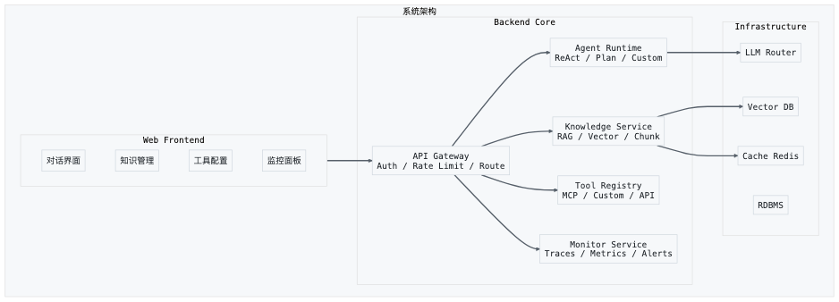

# 第21章 实践路线图

> 纸上得来终觉浅，绝知此事要躬行。——陆游《冬夜读书示子聿》

读完了前面二十章，你已经拥有了足够的知识储备。但知识不等于能力，能力来自实践。本章将给你一张从原理到生产的实践路线图：一份 90 天学习计划（初学者和有经验者两个版本），10 个递进式练手项目（从最小 Agent 到完整产品），开源项目推荐和社区资源导航，以及 Agent 开发者的持续成长策略。

## 21.1 学习路径

### 总体规划

90 天分为三个阶段，每个阶段 30 天：

- **第一阶段（第 1-30 天）：基础筑基**——掌握 Agent 的核心概念和基础技能
- **第二阶段（第 31-60 天）：能力进阶**——构建完整的 Agent 系统
- **第三阶段（第 61-90 天）：项目实战**——独立完成一个生产级 Agent 项目

每天建议投入 2-3 小时。如果你是全职学习，可以适当加速；如果是业余学习，可以按比例延长，但保持节奏感很重要。

---

### 第一阶段：基础筑基（第 1-30 天）

**第 1 周：Agent 认知与开发环境搭建**

| 天数 | 学习目标 | 具体任务 | 产出 |
|------|---------|---------|------|
| Day 1 | 理解 Agent 全景 | 阅读本书第 1-4 章，梳理 Agent 的定义、分类和核心架构 | 一页纸的 Agent 概念导图 |
| Day 2 | 大语言模型基础 | 理解 LLM 的工作原理：Token 化、上下文窗口、Temperature、Top-P 等核心参数 | 参数对照笔记 |
| Day 3 | API 实战入门 | 注册 OpenAI / Anthropic API，用 Python 完成第一次 API 调用，理解 ChatCompletion 的请求和响应格式 | 可运行的基础脚本 |
| Day 4 | Prompt Engineering | 学习核心 Prompt 技巧：角色设定、Few-shot、Chain-of-Thought、结构化输出 | Prompt 模板库（至少 10 个） |
| Day 5 | 开发环境搭建 | 安装 Python 3.11+、配置虚拟环境、安装 LangChain/LlamaIndex 等核心库、配置 VS Code + Copilot | 完整的开发环境 |
| Day 6 | 版本控制与协作 | 熟悉 Git 工作流：分支管理、Commit 规范、PR 流程、GitHub Actions 基础 | GitHub 仓库 + CI 配置 |
| Day 7 | 周复盘 | 回顾本周学习内容，整理笔记，解决遗留问题，写一篇学习日志 | 学习日志 |

**第 2 周：Agent 核心组件**

| 天数 | 学习目标 | 具体任务 | 产出 |
|------|---------|---------|------|
| Day 8 | ReAct 模式 | 理解 ReAct（Reasoning + Acting）范式，手写一个简化版 ReAct Agent | 简化版 ReAct Agent |
| Day 9 | 工具使用（Tool Use） | 学习 Function Calling 机制，为 Agent 添加搜索、计算器、代码执行三个工具 | 带 3 个工具的 Agent |
| Day 10 | 记忆系统（Memory） | 实现短期记忆（对话历史）和长期记忆（向量存储），理解两者的区别和应用场景 | 带记忆的 Agent |
| Day 11 | RAG 基础 | 理解 RAG（Retrieval-Augmented Generation）原理，用 LlamaIndex 构建一个简单的文档问答系统 | 文档问答 Agent |
| Day 12 | 向量数据库 | 学习 Chroma/Pinecone/Weaviate 的使用，理解 Embedding、索引、检索的流程 | 向量检索 Demo |
| Day 13 | 多轮对话管理 | 实现多轮对话的状态管理，理解对话上下文的维护和压缩策略 | 多轮对话 Agent |
| Day 14 | 周复盘 + 阶段检查 | 整合本周所有组件，构建一个完整的单 Agent 系统；写周报 | 整合版 Agent + 周报 |

**第 3 周：Agent 框架深入**

| 天数 | 学习目标 | 具体任务 | 产出 |
|------|---------|---------|------|
| Day 15 | LangChain 深入 | 学习 LangChain 的核心抽象：Chain、Agent、Tool、Memory、Callback | LangChain 项目 |
| Day 16 | LangGraph 入门 | 理解图结构的状态机模型，用 LangGraph 构建一个有条件分支的 Agent 工作流 | LangGraph 工作流 |
| Day 17 | LlamaIndex 深入 | 学习 LlamaIndex 的高级检索：混合检索、重排序、自动合并检索 | 高级 RAG 系统 |
| Day 18 | CrewAI 多 Agent | 学习多 Agent 框架，理解角色定义、任务分配、协作流程 | 多 Agent 协作 Demo |
| Day 19 | AutoGen 多 Agent | 学习 AutoGen 的对话式多 Agent 协作模式，与 CrewAI 对比 | AutoGen Demo |
| Day 20 | 框架对比与选型 | 对比 LangChain、LlamaIndex、CrewAI、AutoGen 的优劣势，形成自己的选型框架 | 框架选型决策矩阵 |
| Day 21 | 周复盘 | 回顾三种框架的实践经验，总结各自适用的场景 | 框架对比报告 |

**第 4 周：评估与优化**

| 天数 | 学习目标 | 具体任务 | 产出 |
|------|---------|---------|------|
| Day 22 | Agent 评估框架 | 学习 Agent 的评估方法：任务完成率、工具使用准确率、推理链质量、延迟指标 | 评估指标清单 |
| Day 23 | 自动化评估 | 实现 LLM-as-Judge 评估流程，用 GPT-4/Claude 自动评估 Agent 的输出质量 | 自动评估脚本 |
| Day 24 | Prompt 优化 | 学习 Prompt 优化的系统方法：迭代优化、A/B 测试、自动 Prompt 优化（DSPy） | 优化前后的对比报告 |
| Day 25 | 性能优化 | 学习 Token 优化、缓存策略、流式输出、并发处理等性能优化技巧 | 性能优化记录 |
| Day 26 | 错误分析与修复 | 收集 Agent 的错误案例，分类分析根因，制定修复方案 | 错误分析报告 |
| Day 27 | 安全基础 | 学习 Prompt Injection 防御、输出过滤、权限控制等 Agent 安全基础 | 安全检查清单 |
| Day 28-30 | 阶段项目 | 构建一个完整的个人知识库 Agent，整合 RAG、记忆、多轮对话、工具使用等所有第一阶段的技能 | 个人知识库 Agent |

---

### 第二阶段：能力进阶（第 31-60 天）

**第 5 周：高级 Agent 架构**

| 天数 | 学习目标 | 具体任务 | 产出 |
|------|---------|---------|------|
| Day 31 | Plan-and-Execute | 实现 Plan-and-Execute 架构，理解规划与执行的分离 | 规划执行 Agent |
| Day 32 | 反思与自我改进 | 实现 Reflexion 机制，让 Agent 能从错误中学习 | 反思型 Agent |
| Day 33 | 多 Agent 编排 | 设计和实现多 Agent 编排系统：主从模式、对等模式、管道模式 | 多 Agent 编排系统 |
| Day 34 | Agent 通信协议 | 学习 MCP（Model Context Protocol）的设计和使用，实现一个 MCP Server | MCP Server |
| Day 35 | 人机协作模式 | 设计人在环中（HITL）的交互模式，实现关键节点的审批和确认机制 | HITL Agent |
| Day 36 | 状态管理与持久化 | 实现 Agent 的状态持久化，支持断点续执行和回滚 | 持久化 Agent |
| Day 37 | 周复盘 | 整合高级架构组件，构建一个支持规划、反思、人机协作的 Agent 系统 | 整合版高级 Agent |

**第 6 周：生产级工程化**

| 天数 | 学习目标 | 具体任务 | 产出 |
|------|---------|---------|------|
| Day 38 | API 服务化 | 用 FastAPI 将 Agent 包装为 RESTful API，处理认证、限流、错误码 | Agent API 服务 |
| Day 39 | 可观测性 | 集成 LangSmith/LangFuse 进行 Trace 和监控，理解 Agent 的可观测性需求 | 监控面板 |
| Day 40 | 日志与审计 | 实现结构化日志、操作审计、合规记录，满足企业级审计需求 | 日志审计系统 |
| Day 41 | 成本控制 | 实现 Token 用量追踪、预算控制、智能路由（根据任务复杂度选择模型） | 成本控制模块 |
| Day 42 | 测试策略 | 设计 Agent 的测试策略：单元测试、集成测试、端到端测试、回归测试 | 测试套件 |
| Day 43 | 部署与运维 | 学习 Docker 容器化部署、Kubernetes 编排、蓝绿部署、灰度发布 | 部署方案 |
| Day 44 | 周复盘 | 回顾工程化实践，梳理生产级 Agent 的工程检查清单 | 工程检查清单 |

**第 7 周：行业场景深入**

| 天数 | 学习目标 | 具体任务 | 产出 |
|------|---------|---------|------|
| Day 45 | 代码 Agent | 构建一个代码生成与审查 Agent，理解 AST、LSP、测试执行等代码领域的特殊需求 | 代码 Agent |
| Day 46 | 数据分析 Agent | 构建一个自然语言驱动的数据分析 Agent，实现 NL2SQL 和图表生成 | 数据分析 Agent |
| Day 47 | 内容创作 Agent | 构建一个多格式内容创作 Agent，支持文章、社交媒体、邮件等格式 | 内容 Agent |
| Day 48 | 客服 Agent | 构建一个客服 Agent，实现意图识别、知识检索、多轮对话、工单创建 | 客服 Agent |
| Day 49 | 研究 Agent | 构建一个深度研究 Agent，实现多源信息检索、交叉验证、报告生成 | 研究 Agent |
| Day 50 | 场景对比分析 | 对比五个场景的 Agent 架构差异，提炼出场景通用的模式和场景特有的设计 | 场景分析报告 |
| Day 51 | 周复盘 | 选择一个你最感兴趣的场景深入优化，形成可展示的 Demo | 场景 Demo |

**第 8 周：评估与优化深入**

| 天数 | 学习目标 | 具体任务 | 产出 |
|------|---------|---------|------|
| Day 52 | 评估框架设计 | 设计一套完整的 Agent 评估框架，覆盖正确性、效率、安全性、用户体验 | 评估框架文档 |
| Day 53 | 基准测试 | 构建 Agent Benchmark，使用标准数据集进行基准测试，与公开结果对比 | 基准测试报告 |
| Day 54 | RAG 优化深入 | 学习 Chunk 策略优化、查询改写、混合检索、重排序等高级 RAG 优化技术 | RAG 优化实验 |
| Day 55 | Agent 微调 | 学习如何用 SFT（监督微调）和 RLHF 优化 Agent 的特定能力 | 微调实验 |
| Day 56 | 端到端优化 | 从用户请求到最终响应的全链路优化，识别和消除瓶颈 | 优化报告 |
| Day 57-60 | 阶段项目 | 选择一个行业场景，从零构建一个接近生产级的 Agent 系统 | 生产级 Agent 项目 |

---

### 第三阶段：项目实战（第 61-90 天）

**第 9 周：项目启动与核心功能开发**

| 天数 | 学习目标 | 具体任务 | 产出 |
|------|---------|---------|------|
| Day 61 | 项目规划 | 确定项目目标、用户画像、核心功能、技术选型，写一份一页纸的项目说明 | 项目说明书 |
| Day 62 | 架构设计 | 设计系统架构：Agent 架构、数据流、API 设计、部署架构 | 架构设计文档 |
| Day 63 | 数据准备 | 收集和整理领域数据，构建知识库，设计数据管道 | 知识库 + 数据管道 |
| Day 64 | 核心功能 V1 | 实现最小可用的核心功能：基本的对话和任务执行 | MVP V1 |
| Day 65 | 工具集成 | 为 Agent 添加场景相关的工具，实现工具的动态发现和调用 | 工具集成版 |
| Day 66 | 记忆与上下文 | 实现长期记忆和上下文管理，支持个性化服务 | 记忆增强版 |
| Day 67 | 周复盘 | Demo 演示，收集反馈，制定下周优化计划 | Demo + 反馈记录 |

**第 10 周：优化与工程化**

| 天数 | 学习目标 | 具体任务 | 产出 |
|------|---------|---------|------|
| Day 68 | 评估体系搭建 | 建立项目的评估指标和自动化评估流程 | 评估体系 |
| Day 69 | 质量优化 | 基于评估结果优化 Agent 的输出质量和工具使用准确率 | 质量优化报告 |
| Day 70 | 性能优化 | 优化响应延迟、Token 用量、并发能力 | 性能优化报告 |
| Day 71 | 安全加固 | 实施 Prompt Injection 防御、输出过滤、权限控制 | 安全加固报告 |
| Day 72 | 监控与告警 | 实现运行时监控、异常检测、自动告警 | 监控系统 |
| Day 73 | 用户体验 | 优化交互界面、错误提示、进度反馈、结果呈现 | UX 优化报告 |
| Day 74 | 周复盘 | 集成测试，准备最终展示 | 集成测试报告 |

**第 11-12 周：打磨与展示**

| 天数 | 学习目标 | 具体任务 | 产出 |
|------|---------|---------|------|
| Day 75-76 | 边缘场景处理 | 收集和修复边缘场景的 Bug，提升鲁棒性 | Bug 修复记录 |
| Day 77-78 | 文档与部署 | 编写使用文档、API 文档、部署文档，完成生产环境部署 | 完整文档 + 部署 |
| Day 79-80 | 用户测试 | 邀请 5-10 个真实用户试用，收集反馈 | 用户反馈报告 |
| Day 81-82 | 迭代优化 | 基于用户反馈进行最后一轮优化 | 优化版 |
| Day 83-84 | 项目展示 | 准备项目演示：Demo 视频、技术博客、开源仓库 | 演示材料 |
| Day 85-87 | 开源发布 | 将项目开源，编写 README，提交到 GitHub，在社区推广 | 开源项目 |
| Day 88-90 | 90 天复盘 | 全面回顾 90 天的学习历程，整理知识体系，制定下一步学习计划 | 90 天总结报告 |

---

### 学习节奏建议

**每日节奏：**
- 30 分钟阅读理论（书籍、论文、技术博客）
- 90 分钟动手实践（写代码、调试、实验）
- 30 分钟输出整理（笔记、博客、代码提交）

**每周节奏：**
- 周一到周六按计划学习
- 周日复盘总结，不留技术债

**防止倦怠：**
- 遇到卡点不要硬磕，换个任务或休息
- 保持社区交流，不要闭门造车
- 适度分享，教学相长

---

### 周末版（6 个月计划）

如果你只能利用周末学习，每周六日各投入 4 小时（共 8 小时/周），可以在 6 个月（24 个周末）内完成整个学习路线。

**第 1-2 个月（周末 1-8）：基础筑基**

| 周末 | 学习重点 | 具体安排 |
|------|---------|---------|
| 周末 1 | Agent 认知与环境搭建 | 阅读 Ch1-Ch5，搭建开发环境，完成第一次 API 调用 |
| 周末 2 | Prompt Engineering | 学习核心 Prompt 技巧，构建 Prompt 模板库，完成项目 1（智能问答助手） |
| 周末 3 | ReAct 模式与工具使用 | 手写 ReAct Agent，实现 Function Calling，添加 3 个工具 |
| 周末 4 | 记忆系统与 RAG | 实现短期/长期记忆，用 LlamaIndex 构建文档问答，完成项目 2（RAG 系统） |
| 周末 5 | 向量数据库与多轮对话 | 学习 Chroma/Pinecone，实现多轮对话状态管理 |
| 周末 6 | LangChain 深入 | 学习 Chain、Agent、Tool、Memory、Callback，完成项目 3（工具增强型 Agent） |
| 周末 7 | LangGraph 与 LlamaIndex | 构建条件分支工作流，学习高级检索策略，完成项目 4（多源研究 Agent） |
| 周末 8 | 多 Agent 框架与阶段复盘 | 学习 CrewAI/AutoGen，框架对比，完成项目 5（代码审查 Agent） |

**第 3-4 个月（周末 9-16）：能力进阶**

| 周末 | 学习重点 | 具体安排 |
|------|---------|---------|
| 周末 9 | 高级 Agent 架构 | 实现 Plan-and-Execute、Reflexion 机制 |
| 周末 10 | 多 Agent 编排与 MCP | 实现多 Agent 编排系统，学习 MCP 协议，完成项目 6（多 Agent 协作） |
| 周末 11 | 人机协作与状态管理 | 实现 HITL 交互、状态持久化与断点续执行 |
| 周末 12 | API 服务化与可观测性 | 用 FastAPI 包装 Agent API，集成 LangSmith/LangFuse |
| 周末 13 | 生产级工程化 | 日志审计、成本控制、测试策略，完成项目 7（自适应客服 Agent） |
| 周末 14 | 行业场景：代码与数据 | 构建代码 Agent 和数据分析 Agent |
| 周末 15 | 行业场景：内容与客服 | 构建内容创作 Agent 和客服 Agent，完成项目 8（数据分析 Agent） |
| 周末 16 | 评估优化深入 | 评估框架设计、RAG 优化、Agent 微调实验 |

**第 5-6 个月（周末 17-24）：项目实战**

| 周末 | 学习重点 | 具体安排 |
|------|---------|---------|
| 周末 17-18 | 项目规划与 MVP | 确定项目目标、架构设计、数据准备，完成核心功能 V1 |
| 周末 19-20 | 功能完善与工具集成 | 添加场景工具、记忆与上下文、评估体系搭建，完成项目 9（MCP 工具生态） |
| 周末 21-22 | 优化与工程化 | 质量优化、性能优化、安全加固、监控告警 |
| 周末 23-24 | 打磨与展示 | 边缘场景处理、文档编写、用户测试、项目展示，启动项目 10（生产级平台） |

> **周末版提示：** 周末时间集中，适合深度编码。工作日可以每天花 15-30 分钟阅读理论或复习笔记，保持手感。

---

### 碎片版（9 个月计划）

如果你每天只能投入 1 小时，可以按以下节奏在 9 个月内完成学习。每天 1 小时虽短，但贵在坚持——9 个月的持续积累，效果不亚于集中学习。

**第 1-2 个月：基础筑基（每天 1 小时）**

| 周 | 学习章节 | 周内安排 |
|---|---------|---------|
| 第 1 周 | Ch1-Ch2 | Day 1-3：阅读 Ch1；Day 4-5：阅读 Ch2；Day 6：梳理笔记导图；Day 7：复习 |
| 第 2 周 | Ch3-Ch5 | Day 1-3：阅读 Ch3；Day 4-5：阅读 Ch4-Ch5，学习 Prompt 技巧；Day 6-7：Prompt 模板练习 |
| 第 3 周 | API 实战 | Day 1-2：注册 API，完成第一次调用；Day 3-5：实现基础对话脚本；Day 6-7：开始项目 1 |
| 第 4 周 | 项目 1 完成 | Day 1-5：完成智能问答助手；Day 6：测试与优化；Day 7：周复盘 |
| 第 5 周 | ReAct 与工具 | Day 1-3：理解 ReAct 范式，手写简化版；Day 4-5：实现 Function Calling；Day 6-7：添加 3 个工具 |
| 第 6 周 | 记忆与 RAG | Day 1-3：实现短期/长期记忆；Day 4-5：理解 RAG 原理；Day 6-7：搭建简单文档问答 |
| 第 7 周 | 项目 2 完成 | Day 1-5：完成 RAG 文档问答系统；Day 6：测试与优化；Day 7：周复盘 |
| 第 8 周 | 向量数据库 | Day 1-3：学习 Chroma/Pinecone；Day 4-5：实现 Embedding + 检索流程；Day 6-7：多轮对话状态管理 |

**第 3-4 个月：框架深入（每天 1 小时）**

| 周 | 学习章节 | 周内安排 |
|---|---------|---------|
| 第 9 周 | LangChain 核心 | Day 1-3：学习 Chain、Agent 抽象；Day 4-5：实现 LangChain 项目；Day 6-7：练习与复盘 |
| 第 10 周 | 项目 3 完成 | Day 1-5：完成工具增强型 Agent；Day 6：测试；Day 7：复盘 |
| 第 11 周 | LangGraph | Day 1-3：理解图结构状态机；Day 4-5：构建条件分支工作流；Day 6-7：练习与复盘 |
| 第 12 周 | LlamaIndex 高级 | Day 1-3：混合检索、重排序；Day 4-5：自动合并检索；Day 6-7：高级 RAG 实验 |
| 第 13 周 | 项目 4 完成 | Day 1-5：完成多源研究 Agent；Day 6：测试；Day 7：复盘 |
| 第 14 周 | CrewAI 多 Agent | Day 1-3：学习角色定义与协作；Day 4-5：实现多 Agent 协作 Demo；Day 6-7：与 AutoGen 对比 |
| 第 15 周 | 项目 5 完成 | Day 1-5：完成代码审查 Agent；Day 6：测试；Day 7：框架选型总结 |
| 第 16 周 | 评估与优化基础 | Day 1-3：Agent 评估方法；Day 4-5：LLM-as-Judge 实现；Day 6-7：Prompt 优化练习 |

**第 5-6 个月：能力进阶（每天 1 小时）**

| 周 | 学习章节 | 周内安排 |
|---|---------|---------|
| 第 17-18 周 | 高级 Agent 架构 | Plan-and-Execute、Reflexion、多 Agent 编排、MCP 协议 |
| 第 19-20 周 | 项目 6 完成 | 多 Agent 协作系统：规划、实现、测试、复盘 |
| 第 21-22 周 | 生产级工程化 | API 服务化、可观测性、日志审计、成本控制、测试策略 |
| 第 23-24 周 | 项目 7 完成 | 自适应客服 Agent：规划、实现、测试、复盘 |

**第 7-8 个月：行业场景（每天 1 小时）**

| 周 | 学习章节 | 周内安排 |
|---|---------|---------|
| 第 25-26 周 | 行业场景实践 | 代码 Agent、数据分析 Agent，完成项目 8 |
| 第 27-28 周 | 评估优化深入 | 评估框架设计、基准测试、RAG 优化、Agent 微调 |
| 第 29-30 周 | 项目 9 完成 | MCP 工具生态：规划、实现、测试、复盘 |
| 第 31-32 周 | 安全与性能 | Prompt Injection 防御、输出过滤、Token 优化、缓存策略 |

**第 9 个月：项目实战（每天 1 小时）**

| 周 | 学习重点 | 周内安排 |
|---|---------|---------|
| 第 33-34 周 | 项目 10 启动 | 项目规划、架构设计、数据准备、核心功能 V1 |
| 第 35-36 周 | 项目 10 完善 | 工具集成、优化工程化、文档编写、最终展示 |

> **碎片版提示：** 每天 1 小时的关键是专注。建议固定同一时间段学习（如早起后或睡前），形成习惯。用番茄钟保持专注，25 分钟学习 + 5 分钟休息。

---

### 速成版（30 天计划）

如果你是有经验的开发者，已经熟悉 Python、Web 开发和基础的 LLM API 使用，可以跳过入门内容，用 30 天集中攻克 Agent 核心技术。每天投入 4-6 小时。

**适用前提：**
- 熟练掌握 Python 和异步编程
- 有 Web API 开发经验（FastAPI/Flask）
- 已使用过 OpenAI/Anthropic API
- 了解基础的向量检索概念

**阅读安排：** Ch01-Ch05 快速浏览（1 天），Ch18-Ch22 作为独立阅读材料。核心学习范围：Ch06-Ch17。

| 天数 | 学习重点 | 具体任务 | 产出 |
|------|---------|---------|------|
| Day 1 | 快速回顾 | 浏览 Ch01-Ch05，确保基础概念清晰；搭建开发环境 | 开发环境 + 概念速查表 |
| Day 2-3 | ReAct 与工具使用（Ch06-Ch09） | 实现 ReAct Agent + Function Calling，完成项目 1 和项目 3 的核心部分 | ReAct Agent + 工具增强 Agent |
| Day 4-5 | 记忆与 RAG（Ch10-Ch12） | 实现记忆系统 + RAG 流水线，完成项目 2 | RAG 文档问答系统 |
| Day 6-7 | 框架深入（Ch07-Ch08） | LangChain + LangGraph 实战，构建有条件分支的工作流 | LangGraph 工作流项目 |
| Day 8-9 | 多 Agent 协作（Ch13） | 多 Agent 编排实战，完成项目 4 和项目 5 | 多源研究 Agent + 代码审查 Agent |
| Day 10-11 | 高级架构（Ch11） | Plan-and-Execute + Reflexion + 多 Agent 编排 | 高级架构 Agent |
| Day 12-13 | 人机协作与安全（Ch14-Ch16） | 人机协作 + 安全防护，完成项目 6 和项目 9 | 安全 Agent |
| Day 14 | 阶段复盘 | 整合前两周成果，解决遗留问题 | 技术总结 |
| Day 15-16 | 工程化（Ch17-Ch18） | FastAPI 服务化 + 可观测性 + 日志审计 + 成本控制 | 生产级 Agent API |
| Day 17-18 | 行业场景（Ch19） | 代码 Agent + 数据分析 Agent，完成项目 7 和项目 8 | 行业场景 Agent |
| Day 19-20 | 评估优化（Ch15） | 评估框架 + RAG 优化 + 性能优化 | 评估体系 + 优化报告 |
| Day 21-25 | 项目实战 | 选择一个方向深入，从零构建接近生产级的 Agent 系统 | 生产级 Agent 项目 |
| Day 26-28 | 打磨优化 | 边缘场景处理、安全加固、监控告警、文档编写 | 完善项目 |
| Day 29-30 | 展示复盘 | 项目展示、技术博客、开源发布、30 天复盘 | 演示材料 + 复盘报告 |

> **速成版提示：** 速成版节奏很快，确保每天有 1 小时用于消化和整理。不要因为赶进度而跳过动手实践——"看懂了"和"做出来了"之间有很大差距。Ch18-Ch22 可以在 30 天计划结束后作为独立阅读，不需要占用核心学习时间。

## 21.2 开源项目推荐与贡献指南

### 21.2.1 核心开源项目

以下是 Agent 领域最重要的开源项目，按类别整理：

**Agent 框架：**

| 项目 | GitHub Stars | 说明 | 适合贡献的类型 |
|------|-------------|------|---------------|
| LangChain | 90k+ | 最流行的 Agent 开发框架 | 文档改进、新工具集成、Bug 修复 |
| LlamaIndex | 37k+ | RAG 和数据连接框架 | 数据连接器、索引策略、检索算法 |
| LangGraph | 8k+ | 图结构 Agent 工作流 | 节点类型、示例模板 |
| CrewAI | 20k+ | 多 Agent 协作框架 | 角色模板、工具集成 |
| AutoGen | 35k+ | 微软的多 Agent 框架 | 对话模式、评估方法 |

**Agent 应用：**

| 项目 | 说明 | 学习价值 |
|------|------|---------|
| OpenHands（原 OpenDevin） | AI 软件开发 Agent | 端到端 Agent 架构、沙箱执行 |
| SWE-agent | 软件工程 Agent | Agent-计算机接口设计 |
| GPT Researcher | 自主研究 Agent | 多源信息检索与综合 |
| PrivateGPT | 私有化文档问答 | 离线 RAG、隐私保护 |
| Dify | Agent 应用开发平台 | 生产级平台架构 |

**基础设施：**

| 项目 | 说明 | 学习价值 |
|------|------|---------|
| Chroma | 开源向量数据库 | 向量检索原理 |
| Ollama | 本地模型运行 | 模型部署与优化 |
| LiteLLM | 统一模型 API | 多模型路由 |
| MCP Protocol | Agent 通信协议 | 协议设计思想 |

### 21.2.2 如何选择贡献项目

选择开源项目贡献时，考虑以下因素：

**你的技能水平。** 如果你是初学者，选择文档完善、Issue 标签清晰的项目（LangChain 和 LlamaIndex 的 "good first issue" 标签很多）。如果你是有经验的开发者，可以选择架构层面的贡献。

**你的学习目标。** 如果你想深入理解 Agent 框架的内部实现，贡献 LangChain 的核心模块。如果你想学习 RAG 的最佳实践，贡献 LlamaIndex 的数据连接器。如果你想了解多 Agent 协作，贡献 CrewAI 的角色模板。

**项目的活跃度。** 优先选择最近 30 天内有活跃提交的项目。检查 Issue 的响应速度和 PR 的合并速度——如果一个月都没有人回复你的 Issue，这个项目可能不适合贡献。

### 21.2.3 贡献流程

一个标准的开源贡献流程：

**第一步：熟悉项目。** 阅读项目的 README、CONTRIBUTING.md、架构文档。在本地成功运行项目，跑通测试用例。这一步至少花 2-3 天，不要急于提交代码。

**第二步：找到合适的 Issue。** 从 "good first issue" 或 "help wanted" 标签的 Issue 开始。在 Issue 下面留言表示你打算解决它，避免多人同时做同一个 Issue。

**第三步：开发与测试。** Fork 仓库，创建功能分支，编写代码和测试。确保所有现有测试通过，新代码有对应的测试用例。遵循项目的代码风格和 Commit 规范。

**第四步：提交 PR。** 写清晰的 PR 描述：解决了什么问题、如何解决的、有哪些影响。附上相关的 Issue 编号。响应 Code Review 的反馈，及时修改。

**第五步：持续参与。** 第一个 PR 合并后，不要消失。继续参与 Issue 讨论、Review 他人的 PR、改进文档。开源贡献是一个长期的过程，不是一次性的活动。

### 21.2.4 从使用者到贡献者的跃迁

很多开发者止步于"使用者"——用开源项目写自己的应用，但从不回馈社区。从使用者到贡献者的跃迁，关键在于转变心态：从"这个工具不好用"到"我怎样才能让它变得更好"。

几个容易上手的贡献切入点：

**文档改进。** 如果你发现文档中有不清楚的地方，说明其他用户也可能遇到同样的问题。改进文档是最容易被合并、也是最有价值的贡献之一。

**Bug 报告。** 遇到 Bug 时不要只是绕过它，而是花时间写一个清晰的 Bug 报告——包括复现步骤、预期行为、实际行为和环境信息。一个好的 Bug 报告本身就是有价值的贡献。

**示例代码。** 为项目添加新的使用示例。很多用户是通过示例代码来学习一个框架的，你的示例可能帮助到很多人。

**新工具集成。** 为 Agent 框架添加新的工具或数据连接器。这既能帮助社区，也能加深你对框架架构的理解。

## 21.3 社区资源与持续学习

### 21.3.1 核心社区

Agent 领域的核心社区：

**英文社区：**
- **AI Engineer Foundation**（aiengineerfoundation.org）：Agent 领域最重要的社区之一，维护 Agent Protocol 等开放标准，定期举办 AI Engineer Summit
- **LangChain Community**：LangChain 的官方 Discord 社区，活跃度极高，每天都有开发者交流问题和分享项目
- **r/LocalLLaMA**（Reddit）：本地模型和 Agent 的讨论社区，信息密度很高
- **Hugging Face Community**：模型和数据集的分享社区，Agent 相关的模型和 Demo 非常丰富
- **AI Twitter/X**：很多最新的 Agent 研究和项目都在 Twitter 上第一时间发布，关注 @LangChainAI、@OpenAI、@AnthropicAI 等账号

**中文社区：**
- **掘金 AI 社区**：中文技术社区中 AI 内容最活跃的平台之一
- **知乎 AI 话题**：深度分析文章较多，适合系统性学习
- **AI 相关微信群/知识星球**：很多国内 Agent 开发者聚集在微信社群中，信息传递快但质量参差不齐
- **WaytoAGI**（waytoagi.com）：国内较有质量的 AI 学习社区

### 21.3.2 持续学习的信息源

Agent 领域变化极快，持续学习是必需而非可选。以下是我推荐的信息源，按时间投入排序：

**每日 15 分钟：**
- Twitter/X 上的 AI 列表（List）——快速了解行业动态
- Hacker News AI 相关帖子——高质量的技术讨论
- 项目的 GitHub Release Notes——跟踪你使用的工具的更新

**每周 1 小时：**
- AI 领域的周报：The Batch（Andrew Ng）、Ahead of AI（Sebastian Raschka）、TLDR AI
- arXiv 上的 Agent 相关论文：搜索 "agent" + "LLM"，每周约 20-30 篇新论文
- 播客：Latent Space、Practical AI、AI Explained

**每月 2-3 小时：**
- 精读 1-2 篇重要论文，写阅读笔记
- 观看 1-2 个技术会议的视频（NeurIPS、ICML、AI Engineer Summit）
- 回顾自己的项目，总结经验教训

### 21.3.3 构建个人知识体系

在信息爆炸的时代，比获取信息更重要的是组织信息。我建议建立一套个人知识管理体系：

**三层笔记法：**

- **灵感层**：随手记录的想法、发现、灵感，用手机备忘录或 Flomo 等工具
- **知识层**：结构化的学习笔记，按主题组织，用 Notion 或 Obsidian
- **实践层**：项目中的经验总结、踩坑记录、解决方案，用 GitHub Wiki 或技术博客

**定期整理：** 每周花 30 分钟将灵感层的笔记整理到知识层，每月花 1 小时将实践层的经验总结到技术博客。这个"整理"的过程本身就是最好的学习。

**费曼学习法：** 学到一个新概念后，尝试用自己的话向一个不了解这个领域的人解释。如果你解释不清楚，说明你还没真正理解。写技术博客就是费曼学习法的最佳实践——你写得出来，说明你想明白了。

### 21.3.4 避免常见学习陷阱

在 Agent 领域学习过程中，有几个常见的陷阱：

**追逐新框架陷阱。** 每周都有新的 Agent 框架发布，如果你每个都去试，就会永远停留在入门水平。选择 1-2 个核心框架深入学习，其他的了解设计思想即可。

**纸上谈兵陷阱。** 只看教程不写代码，觉得自己"懂了"，但真正动手时一头雾水。每学一个概念，必须动手实践，哪怕是最简单的 Demo。

**完美主义陷阱。** 总是想把代码写得完美了再提交，结果永远没有产出。先完成，再完善。MVP 思维不仅适用于产品，也适用于学习——先做出一个能跑的东西，再逐步优化。

**闭门造车陷阱。** 一个人默默学习，不参与社区交流，不分享自己的成果。Agent 领域发展太快，闭门造车会让你错过很多重要的进展，也无法获得他人的反馈。

## 21.4 自己动手

以下 10 个项目按难度递进排列，每个项目在前一个项目的基础上增加新的技术挑战。建议按顺序完成，每个项目花费 3-7 天。

---

### 项目 1：智能问答助手

**难度：** 入门
**预计时间：** 2-3 天

**项目描述：** 构建一个命令行的智能问答助手，能够调用大语言模型回答用户的问题，支持多轮对话。

**技术要求：**
- 调用 OpenAI 或 Anthropic API
- 维护对话历史，支持上下文关联的多轮对话
- 实现基本的对话管理：开始、继续、清除历史、退出

**验收标准：**
- 能进行 3 轮以上的连贯对话
- 对话历史正确传递，Agent 能引用之前的内容
- 异常处理完善（API 超时、Token 超限等）

**核心代码框架：**

```python
import os
from openai import OpenAI

client = OpenAI(api_key=os.environ.get("OPENAI_API_KEY"))

class QAAgent:
    def __init__(self, system_prompt="你是一个有用的AI助手。"):
        self.messages = [{"role": "system", "content": system_prompt}]

    def chat(self, user_input: str) -> str:
        self.messages.append({"role": "user", "content": user_input})
        response = client.chat.completions.create(
            model="gpt-4o-mini",
            messages=self.messages,
            temperature=0.7
        )
        assistant_message = response.choices[0].message.content
        self.messages.append({"role": "assistant", "content": assistant_message})
        return assistant_message

    def clear_history(self):
        system_prompt = self.messages[0]["content"]
        self.messages = [{"role": "system", "content": system_prompt}]

if __name__ == "__main__":
    agent = QAAgent()
    print("智能问答助手（输入 'quit' 退出，'clear' 清除历史）")
    while True:
        user_input = input("\n你：").strip()
        if user_input.lower() == "quit":
            break
        if user_input.lower() == "clear":
            agent.clear_history()
            print("历史已清除")
            continue
        response = agent.chat(user_input)
        print(f"\n助手：{response}")
```

**拓展方向：** 添加流式输出、支持多种模型切换、添加 Token 用量统计。

---

### 项目 2：文档问答系统（RAG）

**难度：** 入门-进阶
**预计时间：** 3-4 天

**项目描述：** 构建一个基于 RAG 的文档问答系统，用户上传 PDF 或 TXT 文档，系统能回答基于文档内容的问题。

**技术要求：**
- 文档加载和分块（Chunk）
- 使用 Embedding 模型生成向量
- 向量存储和相似度检索
- 基于检索结果的生成式问答

**验收标准：**
- 支持上传 10 页以上的 PDF 文档
- 回答的准确率在 80% 以上（基于文档内容的问题）
- 明确标注回答的来源段落

**核心代码框架：**

```python
from langchain_community.document_loaders import PyPDFLoader, TextLoader
from langchain_text_splitters import RecursiveCharacterTextSplitter
from langchain_openai import OpenAIEmbeddings, ChatOpenAI
from langchain_community.vectorstores import Chroma
from langchain.chains import RetrievalQA

# 1. 加载文档
loader = PyPDFLoader("your_document.pdf")
docs = loader.load()

# 2. 分块
text_splitter = RecursiveCharacterTextSplitter(
    chunk_size=1000, chunk_overlap=200
)
chunks = text_splitter.split_documents(docs)

# 3. 向量存储
embeddings = OpenAIEmbeddings()
vectorstore = Chroma.from_documents(chunks, embeddings, persist_directory="./chroma_db")

# 4. 问答链
llm = ChatOpenAI(model="gpt-4o-mini", temperature=0)
qa_chain = RetrievalQA.from_chain_type(
    llm=llm,
    chain_type="stuff",
    retriever=vectorstore.as_retriever(search_kwargs={"k": 3}),
    return_source_documents=True
)

# 5. 提问
result = qa_chain.invoke({"query": "文档的主要内容是什么？"})
print(result["result"])
print("\n来源：", [doc.metadata for doc in result["source_documents"]])
```

**拓展方向：** 混合检索（关键词+向量）、查询改写、Chunk 策略对比实验。

---

### 项目 3：工具增强型 Agent

**难度：** 进阶
**预计时间：** 3-5 天

**项目描述：** 为 Agent 添加工具使用能力，包括网络搜索、代码执行、文件读写和数学计算。

**技术要求：**
- Function Calling 机制
- 至少实现 4 个工具：搜索、计算器、代码执行、文件操作
- Agent 能自主决定何时使用哪个工具
- 工具执行结果正确地反馈到 Agent 的推理过程中

**验收标准：**
- Agent 能准确判断哪些问题需要使用工具
- 工具调用链正确：比如"2024年奥运会举办城市的人口是多少"需要先搜索举办城市，再搜索人口
- 错误处理：工具调用失败时 Agent 能优雅降级

**核心代码框架：**

```python
import json
import subprocess
from openai import OpenAI

client = OpenAI()

tools = [
    {
        "type": "function",
        "function": {
            "name": "calculator",
            "description": "执行数学计算",
            "parameters": {
                "type": "object",
                "properties": {
                    "expression": {"type": "string", "description": "数学表达式，如 '2+3*4'"}
                },
                "required": ["expression"]
            }
        }
    },
    {
        "type": "function",
        "function": {
            "name": "run_python",
            "description": "执行 Python 代码并返回输出",
            "parameters": {
                "type": "object",
                "properties": {
                    "code": {"type": "string", "description": "要执行的 Python 代码"}
                },
                "required": ["code"]
            }
        }
    }
]

def execute_tool(tool_name: str, arguments: dict) -> str:
    if tool_name == "calculator":
        try:
            return str(eval(arguments["expression"]))
        except Exception as e:
            return f"计算错误：{e}"
    elif tool_name == "run_python":
        try:
            result = subprocess.run(
                ["python", "-c", arguments["code"]],
                capture_output=True, text=True, timeout=10
            )
            return result.stdout or result.stderr
        except Exception as e:
            return f"执行错误：{e}"
    return "未知工具"

def agent_loop(user_query: str, max_steps: int = 5):
    messages = [{"role": "user", "content": user_query}]
    for step in range(max_steps):
        response = client.chat.completions.create(
            model="gpt-4o-mini",
            messages=messages,
            tools=tools,
            tool_choice="auto"
        )
        msg = response.choices[0].message
        messages.append(msg)

        if msg.tool_calls:
            for tool_call in msg.tool_calls:
                result = execute_tool(
                    tool_call.function.name,
                    json.loads(tool_call.function.arguments)
                )
                messages.append({
                    "role": "tool",
                    "tool_call_id": tool_call.id,
                    "content": result
                })
        else:
            return msg.content

    return "达到最大步骤数限制"

# 测试
print(agent_loop("计算 (15^3 + 27^2) / 13 的结果"))
print(agent_loop("写一段Python代码，生成斐波那契数列的前10项并输出"))
```

**拓展方向：** 添加更多工具（天气查询、数据库查询、API 调用）、工具组合策略、工具使用效率优化。

---

### 项目 4：多源研究 Agent

**难度：** 进阶
**预计时间：** 4-5 天

**项目描述：** 构建一个能自动进行多源研究的 Agent，给定一个研究主题，它自动搜索多个信息源、整合分析、生成结构化的研究报告。

**技术要求：**
- 多源信息检索（搜索引擎、Wikipedia API、新闻 API）
- 信息去重和交叉验证
- 结构化报告生成（摘要、分析、结论、参考来源）
- 支持研究深度控制（快速概览 vs 深度研究）

**验收标准：**
- 给定一个研究主题，能生成一份有逻辑结构的报告
- 报告中的事实性信息有来源标注
- 能识别和标注信息冲突（不同来源给出矛盾信息时）

**拓展方向：** 添加时间线分析、竞品对比、趋势预测等研究模板。

---

### 项目 5：代码审查 Agent

**难度：** 进阶
**预计时间：** 4-5 天

**项目描述：** 构建一个代码审查 Agent，能够分析 Git Diff 或代码片段，给出审查意见，包括 Bug 发现、风格建议、性能优化建议。

**技术要求：**
- 解析 Git Diff 格式
- 理解多种编程语言的代码
- 按严重程度分类审查意见（Critical / Warning / Suggestion）
- 支持自定义审查规则

**验收标准：**
- 能发现常见的代码 Bug（空指针、资源泄漏、并发问题）
- 审查意见有具体的行号和修改建议
- 误报率低于 30%

**拓展方向：** 集成到 CI/CD 流程、支持自动修复、添加安全审查规则。

---

### 项目 6：多 Agent 协作系统

**难度：** 进阶-高级
**预计时间：** 5-7 天

**项目描述：** 构建一个多 Agent 协作系统，包含 Researcher（研究员）、Writer（作者）和 Reviewer（审稿人）三个角色，协作完成一篇研究报告。

**技术要求：**
- 角色定义和职责划分
- Agent 间的消息传递和协作流程
- 评审-修改循环（Reviewer 反馈 → Writer 修改 → Reviewer 再审）
- 支持人类介入审批

**验收标准：**
- 三个 Agent 能按流程协作完成报告
- 报告质量明显优于单 Agent 直接生成
- Reviewer 的反馈被有效采纳，修改前后有明确的改善

**核心代码框架：**

```python
from crewai import Agent, Task, Crew, Process

# 定义角色
researcher = Agent(
    role="研究员",
    goal="收集和分析关于指定主题的深入信息",
    backstory="你是一位经验丰富的研究员，擅长从多个来源收集和综合信息。",
    verbose=True,
    allow_delegation=False
)

writer = Agent(
    role="作者",
    goal="基于研究材料撰写清晰、有深度的报告",
    backstory="你是一位技术写作专家，擅长将复杂概念转化为清晰的文字。",
    verbose=True,
    allow_delegation=False
)

reviewer = Agent(
    role="审稿人",
    goal="审查报告的质量，提出改进建议",
    backstory="你是一位严谨的审稿人，关注逻辑性、准确性和可读性。",
    verbose=True,
    allow_delegation=False
)

# 定义任务
research_task = Task(
    description="研究{topic}，收集关键信息、数据和发展趋势",
    agent=researcher,
    expected_output="包含关键发现、数据支撑和趋势分析的研究摘要"
)

writing_task = Task(
    description="基于研究摘要，撰写关于{topic}的深度报告，包括概述、分析、结论",
    agent=writer,
    expected_output="结构完整的深度报告，3000字以上"
)

review_task = Task(
    description="审查报告的逻辑性、准确性和可读性，给出修改建议",
    agent=reviewer,
    expected_output="审查意见和修改建议，包括具体需要修改的段落"
)

# 组建团队
crew = Crew(
    agents=[researcher, writer, reviewer],
    tasks=[research_task, writing_task, review_task],
    process=Process.sequential,
    verbose=True
)

# 执行
result = crew.kickoff(inputs={"topic": "2025年大语言模型的最新进展"})
print(result)
```

**拓展方向：** 添加更多角色（编辑、事实核查员）、实现并行研究多个子主题、添加人类审批节点。

---

### 项目 7：自适应客服 Agent

**难度：** 高级
**预计时间：** 5-7 天

**项目描述：** 构建一个能自适应不同用户情绪和需求的客服 Agent，具备知识库检索、工单创建、智能转人工等功能。

**技术要求：**
- 意图识别和情绪分析
- 知识库检索（产品FAQ、政策文档）
- 工单创建和管理（模拟 CRM 系统）
- 智能转人工：识别自身无法处理的情况
- 用户画像构建：记住用户的偏好和历史问题

**验收标准：**
- 能正确识别 80% 以上的用户意图
- 情绪识别准确率 70% 以上
- 对知识库覆盖的问题，回答准确率 85% 以上
- 合理判断转人工时机（不是什么都转，也不是什么都扛）

**拓展方向：** 多语言支持、语音接入、A/B 测试不同回复策略。

---

### 项目 8：自动化数据分析 Agent

**难度：** 高级
**预计时间：** 5-7 天

**项目描述：** 构建一个自然语言驱动的数据分析 Agent，用户用自然语言描述分析需求，Agent 自动完成数据查询、统计分析、可视化生成。

**技术要求：**
- NL2SQL：自然语言转 SQL 查询
- 数据统计分析：趋势分析、异常检测、相关性分析
- 图表自动生成：折线图、柱状图、散点图、热力图
- 分析报告生成：自动生成分析结论和建议

**验收标准：**
- 给定一个数据库，用户能通过自然语言查询数据
- 生成的 SQL 语法正确率 90% 以上
- 图表和分析结论与数据一致
- 支持追问和迭代分析

**拓展方向：** 添加预测分析、支持多种数据源（CSV、Excel、API）、交互式仪表盘。

---

### 项目 9：MCP 工具生态

**难度：** 高级-专家
**预计时间：** 5-7 天

**项目描述：** 基于 Model Context Protocol（MCP），构建一套 Agent 工具生态，包含 3-5 个 MCP Server，以及一个能动态发现和使用这些工具的 Agent 客户端。

**技术要求：**
- 理解 MCP 协议规范
- 实现 MCP Server：文件系统 Server、数据库 Server、Web 搜索 Server
- 实现 MCP Client：动态发现 Server、协商能力、调用工具
- 工具组合：Agent 能组合多个工具完成复杂任务

**验收标准：**
- 至少 3 个 MCP Server 可以独立运行
- MCP Client 能动态发现和调用所有 Server 的工具
- 能完成跨工具的复合任务（如：从数据库查询数据 → 生成图表 → 保存到文件）

**核心代码框架：**

```python
# MCP Server 示例：文件系统 Server
from mcp.server import Server
from mcp.types import Tool, TextContent

server = Server("filesystem")

@server.list_tools()
async def list_tools():
    return [
        Tool(
            name="read_file",
            description="读取文件内容",
            inputSchema={
                "type": "object",
                "properties": {
                    "path": {"type": "string", "description": "文件路径"}
                },
                "required": ["path"]
            }
        ),
        Tool(
            name="write_file",
            description="写入文件",
            inputSchema={
                "type": "object",
                "properties": {
                    "path": {"type": "string", "description": "文件路径"},
                    "content": {"type": "string", "description": "文件内容"}
                },
                "required": ["path", "content"]
            }
        )
    ]

@server.call_tool()
async def call_tool(name: str, arguments: dict):
    if name == "read_file":
        with open(arguments["path"], "r") as f:
            content = f.read()
        return [TextContent(type="text", text=content)]
    elif name == "write_file":
        with open(arguments["path"], "w") as f:
            f.write(arguments["content"])
        return [TextContent(type="text", text=f"已写入 {arguments['path']}")]

# 运行 Server
# uvicorn filesystem_server:server
```

**拓展方向：** 添加权限控制、实现工具的版本管理、构建工具市场。

---

### 项目 10：端到端生产级 Agent 平台

**难度：** 专家
**预计时间：** 3-4 周（此项目涉及前端、后端、基础设施和 Agent 核心四个层面，建议至少投入3-4周以确保每个层面都有基本实现）

**项目描述：** 构建一个生产级的 Agent 平台，包含 Agent 配置、对话管理、知识库管理、工具管理、评估监控和用户管理。这是前 9 个项目所有技能的集大成。

**技术要求：**
- Web 前端：对话界面、知识库管理、工具配置、监控面板
- 后端 API：Agent 运行时、知识库服务、工具注册中心、评估服务
- 基础设施：用户认证、数据持久化、日志审计、监控告警
- Agent 核心：可配置的 Agent 架构（ReAct / Plan-Execute / 自定义）、动态工具加载、上下文管理

**系统架构：**



**验收标准：**
- 用户能通过 Web 界面配置和运行 Agent
- 知识库能动态更新，Agent 即时使用新知识
- 工具能动态注册，Agent 即时使用新工具
- 监控面板实时展示 Agent 的运行状态和关键指标
- 系统具备基本的错误恢复和降级能力

**拓展方向：** 多租户支持、Agent Marketplace、A/B 测试框架、自动化运维。

---

### 项目完成后的自检清单

每个项目完成后，用以下清单自检：

- [ ] 功能完整性：所有核心功能是否实现？
- [ ] 代码质量：是否遵循了良好的编码规范？是否有充分的注释？
- [ ] 测试覆盖：是否有对应的测试用例？边界情况是否覆盖？
- [ ] 文档完整：是否有 README、使用说明、API 文档？
- [ ] 错误处理：异常情况是否有优雅的处理？
- [ ] 性能考量：响应时间是否可接受？Token 用量是否合理？
- [ ] 安全基础：是否考虑了基本的安全问题（Prompt Injection、数据泄露）？
- [ ] 可扩展性：架构是否支持未来功能的扩展？

---

> **古典智慧点睛**：老子云"千里之行，始于足下"——从最小 Agent 开始，一步步精进。不要想着一步登天做出一个生产级平台，而是从第一个问答助手开始，一个项目一个项目地积累。每一个小项目的完成，都是通向精通之路上的一个脚印。

## 习题

**习题 1：个性化学习计划调整**

基于 21.1 节的 90 天计划，结合你自身的技术背景和时间安排，制定一份个性化的学习计划。要求：明确每天的具体学习时间、每周的弹性缓冲时间、以及如果进度落后的追赶策略。

**习题 2：开源贡献计划**

从 21.2 节推荐的开源项目中选择一个，找到 3 个你可以贡献的 "good first issue"，为每个 Issue 写一份解决思路（不需要写代码，但需要说明你的理解和计划）。

**习题 3：信息源评估**

订阅 21.3 节推荐的至少 5 个信息源，持续跟踪一周，然后写一份评估报告：每个信息源的信息密度、质量、时效性如何？哪些对你最有价值？为什么？

## 参考文献

1. LangChain Tutorials. https://python.langchain.com/docs/tutorials/
2. LangGraph Examples. https://langchain-ai.github.io/langgraph/tutorials/
3. OpenAI Cookbook. https://cookbook.openai.com/

## 开放讨论

1. 90 天计划中，你认为哪个阶段最具挑战性？你打算如何应对？

2. 在 10 个练手项目中，你对哪个项目最感兴趣？你打算如何拓展它的能力？

3. 开源贡献对个人成长的价值有多大？你是否有过开源贡献的经历？如果有，分享一下你的经验。

4. 在 Agent 技术快速迭代的背景下，如何保持学习的方向感，避免被新框架和新概念牵着走？

5. 你认为 Agent 开发者最需要培养的核心能力是什么？是编程能力、架构设计能力、还是领域理解能力？
